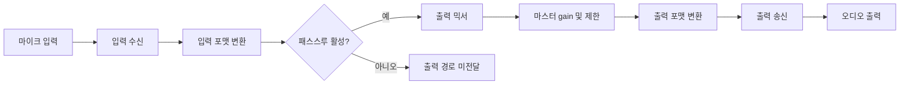
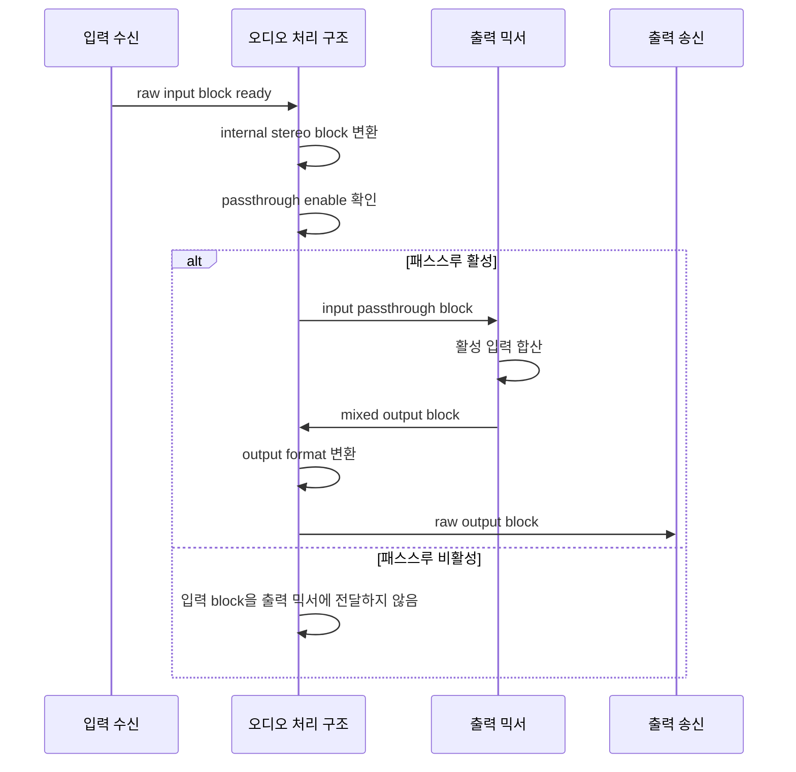
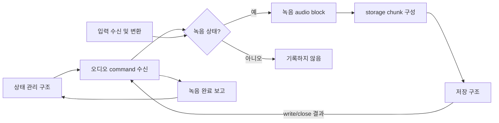
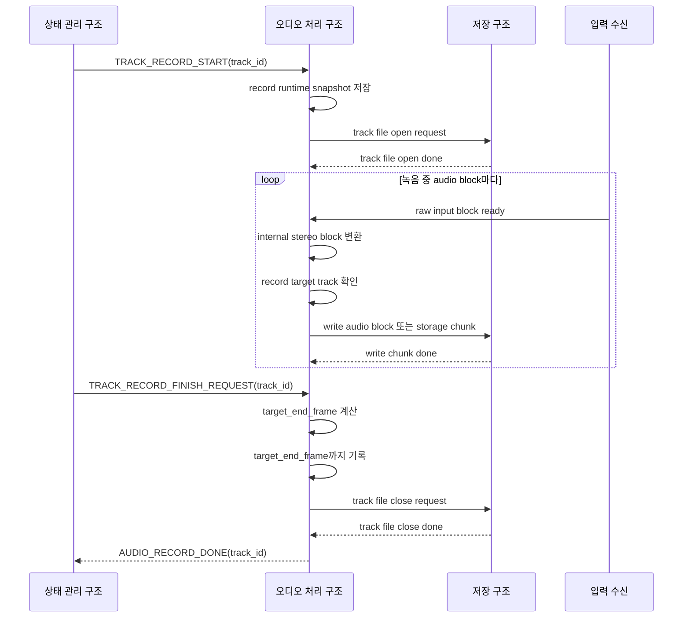
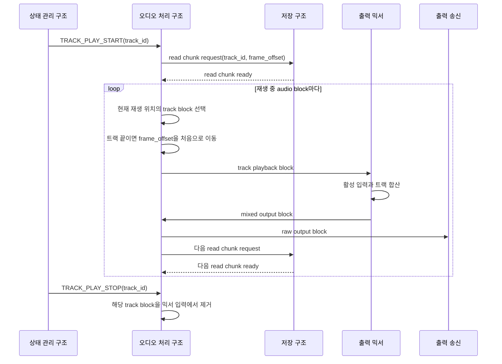
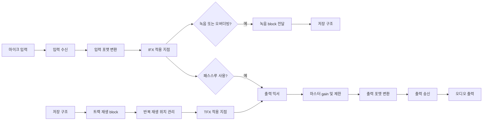

# 오디오 입출력 아키텍처

이 문서는 루프스테이션 요구사항 중 `REQ-AUDIO` 항목을 만족시키기 위한 오디오 입출력 구조를 정의한다.
요구사항 문서는 시스템이 외부에서 어떻게 동작해야 하는지를 설명하고, 이 문서는 그 동작을 구현하기 위해 시스템 내부가 어떤 구조를 가져야 하는지 설명한다.

## 1. 설계 범위

| 항목 | 내용 |
| --- | --- |
| 대상 요구사항 | `REQ-AUDIO-001`, `REQ-AUDIO-002`, `REQ-AUDIO-003` |
| 포함 범위 | 실시간 입력 수신, 입력 패스스루, 녹음 경로 전달, 트랙 재생 경로 수신, 최종 출력 송신 |
| 연관 설계 | 저장 구조, 트랙 생명주기, 오디오 효과, 실시간 동작 |
| 제외 범위 | FX 알고리즘 세부 구현, 트랙 상태 전이 정책, 파일명/디렉터리 정책, 오류 표시 방식 |

## 2. 관련 요구사항

| 요구사항 ID | 요구사항 요약 | 이 문서의 설계 관점 |
| --- | --- | --- |
| `REQ-AUDIO-001` | 마이크 입력 오디오를 출력으로 내보낸다. | 입력 block을 내부 sample format으로 변환한 뒤 패스스루 경로를 통해 출력 믹서로 전달한다. |
| `REQ-AUDIO-002` | 마이크 입력 오디오를 트랙에 녹음한다. | 입력 block을 녹음 경로로 분기하고 저장 구조가 소비할 수 있는 audio block 또는 storage chunk로 전달한다. |
| `REQ-AUDIO-003` | 재생 중인 트랙 오디오를 출력으로 내보낸다. | 저장 구조에서 읽은 트랙 audio block을 반복 재생 경로로 받아 출력 믹서에 합산한다. |

## 3. 요구사항별 설계

### 3.1 REQ-AUDIO-001 설계

`REQ-AUDIO-001`은 사용자가 마이크로 입력한 오디오를 출력에서 들을 수 있어야 한다는 요구사항이다.
이를 구현하려면 입력 수신, 내부 포맷 변환, 패스스루 분기, 출력 믹싱, 출력 송신 아키텍처가 필요하다.
이 경로는 저장 장치 접근 없이 실시간 오디오 처리 주기 안에서 끝나야 한다.

#### 3.1.1 필요 아키텍처

| 설계 ID | 아키텍처 항목 | 역할 | 설계 결정 |
| --- | --- | --- | --- |
| `ARCH-AUDIO-001` | 입력 수신 | 마이크 입력 sample을 일정한 audio block 단위로 받는다. | 입력 peripheral event를 오디오 처리 구조로 전달한다. |
| `ARCH-AUDIO-002` | 입력 포맷 변환 | raw input sample을 내부 공통 sample format으로 바꾼다. | 단일 마이크 입력은 내부 stereo block의 L/R에 복제한다. |
| `ARCH-AUDIO-003` | 패스스루 분기 | 입력음을 출력으로 보낼지 결정한다. | 상태 관리 구조가 보낸 `AUDIO_PASSTHROUGH_ENABLE` 값을 runtime snapshot으로 유지한다. |
| `ARCH-AUDIO-004` | 출력 믹서 | 패스스루 입력과 재생 트랙을 합산한다. | 패스스루만 활성화된 경우에도 믹서를 통과해 최종 출력 경로를 공유한다. |
| `ARCH-AUDIO-005` | 출력 송신 | mixed block을 출력 장치 전송 format으로 변환해 보낸다. | 최종 출력 직전에 clipping을 제한하고 출력 slot에 맞춰 변환한다. |

#### 3.1.2 구조 다이어그램

#### 3.1.3 동작 시나리오

#### 3.1.4 개발해야 할 기능

| 기능 문서 | 기능 | 목적 |
| --- | --- | --- |
| `FEAT-i2s-input-capture.md` | 입력 block 수신 | 마이크 입력을 audio block 단위로 안정적으로 확보한다. |
| `FEAT-sample-format-conversion.md` | 입력/출력 sample 변환 | raw sample과 내부 sample format 사이를 변환한다. |
| `FEAT-audio-passthrough.md` | 입력 패스스루 | 패스스루 설정에 따라 입력 block을 출력 믹서로 전달한다. |
| `FEAT-dac-output-stream.md` | 출력 stream 송신 | mixed block을 출력 장치로 끊김 없이 송신한다. |

### 3.2 REQ-AUDIO-002 설계

`REQ-AUDIO-002`는 사용자가 마이크로 입력한 오디오를 트랙에 녹음할 수 있어야 한다는 요구사항이다.
이를 구현하려면 입력 경로에서 녹음 경로로 block을 분기하고, 저장 구조가 처리할 수 있는 단위로 전달하는 아키텍처가 필요하다.
녹음 중에도 입력 패스스루와 출력 처리는 독립적으로 유지되어야 한다.

#### 3.2.1 필요 아키텍처

| 설계 ID | 아키텍처 항목 | 역할 | 설계 결정 |
| --- | --- | --- | --- |
| `ARCH-AUDIO-006` | 녹음 command 수신 | 상태 관리 구조의 녹음 시작/종료 결정을 오디오 처리 구조에 반영한다. | `TRACK_RECORD_START`, `TRACK_RECORD_FINISH_REQUEST`, `TRACK_RECORD_STOP`을 수신한다. |
| `ARCH-AUDIO-007` | 녹음 runtime snapshot | 대상 트랙, 시작 frame, BPM snapshot, 종료 후보 정보를 보관한다. | 상태 원본은 상태 관리 구조가 소유하고 오디오 처리 구조는 실행에 필요한 값만 보관한다. |
| `ARCH-AUDIO-008` | 녹음 분기 | 입력 변환이 끝난 block을 대상 트랙의 기록 경로로 전달한다. | 녹음 또는 오버더빙 상태인 트랙에 대해서만 write chunk를 만든다. |
| `ARCH-AUDIO-009` | 저장 구조 연동 | 오디오 처리 주기에서 파일 I/O를 직접 수행하지 않는다. | 저장 구조에 file open/write/close 요청을 보내고 결과 메시지를 받는다. |
| `ARCH-AUDIO-010` | 종료 frame 보정 | 사용자의 종료 요청 시점과 실제 기록 종료 시점을 분리한다. | 오디오 처리 구조가 `target_end_frame`을 계산하고 해당 frame까지 기록한다. |

#### 3.2.2 구조 다이어그램

#### 3.2.3 동작 시나리오

#### 3.2.4 개발해야 할 기능

| 기능 문서 | 기능 | 목적 |
| --- | --- | --- |
| `FEAT-record-input-dispatch.md` | 녹음 입력 분기 | 녹음 중인 트랙에 입력 block을 전달한다. |
| `FEAT-sample-format-conversion.md` | 저장용 sample 변환 | 내부 sample을 저장 구조가 기록할 PCM block으로 변환한다. |
| `FEAT-record-end-frame-selection.md` | 녹음 종료 frame 계산 | 종료 요청 시점과 BPM snapshot으로 실제 종료 frame을 정한다. |
| `FEAT-storage-chunk-write.md` | storage chunk 쓰기 연동 | 저장 구조에 write chunk를 요청하고 완료 결과를 처리한다. |
| `FEAT-record-to-playback-transition.md` | 녹음 완료 후 전환 | 녹음 완료 보고 이후 재생 또는 정지 상태로 이어질 수 있게 한다. |

### 3.3 REQ-AUDIO-003 설계

`REQ-AUDIO-003`은 재생 중인 트랙의 오디오를 출력으로 내보낼 수 있어야 한다는 요구사항이다.
이를 구현하려면 저장된 트랙 데이터를 미리 읽고, 트랙 길이에 따라 반복 재생 위치를 관리하며, 출력 믹서로 block을 공급하는 아키텍처가 필요하다.
재생 경로는 입력 패스스루 경로와 같은 출력 믹서를 공유한다.

#### 3.3.1 필요 아키텍처

| 설계 ID | 아키텍처 항목 | 역할 | 설계 결정 |
| --- | --- | --- | --- |
| `ARCH-AUDIO-011` | 재생 command 수신 | 상태 관리 구조의 재생 시작/정지 결정을 반영한다. | `TRACK_PLAY_START`, `TRACK_PLAY_STOP`을 수신한다. |
| `ARCH-AUDIO-012` | read chunk prefetch | 출력 주기 전에 트랙 데이터를 확보한다. | 저장 구조에 다음 read chunk를 비동기로 요청한다. |
| `ARCH-AUDIO-013` | 재생 위치 관리 | 현재 frame offset과 트랙 길이를 기준으로 다음 block을 선택한다. | 트랙 끝에 도달하면 frame offset을 data 시작 위치로 되돌린다. |
| `ARCH-AUDIO-014` | 트랙 block 공급 | 재생 중인 트랙 block을 출력 믹서에 전달한다. | 여러 트랙이 활성화될 수 있으므로 track id별 runtime 상태를 유지한다. |
| `ARCH-AUDIO-015` | 출력 믹싱 | 입력 패스스루와 재생 트랙을 합산한다. | 최종 출력 경로는 `REQ-AUDIO-001`의 출력 송신 아키텍처를 공유한다. |

#### 3.3.2 구조 다이어그램

#### 3.3.3 동작 시나리오

#### 3.3.4 개발해야 할 기능

| 기능 문서 | 기능 | 목적 |
| --- | --- | --- |
| `FEAT-track-playback-stream.md` | 트랙 재생 stream | 저장된 트랙 block을 출력 믹서로 공급한다. |
| `FEAT-storage-chunk-read.md` | storage chunk 읽기 연동 | 저장 구조에서 read chunk를 받아 재생 buffer에 적재한다. |
| `FEAT-playback-loop-position.md` | 반복 재생 위치 관리 | 트랙 끝에서 처음으로 돌아가는 frame offset을 관리한다. |
| `FEAT-dac-output-stream.md` | 출력 stream 송신 | 믹싱된 트랙 오디오를 출력 장치로 송신한다. |

## 4. 공통 설계 정보

이 절은 요구사항별 설계에서 반복해서 등장하는 용어와 공통 값을 정리한다.
요구사항별 절에서는 이 값을 반복 설명하지 않고 필요한 아키텍처와 기능에 집중한다.

### 4.1 전체 오디오 경로

### 4.2 공통 구성 요소

| 구성 요소 | 책임 | 입력 | 출력 | 관련 요구사항 |
| --- | --- | --- | --- | --- |
| 입력 수신 | 오디오 입력 장치에서 일정한 frame 수의 raw sample을 받는다. | 입력 peripheral DMA event 또는 polling 결과 | raw input block | `REQ-AUDIO-001`, `REQ-AUDIO-002` |
| 입력 포맷 변환 | raw input sample을 내부 `int32_t` interleaved stereo block으로 변환한다. | raw input block | internal audio block | `REQ-AUDIO-001`, `REQ-AUDIO-002` |
| 입력 패스스루 분기 | 패스스루 설정이 켜진 경우 입력 block을 출력 믹서로 전달한다. | internal audio block, passthrough enable | mixer input block | `REQ-AUDIO-001` |
| 녹음 분기 | 트랙이 녹음 또는 오버더빙 중이면 입력 block을 저장 경로로 전달한다. | internal audio block, track runtime state | record audio block | `REQ-AUDIO-002` |
| 트랙 재생 수신 | 저장 구조에서 읽은 트랙 block을 오디오 처리 경로로 받는다. | read audio block | track playback block | `REQ-AUDIO-003` |
| 반복 재생 위치 관리 | 트랙 끝에 도달하면 재생 위치를 처음으로 되돌린다. | track playback block, track length | looped playback block | `REQ-AUDIO-003` |
| 출력 믹서 | 입력 패스스루와 재생 중인 트랙 block을 합산한다. | input block, track blocks | mixed block | `REQ-AUDIO-001`, `REQ-AUDIO-003` |
| 출력 포맷 변환 | 내부 sample을 출력 장치 전송 format으로 변환하고 clipping을 제한한다. | mixed internal block | raw output block | `REQ-AUDIO-001`, `REQ-AUDIO-003` |
| 출력 송신 | raw output block을 출력 장치로 전송한다. | raw output block | 실제 오디오 출력 | `REQ-AUDIO-001`, `REQ-AUDIO-003` |

### 4.3 데이터 단위와 포맷

오디오 입출력 설계에서 사용하는 sample format, audio block, storage chunk, 입출력 변환 규칙은 [ARCH-AUDIO-REF-AUDIO-FORMAT.md](./ARCH-AUDIO-REF-AUDIO-FORMAT.md)를 기준으로 한다.
이 문서에서는 요구사항별 구조를 설명하기 위해 필요한 핵심 값만 요약한다.

| 항목 | 설계값 | 설명 |
| --- | --- | --- |
| sample rate | `44.1 kHz` | 입력, 저장, 재생, 출력의 기준 sample rate다. |
| 내부 sample type | `int32_t` | 입력 변환 후 FX, 믹싱, gain 처리를 위한 공통 sample type이다. |
| 내부 channel layout | interleaved stereo | sample 순서는 `L, R, L, R, ...`이다. |
| 입력 mono 처리 | L/R 복제 | 단일 마이크 입력은 내부 stereo block의 좌우 채널에 같은 값을 넣는다. |
| audio block | `256 frame` | 실시간 오디오 처리의 기본 단위다. |
| storage chunk | `1024 frame` | 저장 구조와 연동할 때 audio block 4개를 묶는 기본 단위다. |
| WAV 저장 기준 | `16-bit PCM stereo` | 저장 직전 내부 sample을 16-bit little-endian PCM으로 변환한다. |
| 출력 전송 기준 | 24-bit I2S slot | 출력 장치 송신 직전에 내부 sample을 출력 slot에 맞춘다. |

### 4.4 제어 인터페이스

오디오 입출력 구조는 상태 판단의 원본을 소유하지 않는다.
상태 관리 구조가 트랙 상태와 설정값을 결정하고, 오디오 처리 구조는 수신한 command를 runtime snapshot으로 반영한다.

| 제어 입력 | 송신 주체 | 수신 주체 | 설계 의미 |
| --- | --- | --- | --- |
| `AUDIO_PASSTHROUGH_ENABLE` | 상태 관리 구조 | 오디오 처리 구조 | 입력 block을 출력 믹서로 보낼지 결정한다. |
| `TRACK_RECORD_START` | 상태 관리 구조 | 오디오 처리 구조 | 지정 트랙의 녹음 분기를 활성화한다. |
| `TRACK_RECORD_FINISH_REQUEST` | 상태 관리 구조 | 오디오 처리 구조 | 실제 녹음 종료 frame을 계산하고 녹음 마무리를 시작한다. |
| `TRACK_PLAY_START` | 상태 관리 구조 | 오디오 처리 구조 | 지정 트랙의 재생 block 수신과 반복 재생을 활성화한다. |
| `TRACK_PLAY_STOP` | 상태 관리 구조 | 오디오 처리 구조 | 지정 트랙의 재생 block을 믹서로 보내지 않는다. |
| `STORAGE_WRITE_CHUNK_DONE` | 저장 구조 | 오디오 처리 구조 | 녹음용 buffer를 반환 가능 상태로 바꾼다. |
| `STORAGE_READ_CHUNK_READY` | 저장 구조 | 오디오 처리 구조 | 재생 경로에서 사용할 track block을 준비한다. |
| `STORAGE_CHUNK_IO_FAILED` | 저장 구조 | 오디오 처리 구조 | 해당 트랙의 오디오 입출력 경로를 오류 처리 흐름으로 넘긴다. |

### 4.5 버퍼 소유권 예시

| 버퍼 종류 | 생산자 | 소비자 | 소유권 이전 시점 | 반환 시점 |
| --- | --- | --- | --- | --- |
| 입력 DMA block | 입력 수신 | 오디오 처리 구조 | half/full block ready event | 내부 변환 완료 후 |
| 내부 audio block | 오디오 처리 구조 | 믹서, 녹음 분기 | block 변환 완료 후 | 출력 또는 저장 요청 생성 후 |
| storage write chunk | 오디오 처리 구조 | 저장 구조 | write request 전송 시 | `STORAGE_WRITE_CHUNK_DONE` 수신 시 |
| storage read chunk | 저장 구조 | 오디오 처리 구조 | `STORAGE_READ_CHUNK_READY` 수신 시 | 재생 block 소비 완료 후 |
| 출력 DMA block | 오디오 처리 구조 | 출력 송신 | output format 변환 완료 후 | 다음 송신 가능 event 수신 시 |

## 5. 기능 문서 작성 대상

요구사항별 설계를 실제 구현으로 나누면 다음 기능 문서가 필요하다.
각 기능 문서는 `docs/3-Features/ARCH-AUDIO/` 아래에 기능 한 개씩 작성한다.

| 기능 문서 | 목적 | 주요 입력 | 주요 출력 |
| --- | --- | --- | --- |
| `FEAT-i2s-input-capture.md` | 입력 장치에서 audio block을 안정적으로 수신한다. | 입력 peripheral event | raw input block |
| `FEAT-sample-format-conversion.md` | raw input/output sample과 내부 sample format을 변환한다. | raw block 또는 internal block | 변환된 audio block |
| `FEAT-audio-passthrough.md` | 입력 block을 출력 믹서로 전달한다. | internal input block, passthrough enable | mixer input block |
| `FEAT-dac-output-stream.md` | mixed output block을 출력 장치로 송신한다. | mixed internal block | raw output block |
| `FEAT-record-input-dispatch.md` | 녹음 중인 트랙으로 입력 block을 전달한다. | internal input block, record state | write audio block |
| `FEAT-track-playback-stream.md` | 저장된 트랙 block을 반복 재생 경로로 공급한다. | read chunk, track position | track playback block |
| `FEAT-record-end-frame-selection.md` | 녹음 종료 요청을 실제 종료 frame으로 변환한다. | finish request, BPM snapshot | target end frame |
| `FEAT-playback-loop-position.md` | 트랙 반복 재생 위치를 관리한다. | track length, current frame offset | next playback frame offset |

## 6. 미정 사항

| 항목 | 결정 필요 내용 | 영향 |
| --- | --- | --- |
| 오디오 지연 시간 목표 | 입력부터 출력까지 허용할 최대 지연 시간을 정해야 한다. | block 크기, DMA buffer 수, prefetch 정책 |
| DMA 이벤트 전달 방식 | DMA callback에서 queue를 사용할지 direct notification을 사용할지 정해야 한다. | interrupt latency, 태스크 wake-up 방식 |
| 출력 underrun 정책 | 출력 block이 제때 준비되지 않을 때 silence, 이전 block 반복, 오류 진입 중 하나를 정해야 한다. | 사용자 체감 품질, 오류 처리 |
| 녹음 write backlog 한계 | 저장 쓰기가 지연될 때 허용할 buffer backlog와 drop 정책을 정해야 한다. | RAM 사용량, 녹음 안정성 |
| 재생 prebuffer 크기 | 재생 시작 전 몇 개 chunk를 확보할지 정해야 한다. | 재생 시작 지연, 드롭아웃 방지 |
| clipping 기준 | 최종 출력 제한을 hard saturation으로 둘지 limiter로 둘지 정해야 한다. | 음질, 처리 비용 |
