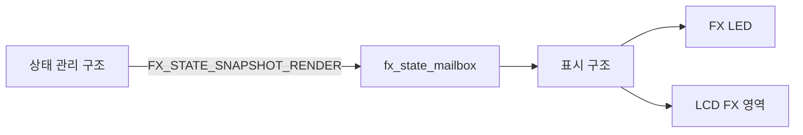
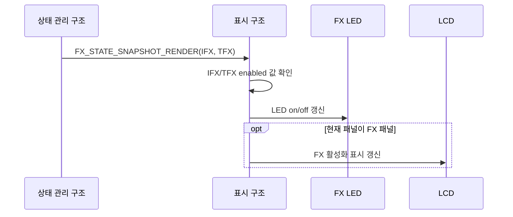
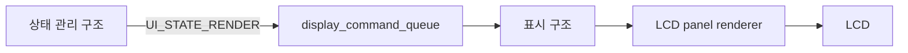
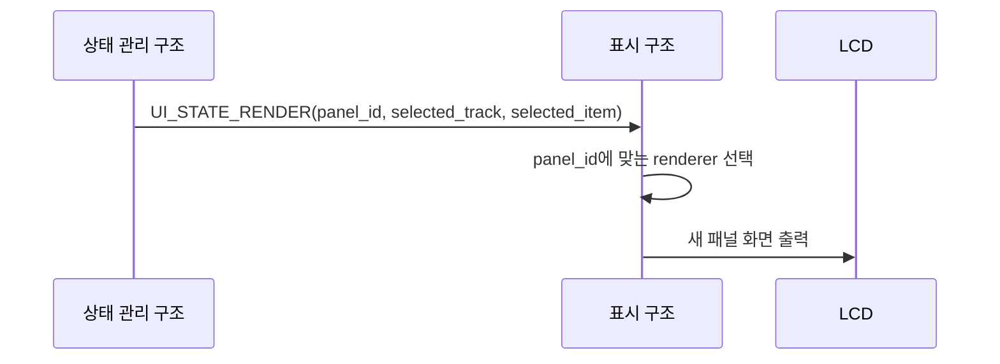
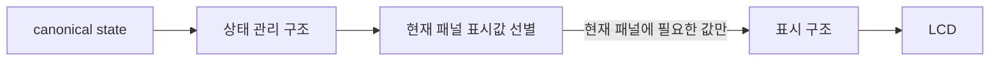
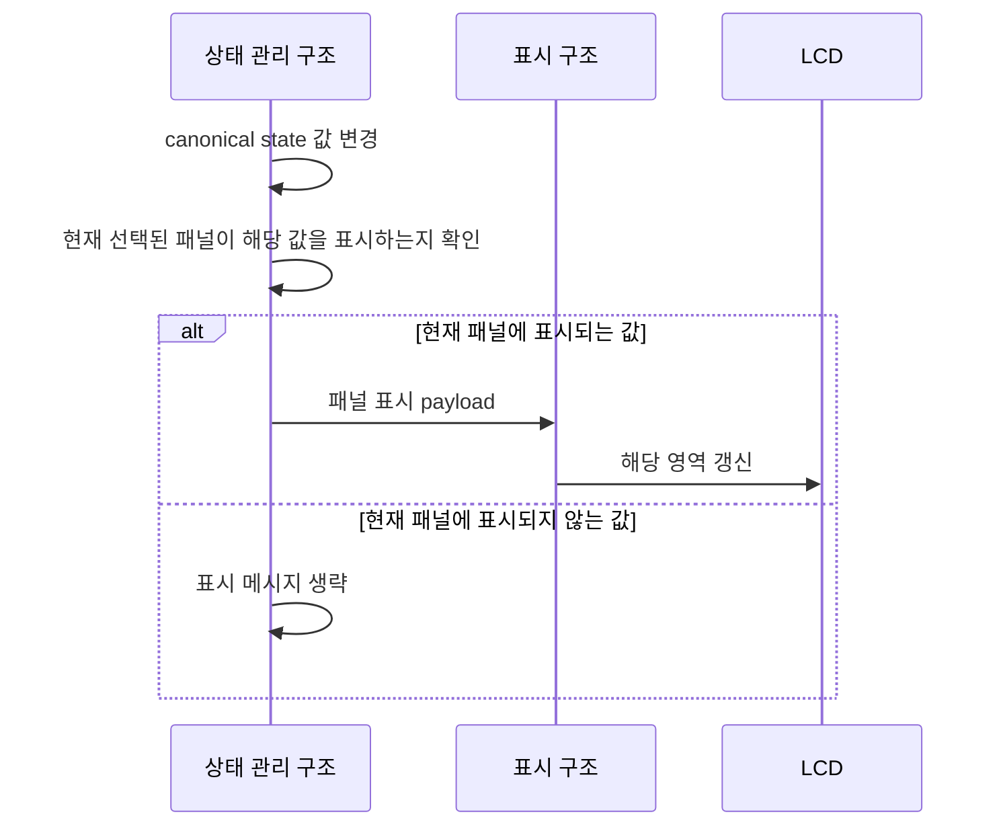
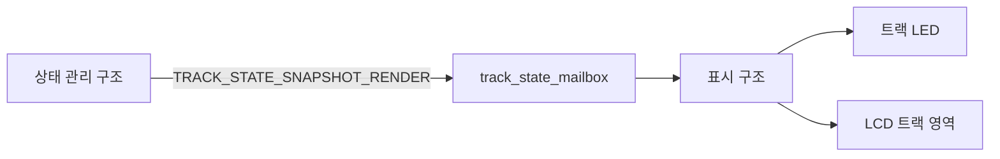
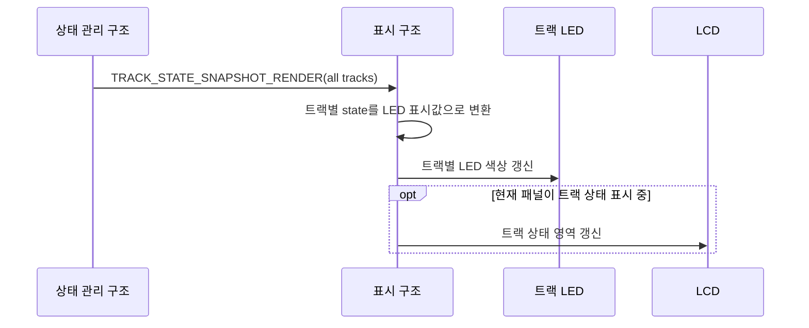
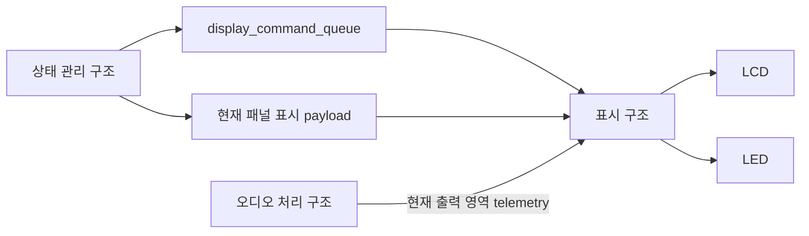

# 표시 및 피드백 아키텍처

이 문서는 루프스테이션 요구사항 중 `REQ-DISPLAY` 항목을 만족시키기 위한 표시 및 피드백 구조를 정의한다.
요구사항 문서는 시스템이 사용자에게 어떤 상태를 보여야 하는지를 설명하고, 이 문서는 상태 변경을 LCD와 LED 표시로 반영하기 위한 내부 구조를 설명한다.

## 1. 설계 범위

| 항목 | 내용 |
| --- | --- |
| 대상 요구사항 | `REQ-DISPLAY-001`, `REQ-DISPLAY-002`, `REQ-DISPLAY-003`, `REQ-DISPLAY-004` |
| 포함 범위 | FX LED 표시, LCD 패널 전환, 표시값 갱신, 트랙 상태 LED 표시, 표시 메시지 queue/mailbox 구조 |
| 연관 설계 | 사용자 입력, 트랙 생명주기, 오디오 효과, 실시간 동작 |
| 제외 범위 | 사용자 입력 해석, FX 알고리즘, 트랙 상태 전이 판단, LCD 드라이버 초기화 코드 세부 구현 |

## 2. 관련 요구사항

| 요구사항 ID | 요구사항 요약 | 이 문서의 설계 관점 |
| --- | --- | --- |
| `REQ-DISPLAY-001` | FX 활성화 상태에 따라 표시등을 켜거나 끈다. | FX 상태 snapshot을 받아 IFX/TFX LED 상태를 갱신한다. |
| `REQ-DISPLAY-002` | 선택된 디스플레이 패널을 화면에 출력한다. | 상태 관리 구조가 선택한 panel id를 표시 command로 전달한다. |
| `REQ-DISPLAY-003` | 선택된 패널에 표시될 값이 바뀌면 화면의 값을 갱신한다. | 상태 관리 구조가 현재 패널에 필요한 값만 선별해 표시 구조로 전달한다. |
| `REQ-DISPLAY-004` | 각 트랙 상태를 표시등의 색으로 표현한다. | 모든 트랙의 상태 snapshot을 받아 트랙 LED 색을 일관되게 갱신한다. |

## 3. 요구사항별 설계

### 3.1 REQ-DISPLAY-001 설계

`REQ-DISPLAY-001`은 FX 조작 결과가 FX 활성화 표시등에 즉시 반영되어야 한다는 요구사항이다.
FX 활성화 여부는 상태 관리 구조가 canonical state로 소유하고, 표시 구조는 전달받은 FX 상태 snapshot을 기준으로 LED와 LCD 표시를 갱신한다.

#### 3.1.1 필요 아키텍처

| 설계 ID | 아키텍처 항목 | 역할 | 설계 결정 |
| --- | --- | --- | --- |
| `ARCH-DISPLAY-001` | FX 상태 snapshot | IFX/TFX 선택 FX와 활성화 상태를 한 번에 표현한다. | `FX_STATE_SNAPSHOT_RENDER`를 사용한다. |
| `ARCH-DISPLAY-002` | FX 상태 mailbox | 최신 FX 상태만 유지한다. | `fx_state_mailbox`를 overwritable queue로 둔다. |
| `ARCH-DISPLAY-003` | FX LED renderer | 활성화 여부를 LED on/off로 변환한다. | 표시 구조는 상태 판단 없이 payload를 표시한다. |
| `ARCH-DISPLAY-004` | FX LCD renderer | 현재 FX 패널에 표시되는 활성화 상태를 갱신한다. | 표시 중인 패널이 FX 관련이면 LCD 값도 갱신한다. |

#### 3.1.2 구조 다이어그램

#### 3.1.3 동작 시나리오

#### 3.1.4 개발해야 할 기능

| 기능 문서 | 기능 | 목적 |
| --- | --- | --- |
| `FEAT-led-status-rendering.md` | FX LED 렌더링 | FX 활성화 상태를 LED on/off로 표시한다. |
| `FEAT-display-mailbox-update.md` | FX 상태 mailbox 처리 | 최신 FX 상태 snapshot을 표시 구조에 반영한다. |

### 3.2 REQ-DISPLAY-002 설계

`REQ-DISPLAY-002`는 사용자 입력으로 선택된 패널을 LCD에 출력해야 한다는 요구사항이다.
패널 선택은 상태 관리 구조가 결정하고, 표시 구조는 `UI_STATE_RENDER` command를 받아 해당 패널을 그린다.

#### 3.2.1 필요 아키텍처

| 설계 ID | 아키텍처 항목 | 역할 | 설계 결정 |
| --- | --- | --- | --- |
| `ARCH-DISPLAY-005` | UI 상태 command | 새 panel id와 선택 항목을 전달한다. | `UI_STATE_RENDER`를 사용한다. |
| `ARCH-DISPLAY-006` | display command queue | 패널 전환처럼 누락되면 안 되는 표시 명령을 순서대로 처리한다. | `display_command_queue`를 일반 queue로 둔다. |
| `ARCH-DISPLAY-007` | panel renderer | panel id별 화면 구성을 그린다. | 홈, 트랙, FX, 설정, 진단 패널 renderer를 분리한다. |
| `ARCH-DISPLAY-008` | 선택 항목 표시 | 현재 선택 track/item을 강조한다. | `selected_track`, `selected_item`을 payload에 포함한다. |

#### 3.2.2 구조 다이어그램

#### 3.2.3 동작 시나리오

#### 3.2.4 개발해야 할 기능

| 기능 문서 | 기능 | 목적 |
| --- | --- | --- |
| `FEAT-DISPLAY-001.md` | `UI_STATE_RENDER` payload 정의 | 선택된 패널과 선택 항목을 표시 command로 표현한다. |
| `FEAT-DISPLAY-002.md` | display command queue 수신 | 패널 전환 command를 누락 없이 queue에 보관한다. |
| `FEAT-DISPLAY-003.md` | display command dequeue | 표시 구조가 패널 전환 command를 순서대로 읽는다. |
| `FEAT-DISPLAY-004.md` | 패널 렌더러 선택 | `panel_id`에 맞는 renderer를 선택한다. |
| `FEAT-DISPLAY-005.md` | 패널 선택 context 갱신 | 현재 표시 패널과 선택 항목 context를 갱신한다. |
| `FEAT-DISPLAY-006.md` | LCD 패널 frame 생성 | 선택된 panel renderer가 출력 frame을 만든다. |
| `FEAT-DISPLAY-007.md` | LCD 출력 commit | 생성된 frame을 실제 LCD 출력으로 반영한다. |

### 3.3 REQ-DISPLAY-003 설계

`REQ-DISPLAY-003`은 선택된 디스플레이 패널에 표시될 값이 바뀌면 LCD 값이 갱신되어야 한다는 요구사항이다.
원본 값은 상태 관리 구조가 항상 최신 상태로 유지하지만, 표시 구조가 모든 패널의 파라미터와 설정값을 최신으로 보관할 필요는 없다.
상태 관리 구조는 현재 선택된 패널이 실제로 출력해야 하는 값만 표시 구조에 전달한다.

#### 3.3.1 필요 아키텍처

| 설계 ID | 아키텍처 항목 | 역할 | 설계 결정 |
| --- | --- | --- | --- |
| `ARCH-DISPLAY-009` | 표시 대상 선별 | 현재 패널이 표시해야 하는 값만 표시 메시지로 만든다. | 상태 관리 구조가 current panel과 변경된 canonical state를 비교한다. |
| `ARCH-DISPLAY-010` | 패널 표시 payload | 선택된 패널을 그리는 데 필요한 값만 묶어 보낸다. | 트랙 설정 패널이면 선택 트랙의 표시 항목만, FX 패널이면 선택 FX의 표시 항목만 전달한다. |
| `ARCH-DISPLAY-011` | 패널 전환 초기 payload | 패널이 바뀌면 새 패널의 초기 출력에 필요한 값만 함께 전달한다. | `UI_STATE_RENDER` 이후 현재 패널 표시 payload를 별도로 전송한다. |
| `ARCH-DISPLAY-012` | 표시 구조 최소 상태 | 표시 구조는 화면 출력에 필요한 최신 payload만 보관한다. | 표시하지 않는 패널의 파라미터를 별도 최신값으로 유지하지 않는다. |
| `ARCH-DISPLAY-013` | telemetry 표시 | 레벨 미터처럼 현재 화면에 항상 노출되는 값만 직접 표시 구조로 보낼 수 있다. | 현재 출력 영역에 없는 telemetry는 표시 갱신 대상이 아니다. |

#### 3.3.2 구조 다이어그램

#### 3.3.3 동작 시나리오

#### 3.3.4 개발해야 할 기능

| 기능 문서 | 기능 | 목적 |
| --- | --- | --- |
| `FEAT-display-mailbox-update.md` | 현재 패널 표시값 갱신 | 현재 패널에 필요한 표시 payload만 받아 LCD 갱신 여부를 결정한다. |
| `FEAT-level-meter-rendering.md` | 레벨 미터 렌더링 | 입력/출력 레벨 telemetry를 화면에 표시한다. |

### 3.4 REQ-DISPLAY-004 설계

`REQ-DISPLAY-004`는 각 트랙 상태를 LED 색상으로 표현해야 한다는 요구사항이다.
트랙 상태는 여러 트랙이 동시에 변할 수 있으므로 단일 트랙 메시지 대신 전체 트랙 상태 snapshot을 전달한다.

#### 3.4.1 필요 아키텍처

| 설계 ID | 아키텍처 항목 | 역할 | 설계 결정 |
| --- | --- | --- | --- |
| `ARCH-DISPLAY-014` | 트랙 상태 snapshot | 모든 트랙 상태와 LED 표시값을 묶어 전달한다. | `TRACK_STATE_SNAPSHOT_RENDER`를 사용한다. |
| `ARCH-DISPLAY-015` | 트랙 상태 mailbox | 최신 트랙 상태 snapshot만 유지한다. | `track_state_mailbox`를 overwritable queue로 둔다. |
| `ARCH-DISPLAY-016` | LED 색상 mapping | 트랙 상태를 LED 색상으로 변환한다. | `IDLE`, `RECORDING`, `PLAYING`, `OVERDUBBING`, `STOPPED` 색상을 매핑한다. |
| `ARCH-DISPLAY-017` | LCD 트랙 상태 표시 | 트랙 패널이 표시 중이면 상태 문자열과 길이를 함께 갱신한다. | snapshot payload의 track list를 사용한다. |

#### 3.4.2 구조 다이어그램

#### 3.4.3 동작 시나리오

#### 3.4.4 개발해야 할 기능

| 기능 문서 | 기능 | 목적 |
| --- | --- | --- |
| `FEAT-led-status-rendering.md` | 트랙 LED 렌더링 | 트랙 상태를 색상으로 표시한다. |
| `FEAT-lcd-panel-rendering.md` | 트랙 상태 LCD 렌더링 | 트랙 패널에 상태와 길이 정보를 표시한다. |

## 4. 공통 설계 정보

### 4.1 전체 표시 경로

설계 ID: `ARCH-DISPLAY-018`

### 4.2 Queue와 mailbox

| 설계 ID | 채널 | 수신 방식 | 사용 기준 |
| --- | --- | --- | --- |
| `ARCH-DISPLAY-019` | `display_command_queue` | 일반 queue | 초기화, 패널 전환, 밝기 변경처럼 순서와 누락 방지가 중요한 명령 |
| `ARCH-DISPLAY-020` | `track_state_mailbox` | overwritable mailbox | 모든 트랙의 최신 상태 snapshot |
| `ARCH-DISPLAY-021` | `track_param_mailbox` | overwritable mailbox | 현재 선택된 트랙 설정 패널에 표시할 파라미터 payload |
| `ARCH-DISPLAY-022` | `fx_state_mailbox` | overwritable mailbox | IFX/TFX 선택과 활성화 상태 snapshot |
| `ARCH-DISPLAY-023` | `fx_param_mailbox` | overwritable mailbox | 현재 선택된 FX 패널에 표시할 파라미터 payload |
| `ARCH-DISPLAY-024` | `system_mailbox` | overwritable mailbox | 현재 선택된 시스템 패널에 표시할 설정 payload |
| `ARCH-DISPLAY-025` | `diagnostic_mailbox` | overwritable mailbox | 현재 선택된 하드웨어 점검 패널에 표시할 진단 payload |
| `ARCH-DISPLAY-026` | `track_position_mailbox` | overwritable mailbox | 현재 패널의 진행률 영역에 표시할 트랙 위치 telemetry |
| `ARCH-DISPLAY-027` | `level_meter_mailbox` | overwritable mailbox | 현재 출력 영역에 표시할 입력/출력 레벨 telemetry |

`track_param_mailbox`, `fx_param_mailbox`, `system_mailbox`, `diagnostic_mailbox`는 전체 상태 cache가 아니라 현재 선택된 패널을 출력하는 데 필요한 payload만 담는다.
표시 구조는 이 채널들을 통해 전달받은 값을 LCD 출력용 최소 상태로만 보관하고, canonical state의 최신성은 상태 관리 구조가 책임진다.

### 4.3 LED 표시 기준

| 대상 | 상태 | 표시 |
| --- | --- | --- |
| FX | 활성화 | on |
| FX | 비활성화 | off |
| 트랙 | `IDLE` | off |
| 트랙 | `RECORDING` | 빨간색 |
| 트랙 | `PLAYING` | 초록색 |
| 트랙 | `OVERDUBBING` | 노란색 |
| 트랙 | `STOPPED` | 파란색 |

## 5. 기능 문서 작성 대상

| 기능 문서 | 목적 | 주요 입력 | 주요 출력 |
| --- | --- | --- | --- |
| `FEAT-DISPLAY-001.md` | 선택된 패널과 선택 항목을 `UI_STATE_RENDER` payload로 정의한다. | panel id, selected item | `UiStateRenderPayload` |
| `FEAT-DISPLAY-002.md` | 패널 전환 command를 `display_command_queue`에 보관한다. | `UI_STATE_RENDER` | queued display command |
| `FEAT-DISPLAY-003.md` | 표시 구조가 display command를 순서대로 읽는다. | `display_command_queue` | display command dispatch request |
| `FEAT-DISPLAY-004.md` | `panel_id`에 맞는 LCD panel renderer를 선택한다. | panel id | panel render request |
| `FEAT-DISPLAY-005.md` | 현재 표시 패널과 선택 항목 context를 갱신한다. | `UiStateRenderPayload` | display panel context |
| `FEAT-DISPLAY-006.md` | 선택된 패널의 LCD frame을 생성한다. | panel render request | LCD frame buffer |
| `FEAT-DISPLAY-007.md` | LCD frame을 실제 출력으로 반영한다. | LCD frame buffer | LCD output |
| `FEAT-display-mailbox-update.md` | 현재 패널에 필요한 표시 메시지를 읽고 갱신 여부를 결정한다. | display message | render request |
| `FEAT-lcd-panel-rendering.md` | 선택된 LCD 패널과 전달받은 표시값을 그린다. | panel id, display payload | LCD output |
| `FEAT-led-status-rendering.md` | FX와 트랙 LED 상태를 갱신한다. | FX/track state snapshot | LED output |
| `FEAT-level-meter-rendering.md` | 오디오 레벨 telemetry를 레벨 미터로 표시한다. | level meter payload | LCD meter output |

## 6. 미정 사항

| 항목 | 결정 필요 내용 | 영향 |
| --- | --- | --- |
| LED 실제 색상 출력 방식 | LED 종류와 MCP23017 pin mapping을 확정해야 한다. | LED renderer |
| LCD redraw 범위 | 전체 redraw와 부분 redraw 기준을 정해야 한다. | 표시 성능 |
| mailbox poll 주기 | 표시 태스크가 mailbox를 확인하는 주기를 정해야 한다. | 표시 응답성 |
| 레벨 미터 scaling | audio level 값을 화면 높이로 변환하는 기준을 정해야 한다. | 사용자 피드백 품질 |
