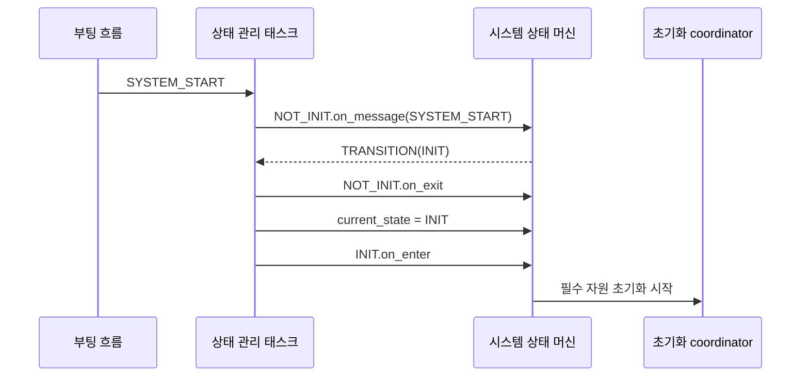
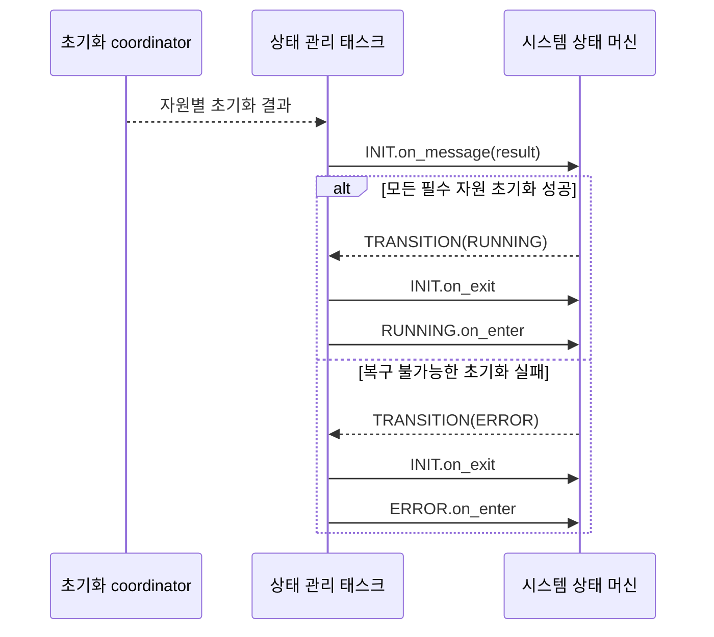
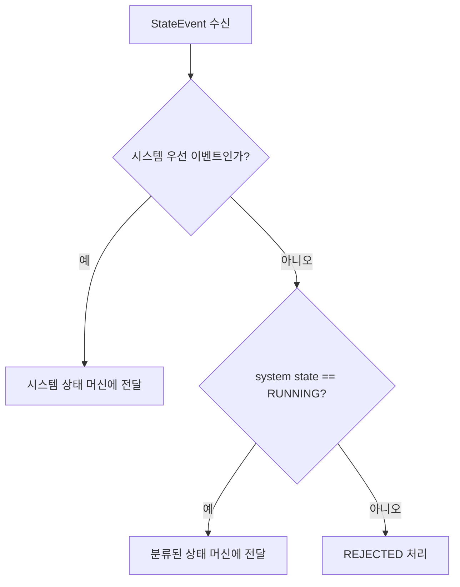
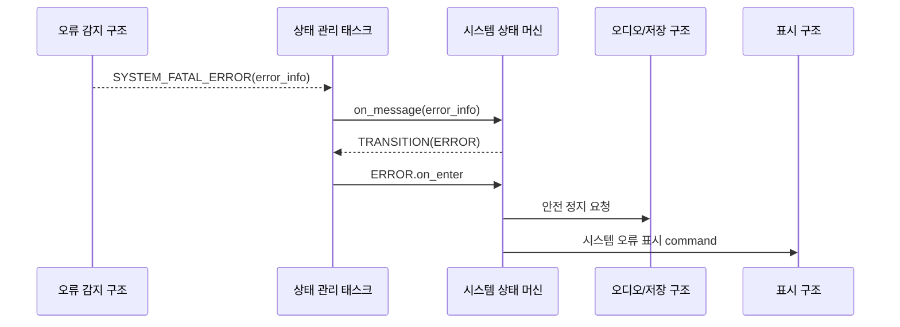
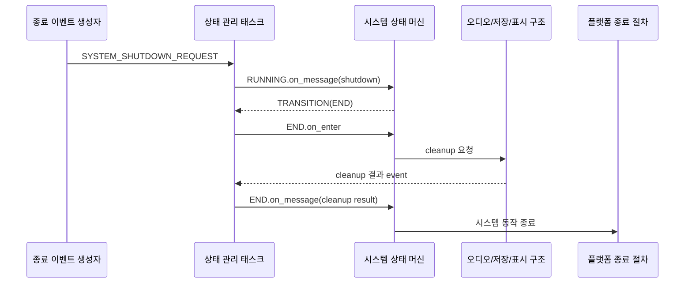
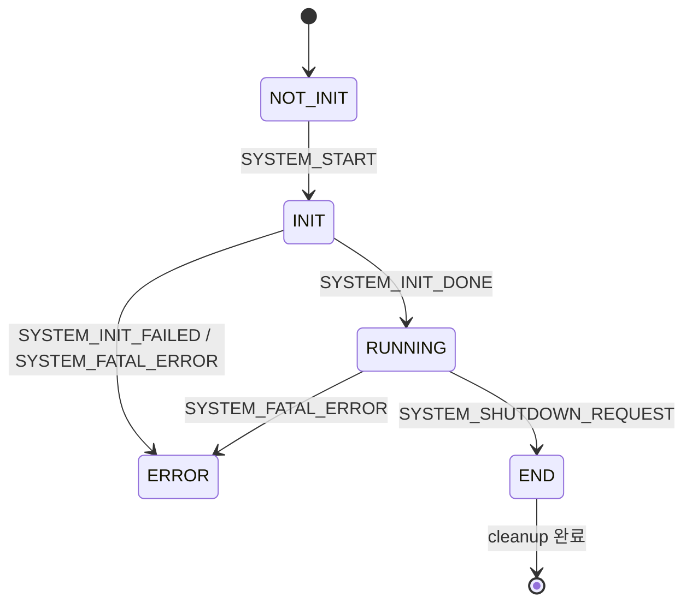

# 시스템 상태 머신 아키텍처

이 문서는 루프스테이션 요구사항 중 `REQ-STATE-SYSTEM` 항목을 만족시키기 위한 시스템 상태 머신 구조를 정의한다.
상태 머신의 등록, 공통 생명주기, 이벤트 위임과 처리 결과 계약은 `ARCH-STATE.md`를 따르며, 이 문서는 시스템 상태의 종류와 전이 조건 및 다른 상태 머신의 실행 허용 기준을 설명한다.

## 1. 설계 범위

| 항목 | 내용 |
| --- | --- |
| 대상 요구사항 | `REQ-STATE-SYSTEM-001` ~ `REQ-STATE-SYSTEM-010` |
| 포함 범위 | 시스템 초기 상태, 자원 초기화, 정상 실행 진입, 일반 이벤트 gate, 복구 불가능 오류, 종료 요청과 cleanup |
| 연관 설계 | 상태 머신 공통 구조, 실시간 동작 및 오류 대응, 사용자 입력, 표시 및 피드백, 저장 및 불러오기 |
| 제외 범위 | peripheral별 초기화 코드, 개별 오류의 복구 알고리즘, 전원 차단 회로 제어, 다른 상태 머신의 상태 종류와 전이 조건 |

## 2. 관련 요구사항

| 요구사항 ID | 요구사항 요약 | 이 문서의 설계 관점 |
| --- | --- | --- |
| `REQ-STATE-SYSTEM-001` | 전원 인가 후 초기화되지 않은 상태에서 시작한다. | 시스템 상태 머신의 초기 상태를 `NOT_INIT`으로 등록한다. |
| `REQ-STATE-SYSTEM-002` | 초기화되지 않은 상태에서 초기화 상태로 전환한다. | 시작 이벤트를 처리해 `NOT_INIT -> INIT` 전이를 수행한다. |
| `REQ-STATE-SYSTEM-003` | 초기화 상태에서 필요한 자원을 준비한다. | `INIT` 진입 후 초기화 대상의 완료와 실패 결과를 수집한다. |
| `REQ-STATE-SYSTEM-004` | 초기화가 완료되면 정상 실행 상태로 전환한다. | 모든 필수 초기화 결과가 성공하면 `RUNNING`으로 전이한다. |
| `REQ-STATE-SYSTEM-005` | 초기화 중 복구 불가능한 오류가 발생하면 오류 상태로 전환한다. | 필수 초기화 실패를 치명 오류로 분류해 `ERROR`로 전이한다. |
| `REQ-STATE-SYSTEM-006` | 정상 실행 상태에서만 일반 기능 이벤트를 처리한다. | 시스템 상태가 `RUNNING`인 경우에만 다른 상태 머신으로 일반 이벤트를 dispatch한다. |
| `REQ-STATE-SYSTEM-007` | 정상 실행 중 복구 불가능한 오류가 발생하면 오류 상태로 전환한다. | 치명 오류 이벤트를 우선 처리해 `RUNNING -> ERROR` 전이를 수행한다. |
| `REQ-STATE-SYSTEM-008` | 정상 실행 중 종료 이벤트가 발생하면 종료 상태로 전환한다. | 종료 요청을 처리해 `RUNNING -> END` 전이를 수행한다. |
| `REQ-STATE-SYSTEM-009` | 종료 상태에서 자원을 정리한 뒤 시스템 동작을 종료한다. | `END` 진입 후 cleanup 완료를 확인하고 기능 처리를 종료한다. |
| `REQ-STATE-SYSTEM-010` | 오류 상태에서 일반 기능을 차단하고 오류를 표시한다. | `ERROR` 진입 시 일반 command 생성을 차단하고 오류 표시를 요청한다. |

## 3. 요구사항별 설계

### 3.1 REQ-STATE-SYSTEM-001 ~ REQ-STATE-SYSTEM-003 설계

시스템 상태 머신은 전원 인가 후 `NOT_INIT`으로 등록된다.
상태 관리 태스크가 시작 이벤트를 전달하면 `INIT`으로 전이하고, `INIT` 진입 동작에서 루프스테이션 실행에 필요한 필수 자원의 초기화를 시작한다.

| 설계 ID | 아키텍처 항목 | 역할 | 설계 결정 |
| --- | --- | --- | --- |
| `ARCH-STATE-SYSTEM-001` | 시스템 상태 모델 | 시스템 생명주기의 canonical state를 유지한다. | `NOT_INIT`, `INIT`, `RUNNING`, `END`, `ERROR`를 정적 상태로 둔다. |
| `ARCH-STATE-SYSTEM-002` | 시스템 초기 상태 | 전원 인가 직후의 상태를 고정한다. | 초기 상태 참조를 `NOT_INIT`으로 등록한다. |
| `ARCH-STATE-SYSTEM-003` | 시작 이벤트 | 초기화 시작 시점을 명시한다. | `SYSTEM_START` 처리 시 `NOT_INIT -> INIT`으로 전이한다. |
| `ARCH-STATE-SYSTEM-004` | 초기화 context | 필수 자원의 준비 결과를 추적한다. | 초기화 대상별 pending, success, failure 상태를 system context에 보관한다. |
| `ARCH-STATE-SYSTEM-005` | 초기화 시작 | 필수 자원의 준비를 요청한다. | `INIT.on_enter`에서 초기화 coordinator를 시작하고 결과 이벤트를 기다린다. |

### 3.2 REQ-STATE-SYSTEM-004 및 REQ-STATE-SYSTEM-005 설계

초기화 결과는 성공과 실패를 구분해 시스템 상태 머신으로 전달한다.
모든 필수 초기화가 완료되면 `RUNNING`으로 전이하고, 하나라도 복구 불가능한 실패로 판정되면 `ERROR`로 전이한다.

| 설계 ID | 아키텍처 항목 | 역할 | 설계 결정 |
| --- | --- | --- | --- |
| `ARCH-STATE-SYSTEM-006` | 초기화 결과 수집 | 비동기 초기화 완료 여부를 집계한다. | 자원별 결과 이벤트를 system context에 반영한다. |
| `ARCH-STATE-SYSTEM-007` | 초기화 성공 판정 | 정상 실행 진입 조건을 결정한다. | 모든 필수 자원이 success일 때 `SYSTEM_INIT_DONE`을 확정한다. |
| `ARCH-STATE-SYSTEM-008` | 초기화 실패 판정 | 초기화 중단 조건을 결정한다. | 필수 자원의 복구 불가능한 failure를 `SYSTEM_INIT_FAILED`로 확정한다. |
| `ARCH-STATE-SYSTEM-009` | 초기화 결과 전이 | 결과에 따라 다음 상태를 선택한다. | `SYSTEM_INIT_DONE`은 `RUNNING`, `SYSTEM_INIT_FAILED`는 `ERROR`로 전이한다. |

### 3.3 REQ-STATE-SYSTEM-006 설계

시스템 상태 머신은 다른 상태 머신의 실행 허용 여부를 결정하는 gate다.
상태 관리 태스크는 시스템 생명주기와 오류 이벤트는 현재 시스템 상태와 관계없이 시스템 상태 머신에 전달하지만, 일반 기능 이벤트는 시스템 상태가 `RUNNING`일 때만 대상 상태 머신에 전달한다.

| 설계 ID | 아키텍처 항목 | 역할 | 설계 결정 |
| --- | --- | --- | --- |
| `ARCH-STATE-SYSTEM-010` | RUNNING gate | 일반 기능의 실행 가능 여부를 제공한다. | system state가 `RUNNING`이면 일반 이벤트 dispatch를 허용한다. |
| `ARCH-STATE-SYSTEM-011` | 시스템 우선 이벤트 | 생명주기와 치명 오류 처리가 gate에 막히지 않게 한다. | 시작, 초기화 결과, 종료, 치명 오류 이벤트는 시스템 상태 머신에 우선 전달한다. |
| `ARCH-STATE-SYSTEM-012` | 비활성 상태 처리 | 초기화 전, 종료 중, 오류 상태의 일반 동작을 차단한다. | 일반 이벤트는 대상 상태 머신에 전달하지 않고 `REJECTED`로 처리한다. |
| `ARCH-STATE-SYSTEM-013` | 상태 머신 활성화 | 정상 실행 진입 시 도메인 상태 머신의 생명주기를 시작한다. | `RUNNING.on_enter` 완료 후 등록된 일반 상태 머신의 초기 진입을 허용한다. |

### 3.4 REQ-STATE-SYSTEM-007 및 REQ-STATE-SYSTEM-010 설계

복구 불가능한 오류는 시스템 상태 머신에 전달되는 치명 오류 이벤트로 정규화한다.
`RUNNING` 또는 `INIT`에서 치명 오류를 수신하면 `ERROR`로 전이하며, `ERROR` 진입 이후에는 일반 기능 이벤트와 command 생성을 차단하고 오류 표시를 요청한다.

| 설계 ID | 아키텍처 항목 | 역할 | 설계 결정 |
| --- | --- | --- | --- |
| `ARCH-STATE-SYSTEM-014` | 치명 오류 이벤트 | 오류 발생 위치와 무관하게 시스템 오류 전이를 요청한다. | `SYSTEM_FATAL_ERROR`에 오류 원인과 발생 주체를 포함한다. |
| `ARCH-STATE-SYSTEM-015` | 오류 상태 전이 | 복구 불가능한 시스템 동작을 중단한다. | `INIT`과 `RUNNING`에서 `SYSTEM_FATAL_ERROR` 수신 시 `ERROR`로 전이한다. |
| `ARCH-STATE-SYSTEM-016` | 기능 차단 | 오류 상태에서 추가 동작이 실행되는 것을 막는다. | `ERROR`에서는 진단과 종료 정책 이외의 이벤트를 `REJECTED`로 처리한다. |
| `ARCH-STATE-SYSTEM-017` | 오류 표시 | 사용자가 오류 상태와 원인을 확인하게 한다. | `ERROR.on_enter`에서 오류 표시 command를 표시 구조로 보낸다. |
| `ARCH-STATE-SYSTEM-018` | 안전 정지 요청 | 진행 중인 기능을 더 이상 계속하지 않게 한다. | `ERROR.on_enter`에서 오디오와 저장 구조에 안전 정지 요청을 보낸다. |

### 3.5 REQ-STATE-SYSTEM-008 및 REQ-STATE-SYSTEM-009 설계

종료 이벤트는 `RUNNING`에서만 정상 종료 전이를 발생시킨다.
`END` 진입 후 새 일반 이벤트를 차단하고, 사용 중인 자원의 cleanup 결과를 수집한 다음 플랫폼 종료 절차를 실행한다.

| 설계 ID | 아키텍처 항목 | 역할 | 설계 결정 |
| --- | --- | --- | --- |
| `ARCH-STATE-SYSTEM-019` | 종료 요청 | 정상 종료 시작 시점을 명시한다. | `SYSTEM_SHUTDOWN_REQUEST` 처리 시 `RUNNING -> END`로 전이한다. |
| `ARCH-STATE-SYSTEM-020` | cleanup 시작 | 사용 중인 자원의 정리를 요청한다. | `END.on_enter`에서 오디오 정지, 파일 finalize와 표시 종료 처리를 요청한다. |
| `ARCH-STATE-SYSTEM-021` | cleanup 결과 수집 | 종료 가능한 시점을 판단한다. | 필수 cleanup 대상의 완료와 실패 결과를 system context에 기록한다. |
| `ARCH-STATE-SYSTEM-022` | 시스템 동작 종료 | cleanup 후 기능 처리를 끝낸다. | 모든 필수 cleanup이 종료되면 일반 이벤트 수신을 중단하고 플랫폼 종료 절차를 호출한다. |

## 4. 공통 설계 정보

### 4.1 시스템 상태 머신

### 4.2 상태별 책임

| 상태 | 진입 동작 | 처리하는 주요 이벤트 | 일반 기능 이벤트 |
| --- | --- | --- | --- |
| `NOT_INIT` | 초기 system context를 확인한다. | `SYSTEM_START` | 차단 |
| `INIT` | 필수 자원 초기화를 시작한다. | 초기화 결과, `SYSTEM_FATAL_ERROR` | 차단 |
| `RUNNING` | 일반 상태 머신의 실행을 허용한다. | 종료 요청, `SYSTEM_FATAL_ERROR` | 허용 |
| `END` | cleanup을 시작하고 완료를 확인한다. | cleanup 결과 | 차단 |
| `ERROR` | 안전 정지와 오류 표시를 요청한다. | 진단 및 향후 정의할 종료 이벤트 | 차단 |

### 4.3 주요 이벤트와 command

| 이름 | 방향 | 용도 |
| --- | --- | --- |
| `SYSTEM_START` | 부팅 흐름 -> 상태 관리 구조 | `NOT_INIT -> INIT` 전이 요청 |
| `SYSTEM_INIT_DONE` | 초기화 coordinator -> 시스템 상태 머신 | 필수 초기화 성공 확정 |
| `SYSTEM_INIT_FAILED` | 초기화 coordinator -> 시스템 상태 머신 | 복구 불가능한 초기화 실패 확정 |
| `SYSTEM_FATAL_ERROR` | 오류 감지 구조 -> 시스템 상태 머신 | 실행 중 복구 불가능 오류 보고 |
| `SYSTEM_SHUTDOWN_REQUEST` | 종료 이벤트 생성자 -> 시스템 상태 머신 | 정상 종료 요청 |
| cleanup 요청/결과 | 시스템 상태 머신 <-> 관련 구조 | 종료 전 자원 정리 |
| 시스템 오류 표시 command | 시스템 상태 머신 -> 표시 구조 | 오류 상태와 원인 표시 |

## 5. 기능 문서 작성 대상

| 기능 문서 | 목적 | 주요 입력 | 주요 출력 |
| --- | --- | --- | --- |
| `FEAT-STATE-SYSTEM-001.md` | 시스템 상태와 초기 context를 생성한다. | 시스템 등록 정보 | `NOT_INIT` 상태 머신 |
| `FEAT-STATE-SYSTEM-002.md` | 필수 자원 초기화 결과를 수집하고 성공 또는 실패를 판정한다. | 자원별 초기화 결과 | init done/failed event |
| `FEAT-STATE-SYSTEM-003.md` | `RUNNING` 상태에 따른 일반 이벤트 gate를 구현한다. | system state, state event | dispatch 또는 rejected result |
| `FEAT-STATE-SYSTEM-004.md` | 치명 오류를 `ERROR` 전이와 안전 정지로 연결한다. | fatal error event | error state, stop/display command |
| `FEAT-STATE-SYSTEM-005.md` | 종료 요청과 cleanup 완료 흐름을 구현한다. | shutdown event, cleanup result | `END`, 플랫폼 종료 |

## 6. 미정 사항

| 항목 | 결정 필요 내용 | 영향 |
| --- | --- | --- |
| 초기화 대상 목록 | `RUNNING` 진입 전에 반드시 성공해야 하는 자원 목록을 확정해야 한다. | init context와 성공 판정 |
| 초기화 재시도 | 복구 가능한 초기화 실패의 재시도 횟수와 timeout을 정해야 한다. | `INIT` 체류와 오류 분류 |
| ERROR 종료 정책 | `ERROR`에서 `END`로 전이하거나 재시작할 수 있는지 정해야 한다. | 오류 복구와 종료 전이 |
| cleanup 실패 | 종료 중 파일 finalize나 장치 정리에 실패했을 때 종료를 계속할지 정해야 한다. | `END` 완료 조건 |
| 플랫폼 종료 방식 | 전원 유지, 저전력 진입, MCU reset 중 실제 종료 동작을 정해야 한다. | `END` 최종 동작 |
