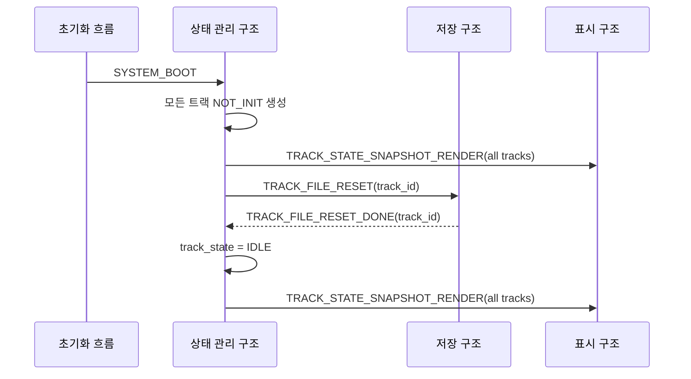
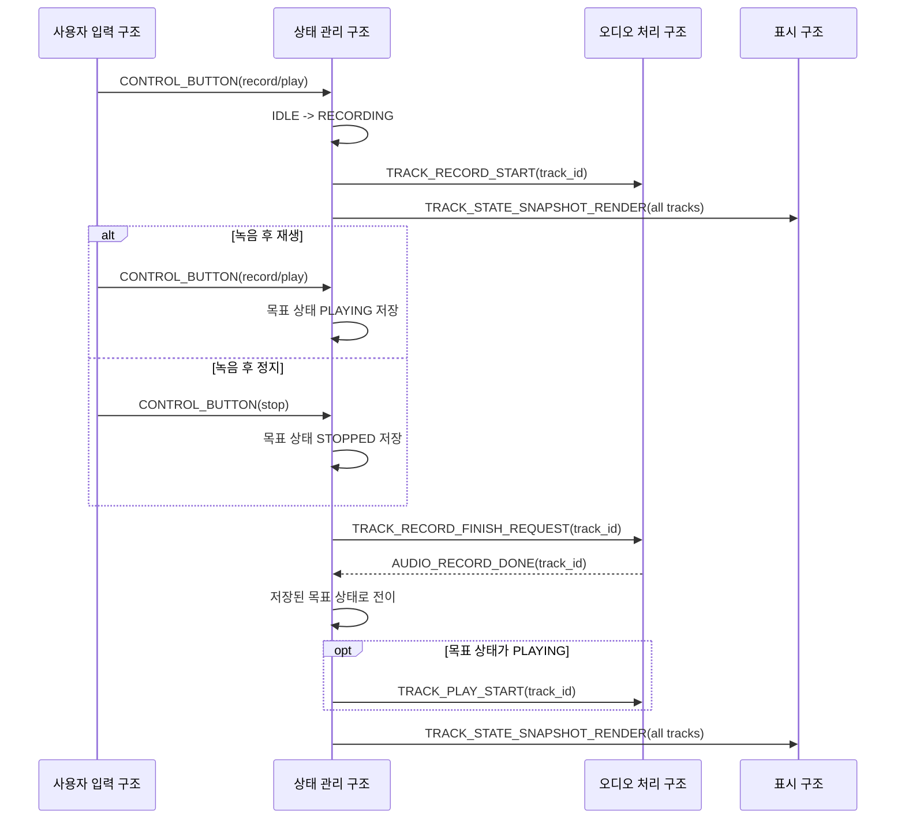
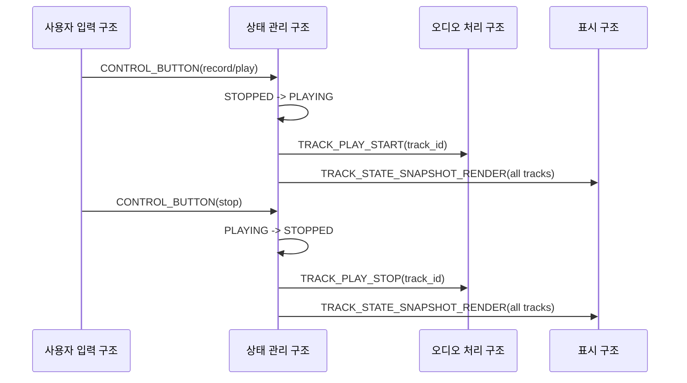
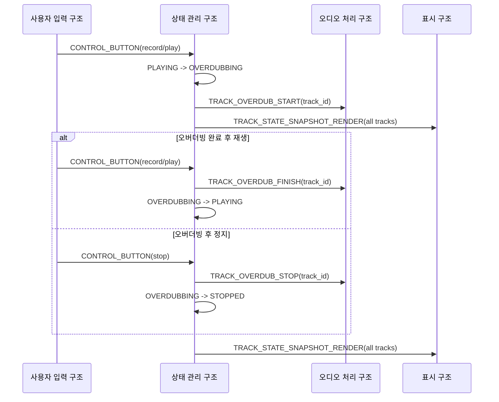
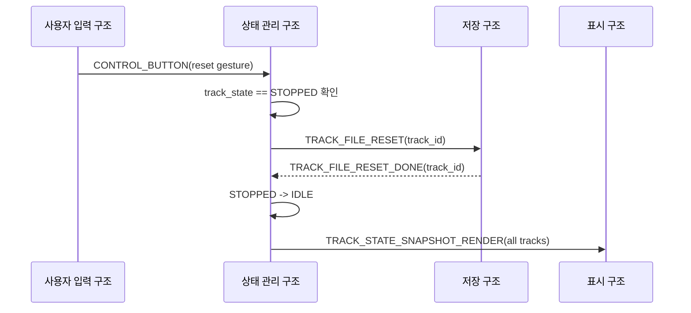
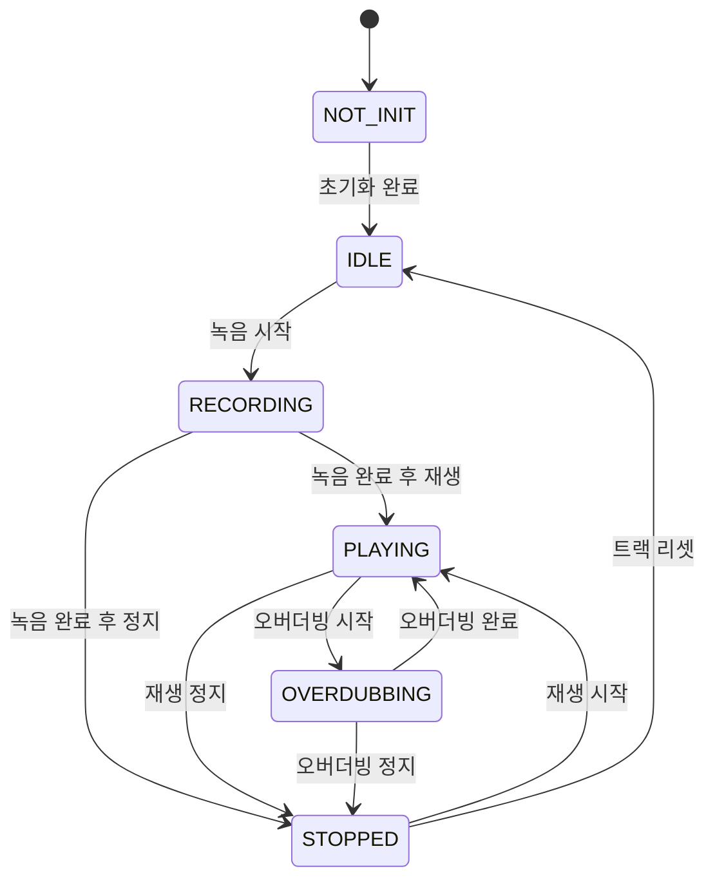

# 트랙 생명주기 아키텍처

이 문서는 루프스테이션 요구사항 중 `REQ-TRACK` 항목을 만족시키기 위한 트랙 상태 전이 구조를 정의한다.
요구사항 문서는 각 트랙이 어떤 상태로 전환되어야 하는지를 설명하고, 이 문서는 상태 관리 구조가 사용자 입력, 오디오 처리 결과, 저장 장치 결과를 어떻게 조합해 canonical track state를 유지하는지 설명한다.

## 1. 설계 범위

| 항목 | 내용 |
| --- | --- |
| 대상 요구사항 | `REQ-TRACK-001` ~ `REQ-TRACK-012` |
| 포함 범위 | 트랙 초기 상태, 초기화, 녹음, 재생, 오버더빙, 정지, 리셋, 상태 snapshot 표시 |
| 연관 설계 | 사용자 입력, 오디오 입출력, 저장 및 불러오기, 표시 및 피드백, 실시간 동작 |
| 제외 범위 | 오디오 sample 처리 알고리즘, SD 카드 파일 포맷 상세, LED/LCD 렌더링 세부 구현 |

## 2. 관련 요구사항

| 요구사항 ID | 요구사항 요약 | 이 문서의 설계 관점 |
| --- | --- | --- |
| `REQ-TRACK-001` | 전원 인가 이후 각 트랙을 초기화되지 않은 상태로 둔다. | 부팅 시 canonical track state를 `NOT_INIT`으로 생성한다. |
| `REQ-TRACK-002` | 초기화되지 않은 트랙을 초기화할 수 있어야 한다. | 상태 관리 구조가 저장 구조에 reset/open 준비를 요청한다. |
| `REQ-TRACK-003` | 초기화 완료 후 대기 상태로 전환한다. | 초기화 성공 결과를 받아 `IDLE`로 전이한다. |
| `REQ-TRACK-004` | 대기 상태에서 녹음 시작 입력 시 녹음 상태로 전환한다. | `IDLE -> RECORDING` 전이와 `TRACK_RECORD_START` command를 연결한다. |
| `REQ-TRACK-005` | 녹음 상태에서 정지 입력 시 정지 상태로 전환한다. | 녹음 종료 목표 상태를 `STOPPED`로 저장한다. |
| `REQ-TRACK-006` | 녹음 완료 입력 시 재생 상태로 전환한다. | `AUDIO_RECORD_DONE` 수신 후 저장된 목표 상태가 `PLAYING`이면 재생을 시작한다. |
| `REQ-TRACK-007` | 재생 상태에서 정지 입력 시 정지 상태로 전환한다. | `TRACK_PLAY_STOP` command와 `PLAYING -> STOPPED` 전이를 연결한다. |
| `REQ-TRACK-008` | 재생 상태에서 오버더빙 시작 입력 시 오버더빙 상태로 전환한다. | `TRACK_OVERDUB_START` command와 `PLAYING -> OVERDUBBING` 전이를 연결한다. |
| `REQ-TRACK-009` | 오버더빙 상태에서 정지 입력 시 정지 상태로 전환한다. | `TRACK_OVERDUB_STOP` command와 `OVERDUBBING -> STOPPED` 전이를 연결한다. |
| `REQ-TRACK-010` | 오버더빙 완료 입력 시 재생 상태로 전환한다. | `TRACK_OVERDUB_FINISH` command와 `OVERDUBBING -> PLAYING` 전이를 연결한다. |
| `REQ-TRACK-011` | 정지 상태에서 재생 시작 입력 시 재생 상태로 전환한다. | `TRACK_PLAY_START` command와 `STOPPED -> PLAYING` 전이를 연결한다. |
| `REQ-TRACK-012` | 정지 상태에서 리셋 입력 시 대기 상태로 전환한다. | 저장 구조의 트랙 초기화 결과를 받아 `IDLE`로 전이한다. |

## 3. 요구사항별 설계

### 3.1 REQ-TRACK-001 ~ REQ-TRACK-003 설계

부팅과 트랙 초기화 요구사항은 트랙 상태 모델의 시작점을 정의한다.
전원 인가 후 모든 트랙은 `NOT_INIT`으로 생성되고, 초기화 요청이 성공하면 `IDLE`로 전환된다.

| 설계 ID | 아키텍처 항목 | 역할 | 설계 결정 |
| --- | --- | --- | --- |
| `ARCH-TRACK-001` | 트랙 상태 모델 | 트랙별 canonical state를 저장한다. | 상태 관리 구조가 소유한다. |
| `ARCH-TRACK-002` | 초기화 요청 | 트랙 파일 또는 metadata를 사용할 수 있는 상태로 만든다. | 저장 구조에 `TRACK_FILE_RESET` 또는 준비 요청을 보낸다. |
| `ARCH-TRACK-003` | 초기화 결과 처리 | 성공/실패에 따라 상태를 갱신한다. | 성공 시 `IDLE`, 실패 시 오류 표시 경로로 보낸다. |
| `ARCH-TRACK-004` | 상태 표시 | 초기화 결과를 사용자에게 보여준다. | `TRACK_STATE_SNAPSHOT_RENDER`를 표시 구조로 보낸다. |

### 3.2 REQ-TRACK-004 ~ REQ-TRACK-006 설계

첫 녹음 요구사항은 `IDLE -> RECORDING -> PLAYING/STOPPED` 흐름을 정의한다.
녹음 종료 입력은 즉시 파일 기록을 끝내지 않고, 오디오 처리 구조가 실제 종료 frame까지 기록한 뒤 `AUDIO_RECORD_DONE`을 보고한다.

| 설계 ID | 아키텍처 항목 | 역할 | 설계 결정 |
| --- | --- | --- | --- |
| `ARCH-TRACK-005` | 녹음 시작 판단 | `IDLE` 트랙에서 녹음 입력을 해석한다. | 상태 관리 구조가 `TRACK_RECORD_START`를 오디오 처리 구조로 보낸다. |
| `ARCH-TRACK-006` | 녹음 종료 목표 상태 | 종료 입력의 의도를 저장한다. | 녹음/재생 버튼이면 `PLAYING`, 정지 버튼이면 `STOPPED`를 로컬에 보관한다. |
| `ARCH-TRACK-007` | 녹음 완료 보고 | 실제 저장 완료를 상태 전이 조건으로 사용한다. | `AUDIO_RECORD_DONE` 수신 후 목표 상태로 전이한다. |
| `ARCH-TRACK-008` | 표시 갱신 | 상태 변화마다 전체 트랙 snapshot을 보낸다. | 표시 구조는 snapshot을 기준으로 LED/LCD를 갱신한다. |

### 3.3 REQ-TRACK-007 및 REQ-TRACK-011 설계

재생과 정지 요구사항은 저장된 트랙이 있는 상태에서 `PLAYING`과 `STOPPED` 사이를 오가는 흐름을 정의한다.

| 설계 ID | 아키텍처 항목 | 역할 | 설계 결정 |
| --- | --- | --- | --- |
| `ARCH-TRACK-009` | 재생 시작 판단 | `STOPPED` 트랙에서 재생 입력을 해석한다. | `TRACK_PLAY_START`를 오디오 처리 구조로 보낸다. |
| `ARCH-TRACK-010` | 재생 정지 판단 | `PLAYING` 트랙에서 정지 입력을 해석한다. | `TRACK_PLAY_STOP`을 오디오 처리 구조로 보낸다. |
| `ARCH-TRACK-011` | 재생 위치 관리 | 실제 loop position은 오디오 처리 구조가 관리한다. | 상태 관리 구조는 canonical state만 갱신한다. |

### 3.4 REQ-TRACK-008 ~ REQ-TRACK-010 설계

오버더빙 요구사항은 기존 재생을 유지하면서 입력 오디오를 트랙에 다시 저장하는 흐름을 정의한다.
상태 관리 구조는 오버더빙 시작/완료/정지 명령을 보내고, read/write와 합성은 오디오/저장 구조가 담당한다.

| 설계 ID | 아키텍처 항목 | 역할 | 설계 결정 |
| --- | --- | --- | --- |
| `ARCH-TRACK-012` | 오버더빙 시작 | `PLAYING` 트랙에서 녹음/재생 입력을 해석한다. | `TRACK_OVERDUB_START`를 보낸 뒤 `OVERDUBBING`으로 전이한다. |
| `ARCH-TRACK-013` | 오버더빙 완료 | 오버더빙 후 재생으로 돌아간다. | `TRACK_OVERDUB_FINISH`를 보내고 `PLAYING`으로 전이한다. |
| `ARCH-TRACK-014` | 오버더빙 정지 | 오버더빙 후 정지한다. | `TRACK_OVERDUB_STOP`을 보내고 `STOPPED`로 전이한다. |
| `ARCH-TRACK-015` | 저장 정책 | 현재는 destructive overwrite를 전제로 한다. | undo/redo는 저장 설계의 미정 사항으로 둔다. |

### 3.5 REQ-TRACK-012 설계

트랙 리셋 요구사항은 `STOPPED` 트랙의 저장 데이터를 초기화하고 `IDLE`로 되돌리는 흐름을 정의한다.
리셋 입력은 정지 버튼 long press 또는 반복 입력 같은 gesture로 해석될 수 있으나, gesture 해석은 사용자 입력 설계에서 다룬다.

| 설계 ID | 아키텍처 항목 | 역할 | 설계 결정 |
| --- | --- | --- | --- |
| `ARCH-TRACK-016` | 리셋 조건 확인 | `STOPPED` 상태에서만 리셋을 허용한다. | 상태 관리 구조가 현재 track state를 검사한다. |
| `ARCH-TRACK-017` | 파일 초기화 요청 | 트랙 audio data와 metadata를 초기화한다. | 저장 구조에 `TRACK_FILE_RESET`을 보낸다. |
| `ARCH-TRACK-018` | 리셋 결과 처리 | 성공 시 `IDLE`로 전이한다. | 실패 시 오류 표시 경로로 보낸다. |

## 4. 공통 설계 정보

### 4.1 트랙 상태 머신

### 4.2 주요 메시지

| 메시지 | 송신 | 수신 | 용도 |
| --- | --- | --- | --- |
| `CONTROL_BUTTON` | 사용자 입력 구조 | 상태 관리 구조 | 녹음/재생/정지/리셋 입력 전달 |
| `TRACK_RECORD_START` | 상태 관리 구조 | 오디오 처리 구조 | 첫 녹음 시작 |
| `TRACK_RECORD_FINISH_REQUEST` | 상태 관리 구조 | 오디오 처리 구조 | 녹음 종료 요청 |
| `AUDIO_RECORD_DONE` | 오디오 처리 구조 | 상태 관리 구조 | 실제 녹음 및 파일 close 완료 |
| `TRACK_PLAY_START` | 상태 관리 구조 | 오디오 처리 구조 | 반복 재생 시작 |
| `TRACK_PLAY_STOP` | 상태 관리 구조 | 오디오 처리 구조 | 반복 재생 정지 |
| `TRACK_OVERDUB_START` | 상태 관리 구조 | 오디오 처리 구조 | 오버더빙 시작 |
| `TRACK_OVERDUB_FINISH` | 상태 관리 구조 | 오디오 처리 구조 | 오버더빙 후 재생 유지 |
| `TRACK_OVERDUB_STOP` | 상태 관리 구조 | 오디오 처리 구조 | 오버더빙 후 정지 |
| `TRACK_STATE_SNAPSHOT_RENDER` | 상태 관리 구조 | 표시 구조 | 트랙 상태 표시 갱신 |

## 5. 기능 문서 작성 대상

| 기능 문서 | 목적 | 주요 입력 | 주요 출력 |
| --- | --- | --- | --- |
| `FEAT-track-state-machine.md` | 트랙 상태 전이 조건을 구현한다. | state event | track state |
| `FEAT-first-recording.md` | 첫 녹음 시작/완료 흐름을 구현한다. | record button event | record/play command |
| `FEAT-playback-loop.md` | 정지 상태에서 재생 시작과 재생 중 정지를 구현한다. | play/stop event | play command |
| `FEAT-overdub-flow.md` | 재생 중 오버더빙 시작/완료/정지를 구현한다. | record/stop event | overdub command |
| `FEAT-track-reset.md` | 정지 상태 트랙 리셋을 구현한다. | reset gesture | reset request |

## 6. 미정 사항

| 항목 | 결정 필요 내용 | 영향 |
| --- | --- | --- |
| 트랙 초기화 범위 | 파일 유지, audio data 초기화, metadata 초기화 범위를 확정해야 한다. | `NOT_INIT -> IDLE`, 리셋 |
| 녹음 종료 보정 | `target_end_frame`이 이미 지난 경우 정책을 정해야 한다. | `RECORDING -> PLAYING/STOPPED` |
| 재생 준비 상태 | 첫 read chunk 준비 전 별도 상태가 필요한지 정해야 한다. | `STOPPED -> PLAYING`, `RECORDING -> PLAYING` |
| 오버더빙 저장 정책 | destructive overwrite 외 undo/redo 정책을 정해야 한다. | `OVERDUBBING` |
