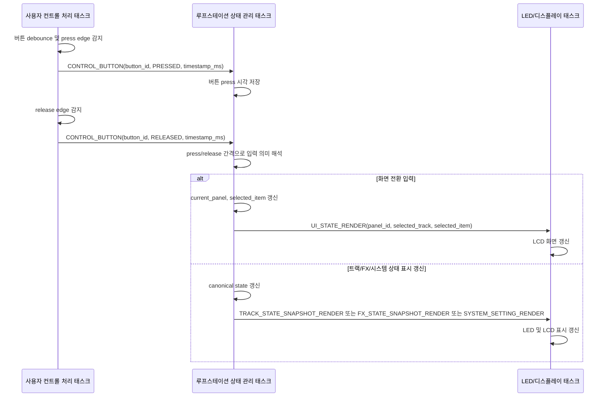
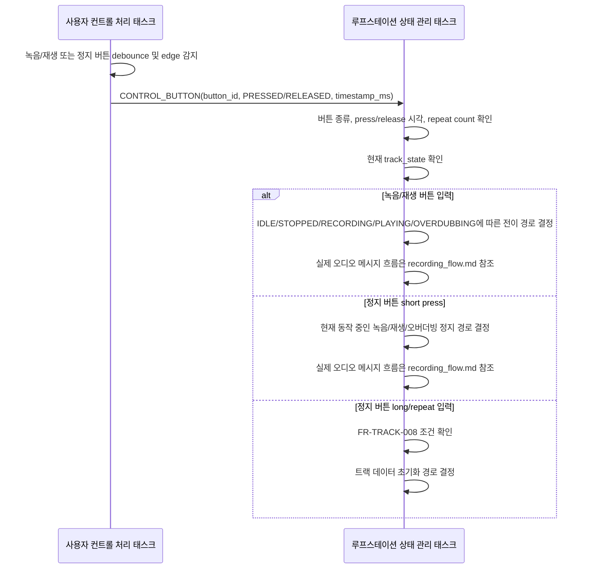
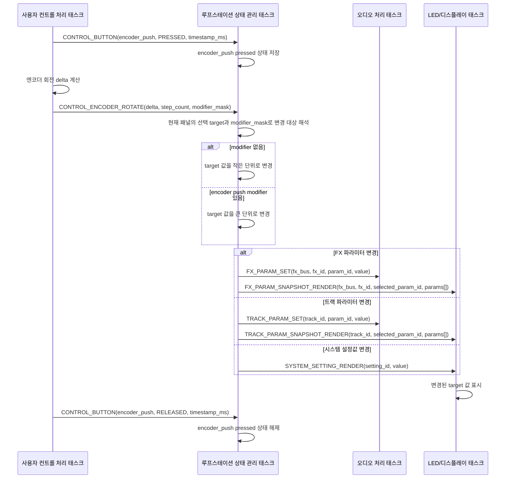
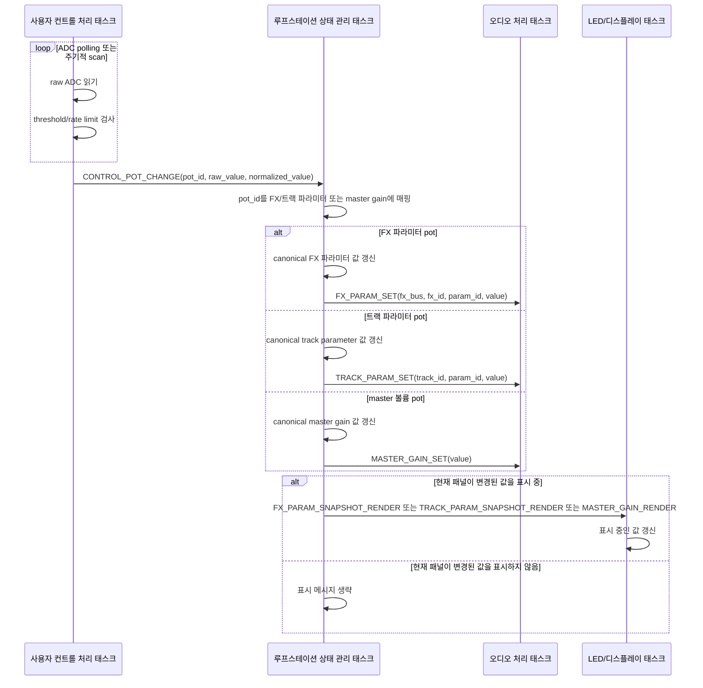
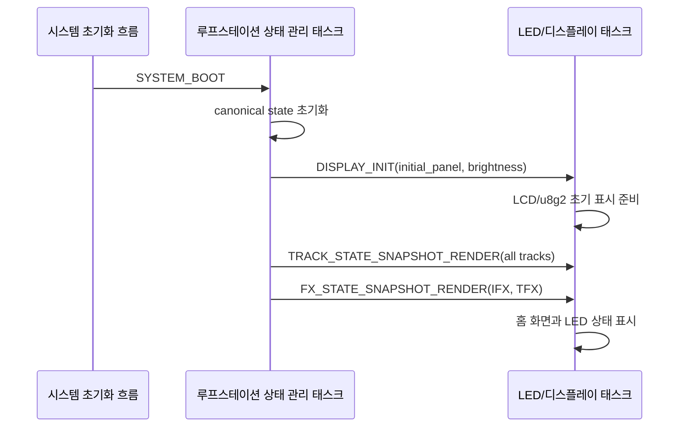
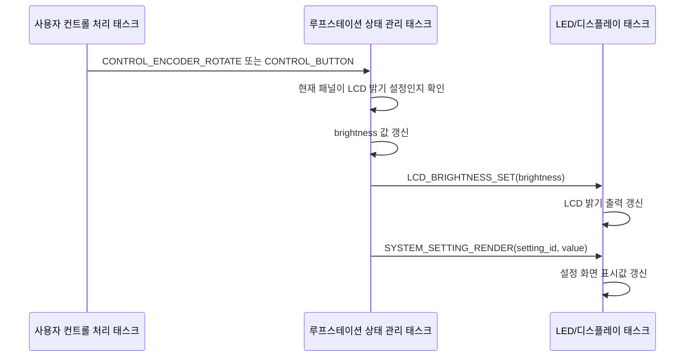
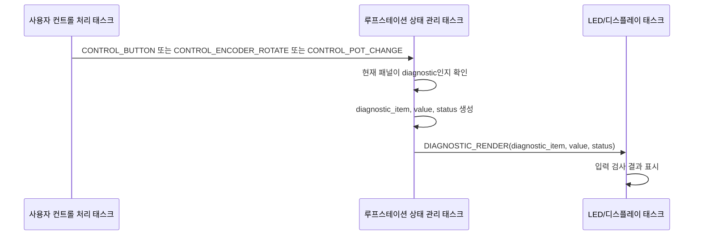

# 사용자 컨트롤 및 표시 처리 시퀀스 초안

이 문서는 녹음이나 트랙 오디오 출력이 아닌, 사용자 컨트롤 처리와 LED/디스플레이 처리 과정에서 어떤 메시지가 전달되는지 시퀀스 다이어그램 초안으로 정리한다.

참고 문서:

| 문서 | 참고 내용 |
| --- | --- |
| [task_message_design.md](./task_message_design.md) | 태스크별 메시지 문서 인덱스 |
| [state_task_messages.md](./messages/state_task_messages.md) | 상태 관리 태스크 수신 메시지와 `StateEventMessage` 스키마 |
| [user_control_task_messages.md](./messages/user_control_task_messages.md) | 사용자 컨트롤 처리 태스크 송신 raw event |
| [display_task_messages.md](./messages/display_task_messages.md) | LED/디스플레이 처리 태스크 수신 메시지와 queue |
| [ui_design.md](../ui/ui_design.md) | UI 패널, 버튼, 표시 정책 |
| [requirements.md](../planning/requirements.md) | `FR-TRACK-008`의 정지 버튼 long/repeat 기반 트랙 데이터 초기화 요구사항 |
| [recording_flow.md](../audio/recording_flow.md) | 녹음/재생/정지/오버더빙 상태 전이와 실제 오디오 메시지 흐름 |

## 1. 기본 원칙

사용자 컨트롤 처리 태스크는 현재 패널이나 시스템 상태를 해석하지 않는다. 버튼, 엔코더, 포텐셔미터 입력을 debounce, edge detection, threshold 처리한 뒤 raw event로 루프스테이션 상태 관리 태스크에 전달한다.

루프스테이션 상태 관리 태스크는 canonical state를 소유한다. 사용자 입력이 어떤 의미인지 해석하고, 상태가 바뀌면 필요한 표시 메시지를 LED/디스플레이 처리 태스크에 전달한다.

LED/디스플레이 처리 태스크는 표시 명령을 실행한다. 상태 전이 판단은 수행하지 않고, 수신한 render payload를 기준으로 LCD와 LED를 갱신한다.

LED 갱신과 LCD 갱신은 별도 RTOS 태스크로 분리하지 않고 LED/디스플레이 처리 태스크 안에서 함께 처리한다.

## 2. 관련 Queue

| Queue | 송신 | 수신 | 용도 |
| --- | --- | --- | --- |
| `state_event_queue` | 사용자 컨트롤 처리 태스크 | 루프스테이션 상태 관리 태스크 | 버튼, 엔코더, 포텐셔미터 raw event 전달 |
| `audio_command_queue` | 루프스테이션 상태 관리 태스크 | 오디오 처리 태스크 | FX 파라미터, 트랙 파라미터, master gain 변경 전달 |
| `display_command_queue` | 루프스테이션 상태 관리 태스크 | LED/디스플레이 처리 태스크 | 초기화, 화면 전환, LCD 밝기 변경처럼 누락되면 안 되는 표시 명령 전달 |
| `track_state_mailbox` | 루프스테이션 상태 관리 태스크 | LED/디스플레이 처리 태스크 | 최신 트랙 상태 표시값 전달 |
| `track_param_mailbox` | 루프스테이션 상태 관리 태스크 | LED/디스플레이 처리 태스크 | 최신 트랙 파라미터 snapshot 전달 |
| `fx_state_mailbox` | 루프스테이션 상태 관리 태스크 | LED/디스플레이 처리 태스크 | 최신 FX 선택/활성화 표시값 전달 |
| `fx_param_mailbox` | 루프스테이션 상태 관리 태스크 | LED/디스플레이 처리 태스크 | 최신 FX 파라미터 snapshot 전달 |
| `system_mailbox` | 루프스테이션 상태 관리 태스크 | LED/디스플레이 처리 태스크 | 최신 시스템 설정 표시값 전달 |
| `diagnostic_mailbox` | 루프스테이션 상태 관리 태스크 | LED/디스플레이 처리 태스크 | 최신 하드웨어 점검 표시값 전달 |

## 3. 버튼 기반 UI 화면 전환

버튼 입력은 `CONTROL_BUTTON` 하나로 전달한다. short press, long press, double click 같은 해석은 상태 관리 태스크가 press/release timestamp를 기준으로 수행한다.

`UI_STATE_RENDER`는 패널 전환 시에만 사용한다. 패널 내부에서 값만 바뀌는 경우에는 값의 의미에 맞는 render 메시지를 사용한다.

## 4. 녹음/재생/정지 버튼 상태 판단

녹음/재생 버튼과 정지 버튼은 트랙 상태 전이를 유발할 수 있다. 이 문서에서는 사용자 입력이 루프스테이션 상태 관리 태스크로 전달되고, 상태 관리 태스크가 현재 트랙 상태에 따라 어떤 처리 경로를 선택하는지까지만 다룬다.

정지 버튼 long press 또는 짧은 시간 내 반복 입력으로 트랙 데이터를 초기화하는 요구사항은 [requirements.md](../planning/requirements.md)의 `FR-TRACK-008`을 따른다. 첫 녹음, 재생, 오버더빙, 정지에 따른 실제 오디오 처리 메시지 흐름은 [recording_flow.md](../audio/recording_flow.md)를 기준으로 한다.

## 5. 엔코더 회전과 push modifier

엔코더 push를 누른 채 회전하는 경우에도 사용자 컨트롤 처리 태스크는 해석을 하지 않는다. 회전 순간 눌려 있던 버튼 상태를 `modifier_mask`로 snapshot 하여 `CONTROL_ENCODER_ROTATE`에 포함한다.

엔코더 회전은 현재 패널 안에서 선택된 target의 값을 수정한다. 화면 전환은 버튼 입력으로 처리하므로, 엔코더 회전만으로 `UI_STATE_RENDER`를 발생시키지 않는다.

## 6. 포텐셔미터 값 변경

포텐셔미터 입력은 사용자 컨트롤 처리 태스크가 threshold/rate limit을 적용한 뒤 `CONTROL_POT_CHANGE`로 전달한다. 루프스테이션 상태 관리 태스크는 패널과 관계없이 pot id를 FX 파라미터, 트랙 파라미터, master gain 중 하나로 매핑하고 오디오 처리 태스크에 변경 메시지를 전달한다.

현재 표시 중인 패널이 변경된 값을 보여주고 있다면 LED/디스플레이 처리 태스크에도 표시 갱신 메시지를 보낸다. 즉 포텐셔미터 값 변경 자체는 항상 오디오 처리로 전달되며, 표시 갱신만 조건부로 수행된다.

## 7. 부팅 후 초기 표시

부팅 또는 시스템 초기화 시점에는 상태 모델을 먼저 초기화한 뒤, 표시 태스크에 초기 화면 표시를 명령한다.

## 8. LCD 밝기 변경

LCD 밝기 변경은 누락되면 안 되는 command이므로 `display_command_queue`를 사용한다.

## 9. 하드웨어 점검 표시

하드웨어 점검 패널에서는 입력 이벤트를 시스템 기능으로 해석하지 않고, 진단 표시값으로 변환해 표시 태스크에 전달한다.

## 10. 표시 메시지 선택 기준

표시 메시지는 `display_command_queue`와 용도별 mailbox를 함께 사용한다. command queue와 mailbox를 나눈 이유는 표시 메시지의 성격이 다르기 때문이다.

`display_command_queue`는 반드시 처리되어야 하고 순서가 중요한 명령에 사용한다. 예를 들어 초기화, 화면 전환, LCD 밝기 변경은 누락되면 실제 UI 상태가 사용자가 기대한 상태와 달라질 수 있다.

mailbox는 같은 종류의 값이 짧은 시간에 여러 번 갱신될 수 있고, 중간값보다 최신값이 중요한 표시 상태에 사용한다. 예를 들어 포텐셔미터를 빠르게 돌리거나 움직일 때 `FX_PARAM_SNAPSHOT_RENDER` 값이 10, 11, 12, 13으로 모두 그려질 필요는 없고 최종적으로 13이 보이면 충분할 수 있다. 이 경우 mailbox는 표시 태스크가 밀리지 않도록 중간 render state를 덮어쓰는 역할을 한다.

mailbox는 단일 `display_render_mailbox`로 묶지 않고 `track_state_mailbox`, `track_param_mailbox`, `fx_state_mailbox`, `fx_param_mailbox`, `system_mailbox`, `diagnostic_mailbox`로 분리한다. 이렇게 하면 서로 다른 표시 영역의 최신값이 하나의 mailbox에서 덮어써지는 문제를 피할 수 있다.

`track_state_mailbox`, `track_param_mailbox`, `fx_state_mailbox`, `fx_param_mailbox`는 단일 항목 변경값이 아니라 해당 표시 영역의 snapshot을 받는다. mailbox overwrite로 중간 메시지가 사라져도 최신 snapshot 하나만으로 현재 패널의 상태/파라미터 영역을 일관되게 다시 그릴 수 있어야 한다.

하나의 출력 queue로 통합하는 대안과 비교하면 다음과 같다.

| 방식 | 장점 | 단점 |
| --- | --- | --- |
| command queue + mailbox 분리 | 빠르게 반복되는 표시 갱신의 중간값을 버릴 수 있어 표시 태스크 backlog를 줄인다. 화면 전환 같은 필수 명령과 telemetry/render state를 구분하기 쉽다. | 표시 경로가 여러 개라 구현과 디버깅이 복잡하다. 어떤 메시지가 누락되어도 되는지 판단이 애매하면 UI 일관성 문제가 생길 수 있다. |
| 단일 `display_command_queue` | 모든 표시 요청이 하나의 순서로 처리되어 이해하기 쉽고, 표시 갱신 누락 가능성이 낮다. 디버깅과 로그 추적이 단순하다. | 포텐셔미터, 레벨 미터처럼 높은 빈도의 갱신이 queue를 채우면 오래된 표시 메시지까지 순서대로 처리하느라 최신 UI 반영이 늦어질 수 있다. queue overflow 정책을 별도로 정해야 한다. |

| 메시지 타입 | Queue | 사용 기준 |
| --- | --- | --- |
| `DISPLAY_INIT` | `display_command_queue` | 부팅 또는 표시 장치 초기화처럼 반드시 처리해야 하는 명령 |
| `UI_STATE_RENDER` | `display_command_queue` | 패널이 바뀔 때 새 패널 화면을 표시하는 화면 전환 명령 |
| `LCD_BRIGHTNESS_SET` | `display_command_queue` | 실제 하드웨어 출력값 변경 |
| `TRACK_STATE_SNAPSHOT_RENDER` | `track_state_mailbox` | 모든 트랙의 최신 상태 snapshot 표시 |
| `TRACK_PARAM_SNAPSHOT_RENDER` | `track_param_mailbox` | 최신 트랙 파라미터 snapshot 표시 |
| `FX_STATE_SNAPSHOT_RENDER` | `fx_state_mailbox` | IFX와 TFX의 최신 상태 snapshot 표시 |
| `FX_PARAM_SNAPSHOT_RENDER` | `fx_param_mailbox` | 최신 FX 파라미터 snapshot 표시 |
| `MASTER_GAIN_RENDER` | `system_mailbox` | 최신 master gain 값 표시 |
| `SYSTEM_SETTING_RENDER` | `system_mailbox` | 최신 시스템 설정값 표시 |
| `DIAGNOSTIC_RENDER` | `diagnostic_mailbox` | 최신 진단 표시값 표시 |

## 11. 남은 결정 사항

현재 이 문서에 남은 결정 사항은 없다. 