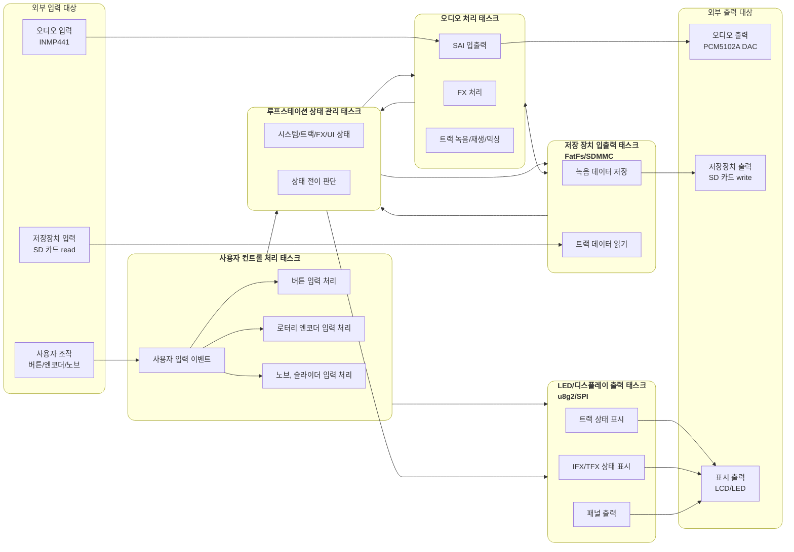

# 태스크 메시지 기반 아키텍처 문서

이 문서는 Loop Station 시스템의 태스크들이 메시지로 협력하는 구조를 정리한다. 초기에는 역할별 계층을 두고 상위/하위 계층 사이로만 메시지를 전달하는 구조를 검토했지만, 실제 RTOS 태스크 흐름에서는 불필요한 중계 메시지가 늘어나고 상태 관리 태스크가 과도한 라우터 역할을 맡게 된다.

따라서 이 프로젝트의 구조는 엄격한 계층형 아키텍처가 아니라, 각 태스크가 자기 책임과 상태를 가지고 필요한 대상 태스크에 직접 메시지를 보내는 **peer-to-peer message-driven task architecture**로 정의한다. 이 구조는 전통적인 계층형보다 **actor model**에 가깝다. 다만 모든 태스크가 순수 actor처럼 완전히 독립적인 mailbox와 상태 격리만으로 동작하는 것은 아니므로, 문서에서는 `actor-like task model`로 부른다.

## 1. 입력 이벤트와 데이터

이 시스템은 일반적인 애플리케이션 API를 외부 프로그램에 제공하는 구조가 아니다. 사용자가 직접 보드를 조작하고, 외부 오디오 데이터가 실시간으로 들어오는 임베디드 시스템이다. 따라서 시스템 입력은 API 호출보다 이벤트와 스트림 데이터로 정의하는 편이 적합하다.

### 1.1 사용자 이벤트

| 이벤트 | 입력 장치 | 설명 |
| --- | --- | --- |
| 전원 인가 | 전원 입력 | 시스템 초기화와 시작 흐름을 발생시킨다. |
| 녹음/재생 버튼 입력 | MCP23017 버튼 GPIO | 트랙 상태를 `IDLE`, `RECORDING`, `PLAYING`, `OVERDUBBING` 사이에서 전환한다. |
| 정지 버튼 입력 | MCP23017 버튼 GPIO | 녹음, 재생, 오버더빙을 정지한다. |
| 정지 버튼 길게 누름 또는 연속 입력 | MCP23017 버튼 GPIO | 트랙 삭제 요청으로 해석한다. |
| IFX 버튼 입력 | MCP23017 버튼 GPIO | 입력 FX 활성화 상태를 토글하고 IFX 설정 패널로 이동한다. |
| TFX 버튼 입력 | MCP23017 버튼 GPIO | 출력 FX 활성화 상태를 토글하고 TFX 설정 패널로 이동한다. |
| UI 이동 버튼 입력 | MCP23017 버튼 GPIO | LCD 패널 이동, 하위 패널 진입, 상위 패널 복귀를 요청한다. |
| 로터리 엔코더 회전 | TIM4 encoder mode | 메뉴 선택, 값 변경, 항목 이동에 사용한다. |
| 로터리 엔코더 push | MCP23017 GPIOB3 | 선택 또는 확인 이벤트로 사용한다. |
| 포텐셔미터 값 변경 | ADC1 | FX 파라미터 또는 아날로그 조작값 변경으로 해석한다. |

### 1.2 외부 데이터

| 데이터 | 입력 또는 출력 경로 | 설명 |
| --- | --- | --- |
| 마이크 오디오 입력 | INMP441, SAI1 Block B | 실시간 오디오 프레임으로 수신한다. |
| DAC 오디오 출력 | PCM5102A, SAI1 Block A | 처리된 오디오 프레임을 출력한다. |
| 트랙 파일 데이터 | SD 카드, SDMMC1, FatFs | 녹음된 오디오를 저장하고 반복 재생 시 읽는다. |
| LCD 표시 데이터 | GMG12864-06D, SPI2, u8g2 | 시스템 상태, 트랙 상태, FX 상태를 표시한다. |
| LED 출력 데이터 | MCP23017 GPIO | 트랙 상태, IFX/TFX 활성화 상태를 표시한다. |

## 2. 하드웨어 경계

하드웨어 구성은 [hardware_configuration.md](../hardware/hardware_configuration.md)를 기준으로 한다.

| 하드웨어 | 연결 peripheral | 시스템에서의 역할 |
| --- | --- | --- |
| MCP23017 x2 | I2C1 | 버튼 입력과 LED 출력 GPIO 확장 |
| GMG12864-06D LCD | SPI2 + GPIO | 상태 표시 |
| 포텐셔미터 | ADC1 | FX 파라미터 또는 아날로그 조작값 입력 |
| SD 카드 | SDMMC1 + GPIO | 트랙 파일 저장 및 읽기 |
| KY-040 | TIM4 + MCP23017 | 회전 입력과 push 입력 |
| INMP441 | SAI1 Block B | 오디오 입력 |
| PCM5102A | SAI1 Block A | 오디오 출력 |

## 3. 아키텍처 정의

### 3.1 가장 가까운 아키텍처

이 구조에 가장 가까운 아키텍처는 **actor model**이다.

actor model의 핵심은 각 actor가 자기 상태를 소유하고, 다른 actor와 공유 메모리 직접 접근이 아니라 메시지를 통해 협력한다는 점이다. 이 프로젝트의 RTOS 태스크도 각자 명확한 책임을 가지고 큐 메시지로 상호작용하므로 actor model과 유사하다.

다만 이 프로젝트는 다음 이유로 순수 actor model이라고 부르지는 않는다.

- FreeRTOS 태스크와 큐를 사용하는 임베디드 구조이며, actor runtime을 사용하는 것은 아니다.
- 오디오 DMA buffer처럼 성능상 메시지 본문 복사보다 descriptor 또는 공유 buffer 소유권 전달이 필요한 데이터가 있다.
- 일부 상태는 루프스테이션 상태 관리 태스크가 중앙에서 관리하지만, 모든 메시지가 이 태스크를 거쳐야 하는 것은 아니다.

따라서 최종 명칭은 **message-driven architecture**로 둔다.

### 3.2 설계 원칙

| 원칙 | 설명 |
| --- | --- |
| 태스크별 책임 소유 | 각 태스크는 자신이 담당하는 하드웨어, 상태, 처리 흐름을 직접 소유한다. |
| 직접 메시지 전송 | 메시지가 필요한 대상 태스크로 직접 전송한다. 단순 전달만 하는 중계 메시지는 만들지 않는다. |
| 상태 관리 태스크의 제한적 중앙성 | 루프스테이션 상태 관리 태스크는 시스템/트랙/FX/UI 상태 전이를 판단하지만 모든 메시지의 필수 경유지는 아니다. |
| 데이터 경로 우선 | 실시간 오디오와 storage chunk는 불필요한 추상 계층보다 지연과 복사 비용을 줄이는 방향을 우선한다. |
| 명시적 메시지 계약 | 태스크 간 직접 통신을 허용하는 대신 메시지 타입, payload, 소유권, 응답 조건을 문서로 고정한다. |

### 3.3 태스크 책임

| 태스크 | 주 책임 | 직접 메시지 대상 예 |
| --- | --- | --- |
| 사용자 컨트롤 처리 태스크 | 버튼, 엔코더, 포텐셔미터 입력을 이벤트로 변환한다. | 상태 관리 태스크, 디스플레이 태스크 |
| 루프스테이션 상태 관리 태스크 | 시스템 상태, 트랙 상태, FX/UI 상태 전이를 판단한다. | 오디오 처리 태스크, 저장장치 I/O 태스크, 디스플레이 태스크 |
| 오디오 처리 태스크 | 실시간 오디오 입력, FX, 트랙 녹음/재생/믹싱, 출력 처리를 담당한다. | 저장장치 I/O 태스크, 상태 관리 태스크 |
| 저장장치 I/O 태스크 | FatFs/SDMMC 파일 생성, 쓰기, 읽기, close/finalize를 담당한다. | 오디오 처리 태스크, 상태 관리 태스크 |
| 디스플레이/LED 출력 태스크 | LCD 화면과 LED 상태 표시를 담당한다. | 상태 관리 태스크 |

# 아키텍처 시각화 및 태스크 요청 흐름

