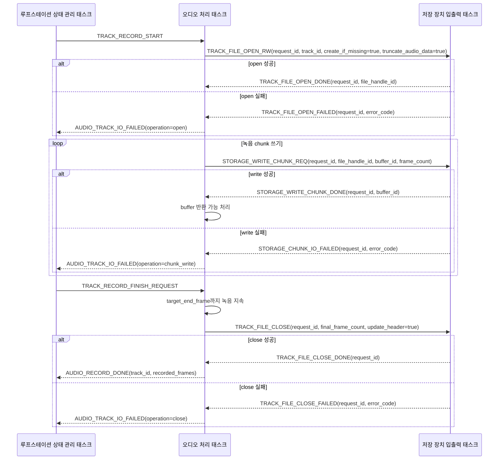
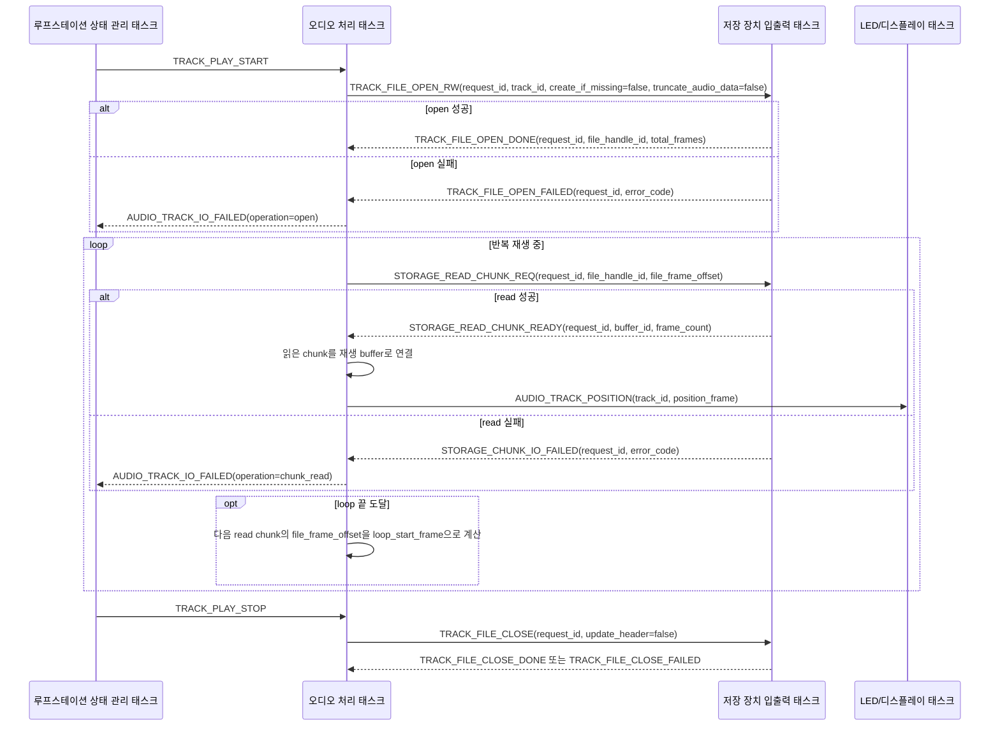
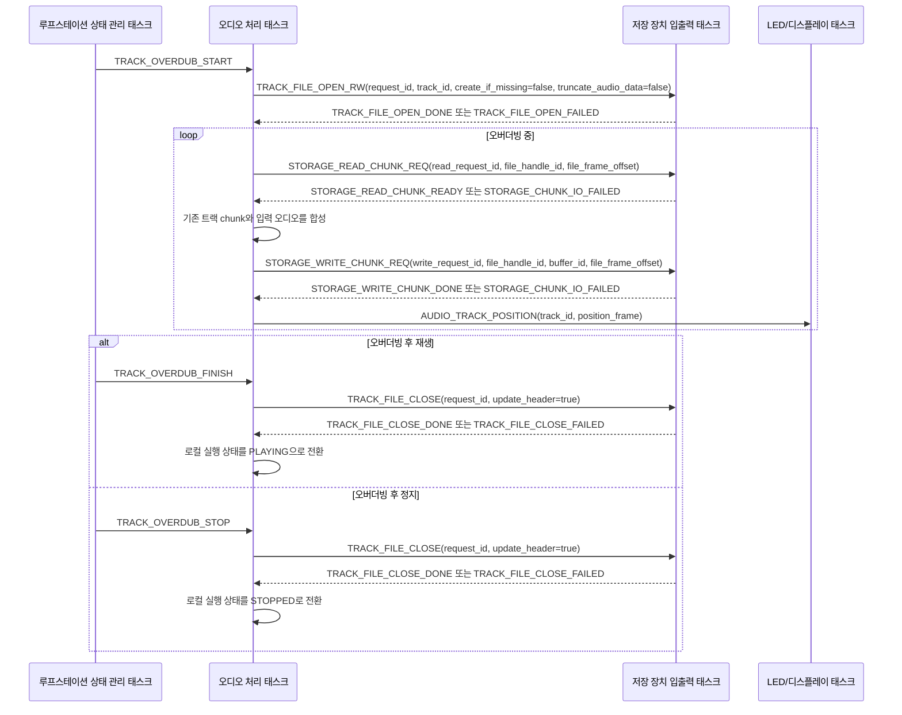
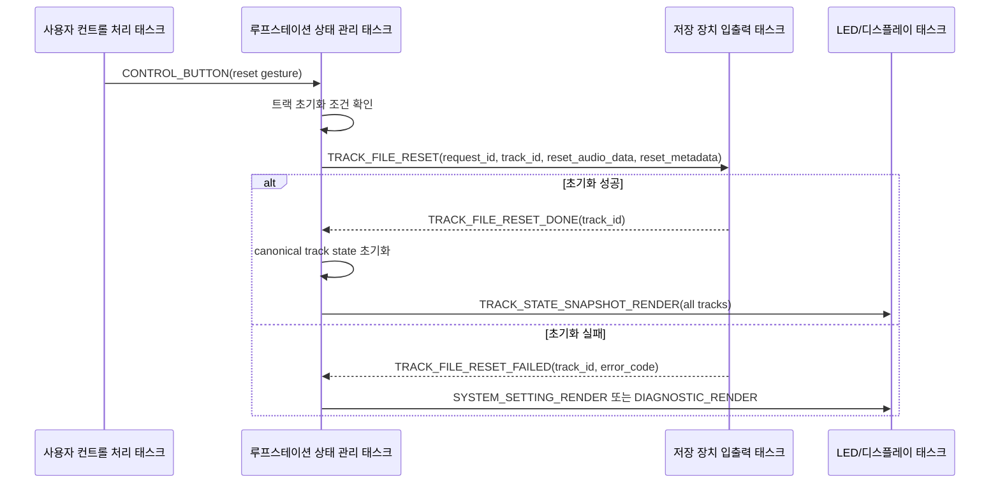
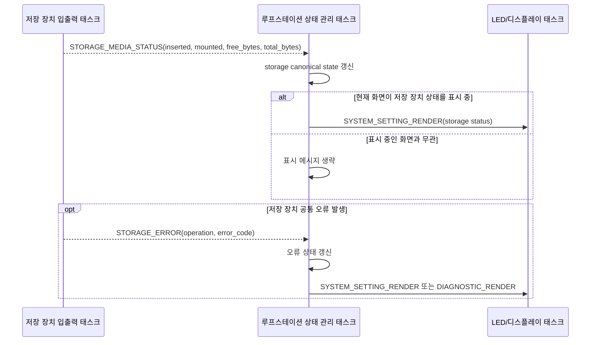

# 저장 장치 입출력 메시지 시퀀스

이 문서는 저장 장치 입출력 태스크가 어떤 요청을 받고, 처리 결과를 어느 태스크로 되돌려주는지 시퀀스 다이어그램으로 정리한다.

참고 문서:

| 문서 | 참고 내용 |
| --- | --- |
| [storage_task_messages.md](./messages/storage_task_messages.md) | 저장 장치 입출력 태스크 수신 요청 메시지와 payload |
| [audio_task_messages.md](./messages/audio_task_messages.md) | 오디오 처리 태스크가 수신하는 저장 장치 처리 결과 메시지 |
| [state_task_messages.md](./messages/state_task_messages.md) | 상태 관리 태스크가 수신하는 트랙 초기화 결과와 저장 장치 상태 메시지 |
| [recording_flow.md](../audio/recording_flow.md) | 첫 녹음과 오버더빙 중 저장 장치 요청 흐름 |
| TODO: 트랙 파일 포맷/저장 정책 문서 | 트랙 파일명, 디렉터리, metadata, split 정책 |

## 1. 기본 원칙

저장 장치 입출력 태스크는 `storage_request_queue`로 파일과 chunk 처리 요청을 받는다. 요청 메시지에는 `requester`와 `request_id`가 포함되며, 저장 장치 입출력 태스크는 처리 결과를 요청한 태스크로 되돌려준다.

오디오 처리 중 필요한 파일 open/read/write/close는 오디오 처리 태스크가 직접 저장 장치 입출력 태스크에 요청한다. 이 결과는 루프스테이션 상태 관리 태스크를 거치지 않고 오디오 처리 태스크로 직접 돌아간다.

상태 관리 태스크가 직접 저장 장치 입출력 태스크에 요청하는 경우는 현재 트랙 파일 초기화가 대표적이다. 이 경우 결과는 상태 관리 태스크가 받아 상태 모델과 표시 상태를 갱신한다.

트랙 오디오 파일은 녹음, 재생, 오버더빙 여부와 관계없이 `FA_READ | FA_WRITE`에 해당하는 read-write 모드로 연다. FatFs에서 read-write 모드는 open 시 접근 권한과 읽기 전용 속성 위반 여부를 확인하는 성격이 크며, 이후 성능은 open mode보다 SD 카드 접근, seek, cluster allocation, dirty sector write-back, chunk 크기에 더 크게 좌우된다.

단, read-write 모드로 연 하나의 `FIL` handle은 read pointer와 write pointer를 따로 갖지 않는다. 같은 handle로 읽기와 쓰기를 모두 수행할 때는 `STORAGE_READ_CHUNK_REQ`, `STORAGE_WRITE_CHUNK_REQ`의 `file_frame_offset`을 기준으로 저장 장치 입출력 태스크가 필요한 위치를 명확히 맞춘 뒤 I/O를 수행한다. 오디오 처리 태스크는 파일 포인터 이동을 별도 메시지로 요청하지 않는다.

## 2. 관련 Queue

| Queue | 송신 | 수신 | 용도 |
| --- | --- | --- | --- |
| `storage_request_queue` | 오디오 처리 태스크, 루프스테이션 상태 관리 태스크 | 저장 장치 입출력 태스크 | 파일 open/close/reset 요청과 chunk read/write 요청 |
| `audio_command_queue` | 저장 장치 입출력 태스크 | 오디오 처리 태스크 | 파일 처리 결과와 chunk 처리 결과 반환 |
| `state_event_queue` | 저장 장치 입출력 태스크 | 루프스테이션 상태 관리 태스크 | 트랙 초기화 결과, 저장 장치 상태, 저장 장치 오류 보고 |

## 3. 첫 녹음 파일 쓰기 흐름

첫 녹음에서는 오디오 처리 태스크가 트랙 파일을 read-write 모드로 열고, 녹음 중 chunk 쓰기를 반복한 뒤, 실제 녹음 종료 시 파일을 닫는다. 파일 close 결과까지 받은 뒤 오디오 처리 태스크가 상태 관리 태스크에 `AUDIO_RECORD_DONE`을 보고한다.

## 4. 반복 재생 파일 읽기 흐름

재생 시작 시 오디오 처리 태스크는 트랙 파일을 read-write 모드로 열고, 재생에 필요한 read chunk를 반복해서 요청한다. 파일 끝에 도달하면 loop 시작점으로 되감기 요청을 보낸다.

## 5. 오버더빙 파일 읽기/쓰기 흐름

오버더빙은 기존 트랙을 읽으면서 입력 오디오를 합친 결과를 다시 저장한다. 따라서 같은 오버더빙 구간에서 read 요청과 write 요청이 모두 발생한다.

오버더빙은 read와 write가 동시에 필요한 기능이지만, 실제 저장 장치 입출력은 `storage_request_queue`에서 순차 처리한다. 따라서 read handle과 write handle을 분리하지 않고 read-write handle 하나를 유지한다.

현재 시퀀스는 undo/redo가 없는 destructive overwrite를 전제로 한다. 기존 chunk를 읽고 입력 오디오와 합성한 뒤 같은 파일 offset에 다시 쓰므로, 향후 undo/redo를 추가하려면 기존 데이터를 즉시 덮어쓰지 않는 take 파일, delta 파일, snapshot 파일 정책을 별도로 설계해야 한다. 이 내용은 [record_to_playback_transition_tba.md](../storage/record_to_playback_transition_tba.md)의 undo/redo 확장 계획에서 추적한다.

## 6. 트랙 파일 초기화 흐름

트랙 초기화는 파일 삭제가 아니라 파일을 유지한 채 audio data 영역과 필요 시 metadata를 초기화하는 동작이다. 이 요청은 상태 관리 태스크가 직접 저장 장치 입출력 태스크에 보낸다.

## 7. 저장 장치 상태 및 오류 보고

SD 카드 삽입, mount 상태, 남은 용량처럼 시스템 상태에 영향을 주는 정보는 상태 관리 태스크로 보고한다. 반면 오디오 처리 요청에 대한 read/write/open/close 실패는 우선 요청자인 오디오 처리 태스크로 돌아가며, 오디오 처리 태스크가 상태 전이에 필요한 오류만 `AUDIO_TRACK_IO_FAILED`로 상태 관리 태스크에 보고한다.

## 8. 메시지 전달 기준

| 상황 | 요청 송신 | 결과 수신 | 기준 |
| --- | --- | --- | --- |
| 녹음 파일 open/write/close | 오디오 처리 태스크 | 오디오 처리 태스크 | 파일은 read-write 모드로 열되, 녹음 중에는 write 요청만 사용한다. 오디오 처리에 필요한 I/O이므로 상태 관리 태스크를 경유하지 않는다. |
| 반복 재생 파일 open/read/close | 오디오 처리 태스크 | 오디오 처리 태스크 | 파일은 read-write 모드로 열되, 재생 중에는 read 요청만 사용한다. loop 위치는 다음 read chunk의 `file_frame_offset`으로 표현한다. |
| 오버더빙 read/write | 오디오 처리 태스크 | 오디오 처리 태스크 | 하나의 read-write handle로 기존 트랙을 읽고 합성 결과를 같은 파일 offset에 다시 쓴다. |
| 트랙 파일 초기화 | 루프스테이션 상태 관리 태스크 | 루프스테이션 상태 관리 태스크 | 사용자의 트랙 초기화 요청은 상태 모델 변경을 동반한다. |
| SD 카드 상태/공통 오류 | 저장 장치 입출력 태스크 | 루프스테이션 상태 관리 태스크 | 시스템 전체 상태와 UI 표시 정책에 영향을 준다. |

## 9. 남은 결정 사항

- `request_id` 생성 주체와 중복 방지 정책을 결정한다.
- `STORAGE_CHUNK_IO_FAILED` 수신 후 오디오 처리 태스크가 retry, silence fill, 즉시 정지 중 어떤 복구 정책을 사용할지 결정한다.
- 저장 장치 입출력 태스크의 queue 길이와 chunk 요청 backpressure 정책을 결정한다.
