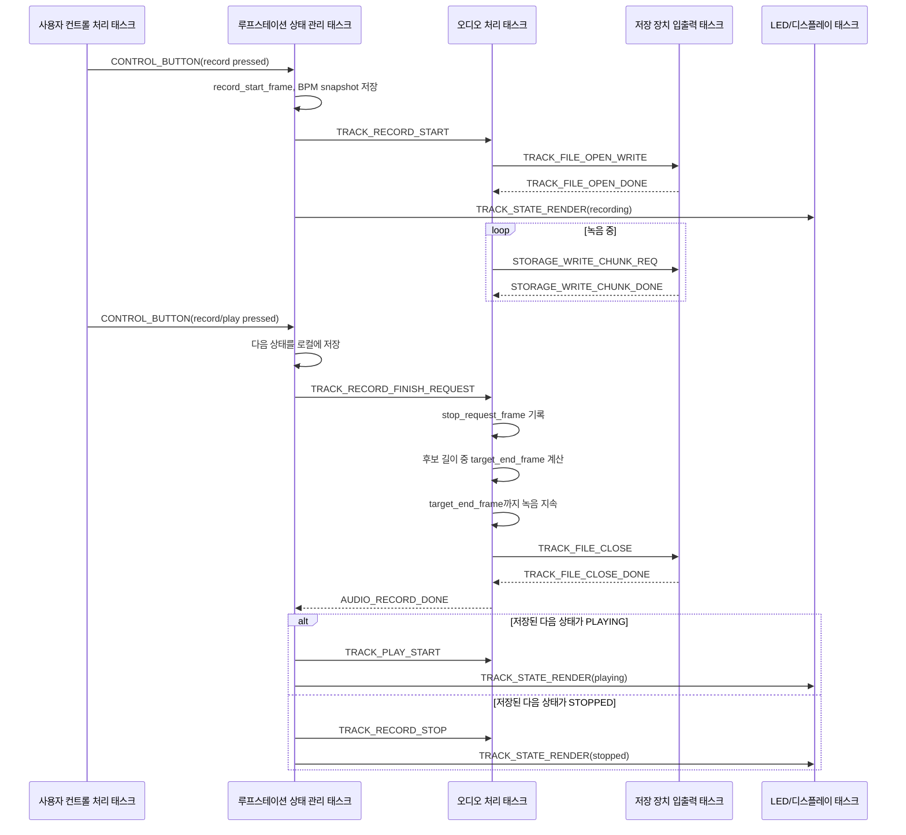
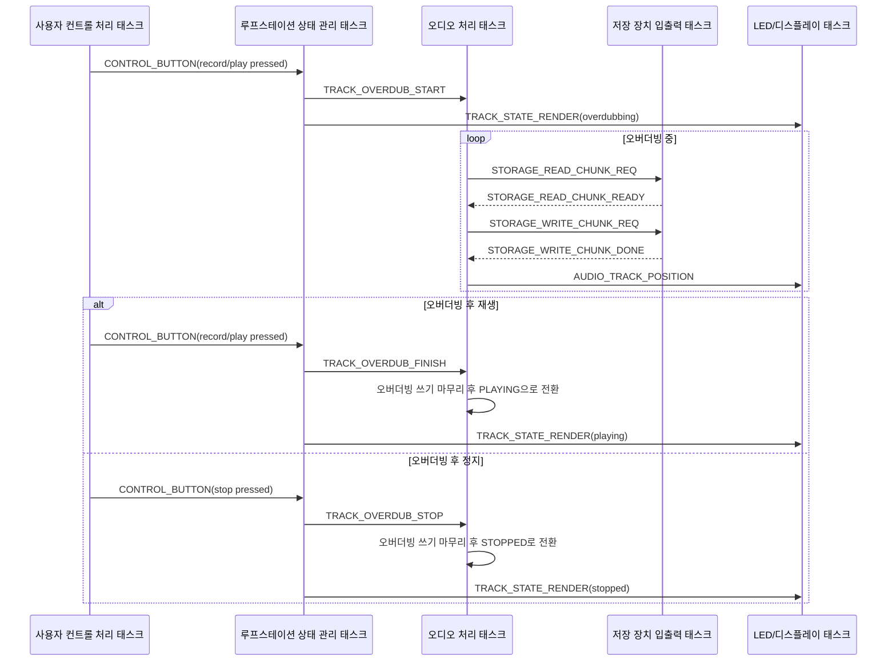

# 녹음 절차 문서

이 문서는 Loop Station 프로젝트에서 트랙 녹음 시작, 녹음 종료 요청, 실제 녹음 종료 시점 확정 절차를 정리한다. 핵심은 사용자가 녹음 종료 버튼을 누른 시점에 즉시 녹음을 끊지 않고, 시스템 BPM 기준 후보 길이에 맞춰 실제 종료 frame을 결정한다는 점이다.

참고 문서:

| 문서 | 참고 내용 |
| --- | --- |
| [audio_data_format.md](./audio_data_format.md) | sample rate, frame, WAV 저장 포맷 |
| [task_message_design.md](../architecture/task_message_design.md) | 녹음 시작/완료/정지 메시지와 태스크 책임 |
| [fx_design.md](./fx_design.md) | BPM 기반 TFX가 트랙 편집 대신 처리할 효과 |
| [RC-505_e02_W.pdf](../references/RC-505_e02_W.pdf) | original tempo, phrase memory tempo, Tempo Sync 개념 참고 |

## 1. 기본 원칙

트랙의 original BPM은 녹음 중 오디오 신호를 분석해서 추정하지 않는다. 녹음 시작 시점의 시스템 BPM을 snapshot으로 저장하고, 이 값을 녹음된 트랙의 original BPM으로 사용한다.

녹음 종료 버튼은 즉시 녹음 중단을 의미하지 않는다. 종료 버튼은 “종료 요청 시점”을 기록하는 이벤트이며, 시스템은 녹음 시작 시점부터 종료 요청 시점까지의 경과 시간을 기준으로 가장 적절한 후보 길이를 선택한다.

현재 후보 길이는 다음과 같다.

| 후보 | 의미 |
| --- | --- |
| `1/8` 마디 | 매우 짧은 loop |
| `1/4` 마디 | 짧은 rhythmic loop |
| `1/2` 마디 | 반 마디 loop |
| `1` 마디 | 기본 1마디 loop |
| `2` 마디 | 2마디 loop |
| `3` 마디 | 3마디 loop |
| n마디 | n마디 loop |

후보 길이 외의 임의 loop 구간 편집은 트랙 기본 기능으로 다루지 않는다. ROLL, BEAT REPEAT, BEAT SHIFT, BEAT SCATTER처럼 트랙을 잘라내거나 반복하는 동작은 TFX에서 처리한다.

## 2. 녹음 시작 시 저장할 값

녹음 시작 버튼이 눌리면 루프스테이션 상태 관리 태스크는 현재 상태를 확인하고 녹음 시작을 결정한다. 이때 다음 값을 snapshot으로 저장한다.

| 항목 | 설명 |
| --- | --- |
| `track_id` | 녹음 대상 트랙 |
| `record_start_frame` | 오디오 처리 기준 녹음 시작 frame |
| `record_start_time_ms` | 제어 이벤트 기준 녹음 시작 시각 |
| `system_bpm_snapshot` | 녹음 시작 시점의 시스템 BPM |
| `time_signature_snapshot` | 녹음 시작 시점의 박자표 |
| `sample_rate` | frame 계산에 사용할 sample rate |

오디오 처리 태스크는 `TRACK_RECORD_START`를 받은 뒤 입력 오디오를 기록하기 시작한다. 녹음 시작 이후 시스템 BPM이 변경되더라도 이미 시작된 녹음의 original BPM 계산에는 `system_bpm_snapshot`을 사용한다.

## 3. 후보 길이 계산

후보 길이는 BPM, 박자표, sample rate를 사용해 frame 단위로 계산한다.

```text
beat_seconds = 60 / bpm
measure_seconds = beat_seconds * beats_per_measure
candidate_seconds = measure_seconds * candidate_measure_count
candidate_frames = candidate_seconds * sample_rate
```

예를 들어 120 BPM, 4/4, 44.1 kHz라면 다음과 같다.

| 후보 | 시간 | frame 수 |
| --- | --- | --- |
| `1/8` 마디 | 0.25초 | 11,025 |
| `1/4` 마디 | 0.5초 | 22,050 |
| `1/2` 마디 | 1.0초 | 44,100 |
| `1` 마디 | 2.0초 | 88,200 |
| `2` 마디 | 4.0초 | 176,400 |
| `3` 마디 | 6.0초 | 264,600 |

TODO: 후보 길이를 고정 목록으로 둘지, 프로젝트 설정값으로 분리할지 결정한다.

## 4. 녹음 종료 요청 처리

사용자가 녹음 종료 버튼을 누르면 루프스테이션 상태 관리 태스크는 종료 요청 이벤트를 오디오 처리 태스크에 전달한다. 오디오 처리 태스크는 녹음 시작 시점의 BPM snapshot과 종료 요청 시점의 frame을 기준으로 실제 종료 frame을 계산한다.

| 항목 | 설명 |
| --- | --- |
| `stop_request_frame` | 사용자가 종료 버튼을 누른 시점의 오디오 frame. 오디오 처리 태스크가 기록한다. |
| `elapsed_frames` | `stop_request_frame - record_start_frame` |
| `selected_candidate_frames` | `elapsed_frames`에 가장 가까운 후보 길이 |
| `target_end_frame` | `record_start_frame + selected_candidate_frames` |

`target_end_frame`이 현재 frame보다 미래라면 오디오 처리 태스크는 해당 frame까지 녹음을 계속한다. `target_end_frame`이 이미 지나간 경우의 처리는 아직 결정하지 않는다.

TODO: 종료 요청이 후보 길이보다 늦게 들어온 경우, 가장 가까운 후보로 자를지 다음 후보 끝까지 연장할지 정책을 결정한다.

## 5. 태스크 책임

| 태스크 | 책임 |
| --- | --- |
| 사용자 컨트롤 처리 태스크 | 녹음 버튼 press/release 이벤트와 timestamp를 상태 관리 태스크에 전달한다. |
| 루프스테이션 상태 관리 태스크 | 녹음 시작/종료 요청을 해석하고 녹음 종료 요청 시 다음 상태를 로컬에 저장한 뒤 오디오 처리 태스크에 종료 요청을 전달한다. |
| 오디오 처리 태스크 | BPM snapshot과 종료 요청 frame으로 후보 길이 및 `target_end_frame`을 계산한다. 트랙 파일 open/write/close를 저장 장치 입출력 태스크에 직접 요청하고, 실제 오디오 기록과 완료 보고를 수행한다. |
| 저장 장치 입출력 태스크 | 오디오 처리 태스크가 요청한 storage chunk를 SD 카드에 기록하고 결과를 오디오 처리 태스크에 반환한다. |
| LED/디스플레이 처리 태스크 | 녹음 상태, 선택된 loop 길이, 진행률을 표시한다. |

## 6. 첫 녹음 메시지 흐름

첫 녹음은 실제 녹음 종료 시점이 사용자 입력 시점과 다를 수 있다. 따라서 루프스테이션 상태 관리 태스크는 종료 요청 시 다음 상태를 먼저 결정해 로컬에 저장하고, 오디오 처리 태스크가 `AUDIO_RECORD_DONE`을 보낸 뒤 저장해둔 상태로 전이한다.



## 7. 오버더빙 메시지 흐름

오버더빙은 기존 트랙 재생 위치에서 쓰기를 시작하고 재생을 계속 유지한다. 종료 입력이 들어오면 루프스테이션 상태 관리 태스크가 `TRACK_OVERDUB_FINISH` 또는 `TRACK_OVERDUB_STOP`을 오디오 처리 태스크에 전달한다. 오디오 처리 태스크는 수신한 명령에 따라 오버더빙 쓰기를 마무리하고 로컬 실행 상태를 재생 또는 정지로 전환한다.



## 8. 트랙 metadata

녹음 완료 후 트랙에는 최소한 다음 metadata를 저장한다.

| 항목 | 설명 |
| --- | --- |
| `original_bpm` | 녹음 시작 시점의 시스템 BPM snapshot |
| `length_frames` | 선택된 후보 길이로 확정된 트랙 길이 |
| `measure_length` | 선택된 후보 마디 길이 |
| `time_signature` | 녹음 시작 시점의 박자표 |
| `sample_rate` | 녹음 당시 sample rate |

`original_bpm`은 나중에 Tempo Sync 또는 playback rate 계산에 사용할 수 있다. 단, 실제 트랙 재생 속도 변경은 SAI 기능이 아니라 오디오 처리 태스크의 resampling 또는 time-stretch 기능으로 구현해야 한다.

## 9. 남은 결정 사항

- 종료 요청 시점이 두 후보 길이의 중간에 가까울 때 어느 쪽을 선택할지 결정한다.
- `target_end_frame`이 이미 지나간 경우 자르기, 다음 후보까지 연장, 또는 오류 처리 중 하나를 선택한다.
- `TRACK_RECORD_FINISH_REQUEST` payload에 포함할 track id, 종료 요청 timestamp, 종료 요청 frame 보정값 범위를 확정한다.
- 녹음 중 시스템 BPM 변경을 허용할지, 허용하더라도 현재 녹음에는 반영하지 않을지 결정한다.
- 선택된 후보 길이를 UI에 언제 표시할지 결정한다.
