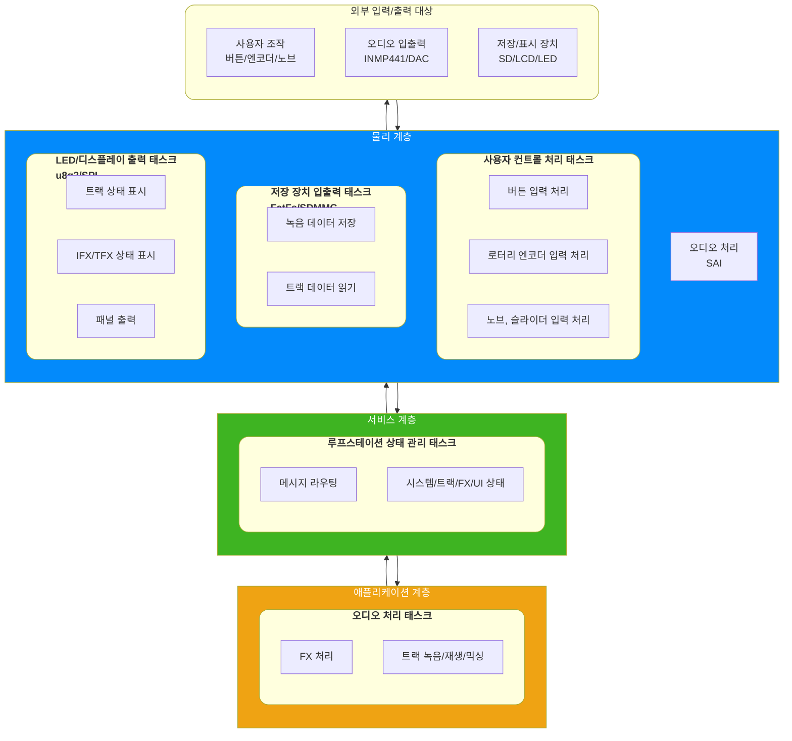

# 계층 분리 설계 문서

이 문서는 Loop Station 시스템을 역할별 계층으로 나누기 위한 설계 기준을 정리한다. 현재는 설계 단계이므로 특정 파일이나 디렉터리 배치를 확정하지 않는다. 대신 사용자가 만든 이벤트와 외부 오디오 데이터가 시스템에 들어왔을 때 어떤 책임 경계를 지나 처리되는지 이해하기 위한 구조를 정의한다.

이 프로젝트에서 계층 분리의 주 목적은 모듈 교체 가능성보다 유지보수의 간편화다. 각 계층은 자신보다 아래에 있는 구체적인 하드웨어나 라이브러리 세부사항을 직접 알지 않도록 하고, 상위 계층은 루프스테이션 동작 의도와 상태 전이에 집중한다.

## 1. 입력 이벤트와 데이터

이 시스템은 일반적인 애플리케이션 API를 외부 프로그램에 제공하는 구조가 아니다. 사용자가 직접 보드를 조작하고, 외부 오디오 데이터가 실시간으로 들어오는 임베디드 시스템이다. 따라서 상위 계층의 입력은 API 호출보다 이벤트와 스트림 데이터로 정의하는 편이 적합하다.

### 1.1 사용자 이벤트

| 이벤트 | 입력 장치 | 설명 |
| --- | --- | --- |
| 전원 인가 | 전원 입력 | 시스템 초기화와 시작 흐름을 발생시킨다. |
| 녹음/재생 버튼 입력 | MCP23017 버튼 GPIO | 트랙 상태를 `IDLE`, `RECORDING`, `PLAYING`, `OVERDUBBING` 사이에서 전환한다. |
| 정지 버튼 입력 | MCP23017 버튼 GPIO | 녹음, 재생, 오버더빙을 정지한다. |
| 정지 버튼 길게 누름 또는 연속 입력 | MCP23017 버튼 GPIO | 트랙 삭제 요청으로 해석한다. |
| IFX 버튼 입력 | MCP23017 버튼 GPIO | 입력 FX 활성화 상태를 토글하고 IFX 설정 패널로 이동한다. |
| TFX 버튼 입력 | MCP23017 버튼 GPIO | 출력 FX 활성화 상태를 토글하고 TFX 설정 패널로 이동한다. |
| UI 이동 버튼 입력 | MCP23017 버튼 GPIO | LCD 패널 이동, 하위 패널 진입, 상위 패널 복귀를 요청한다. |
| 로터리 엔코더 회전 | TIM4 encoder mode | 메뉴 선택, 값 변경, 항목 이동에 사용한다. |
| 로터리 엔코더 push | MCP23017 GPIOB3 | 선택 또는 확인 이벤트로 사용한다. |
| 포텐셔미터 값 변경 | ADC1 | FX 파라미터 또는 아날로그 조작값 변경으로 해석한다. |

### 1.2 외부 데이터

| 데이터 | 입력 또는 출력 경로 | 설명 |
| --- | --- | --- |
| 마이크 오디오 입력 | INMP441, SAI1 Block B | 실시간 오디오 프레임으로 수신한다. |
| DAC 오디오 출력 | UDA1334A 또는 PCM5102A, SAI1 Block A | 처리된 오디오 프레임을 출력한다. |
| 트랙 파일 데이터 | SD 카드, SDMMC1, FatFs | 녹음된 오디오를 저장하고 반복 재생 시 읽는다. |
| LCD 표시 데이터 | GMG12864-06D, SPI2, u8g2 | 시스템 상태, 트랙 상태, FX 상태를 표시한다. |
| LED 출력 데이터 | MCP23017 GPIO | 트랙 상태, IFX/TFX 활성화 상태를 표시한다. |

## 2. 하드웨어 경계

하드웨어 구성은 [hardware_configuration.md](./hardware_configuration.md)를 기준으로 한다.

| 하드웨어 | 연결 peripheral | 시스템에서의 역할 |
| --- | --- | --- |
| MCP23017 x2 | I2C1 | 버튼 입력과 LED 출력 GPIO 확장 |
| GMG12864-06D LCD | SPI2 + GPIO | 상태 표시 |
| 포텐셔미터 | ADC1 | FX 파라미터 또는 아날로그 조작값 입력 |
| SD 카드 | SDMMC1 + GPIO | 트랙 파일 저장 및 읽기 |
| KY-040 | TIM4 + MCP23017 | 회전 입력과 push 입력 |
| INMP441 | SAI1 Block B | 오디오 입력 |
| UDA1334A 또는 PCM5102A | SAI1 Block A | 오디오 출력 |

## 3. 계층 정의

### 1. 물리 계층

사용자가 버튼을 조작하거나 오디오 신호를 발생시키는 입력을 받고, LED나 LCD 디스플레이에 출력 또는 오디오 출력, 그 외 장치들의 통신을 담당하는 계층이다. 

이 계층에서는 페리퍼럴로부터 입력을 받고 이를 적절한 메세지로 만들어 서비스 계층의 모듈에게 전달하거나, 상위 계층의 메세지를 받아 페리퍼럴에게 출력하는 역할을 수행한다. FatFs, u8g2와 같은 라이브러리 호출을 담당한다.

- 사용자 컨트롤 처리 태스크와 LED/디스플레이 출력 태스크, 저장장치 출력 태스크가 이 계층에서 주 작업을 수행한다.

### 2. 서비스 계층

물리 계층으로부터 메세지를 받고 그 메세지에 따라 적절한 처리를 수행하거나, 애플리케이션 계층에게 전달하는 계층이다. 또한 상위 계층에서 전달된 메세지를 처리 후 적절한 물리 계층의 모듈에게 전달한다.

- 루프스테이션 상태 관리 태스크가 이 계층에서 주 작업을 수행한다.

### 3. 애플리케이션 계층

루프스테이션의 핵심 로직들을 담당하는 계층이다. 특히 FX 처리, 트랙 믹싱 등 오디오 처리에 특화된 계층이다.

- 오디오 처리 태스크가 이 계층에서 주 작업을 수행한다.

