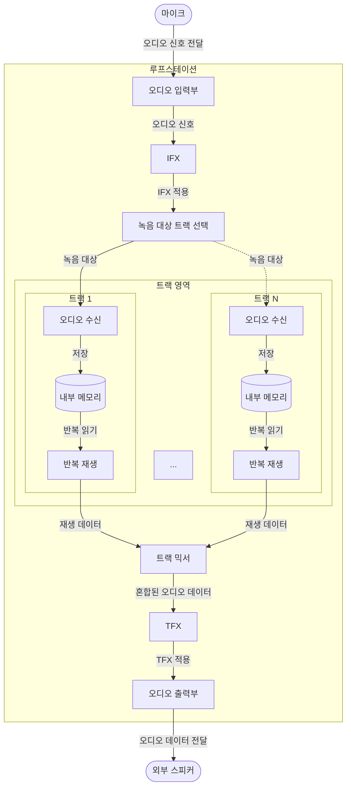
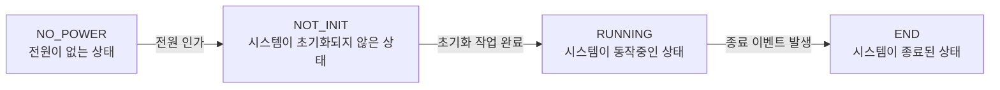
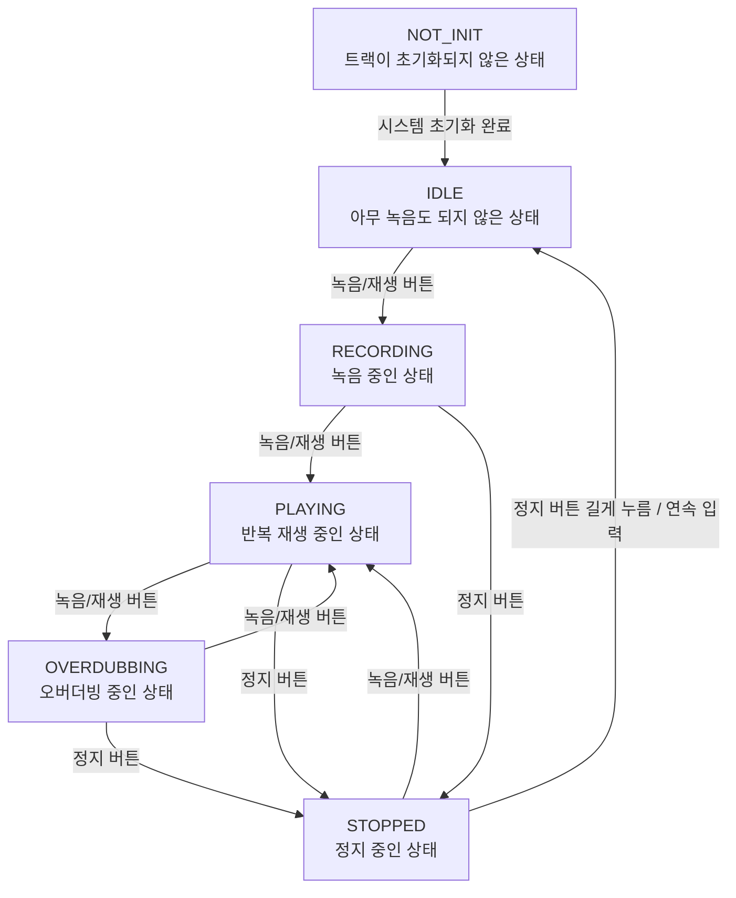
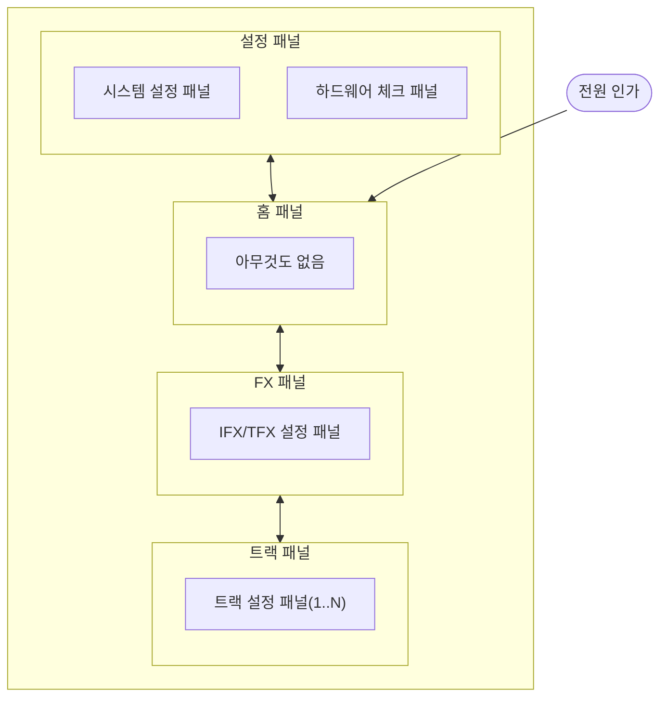
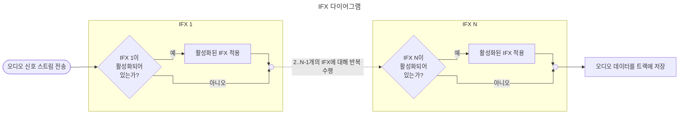
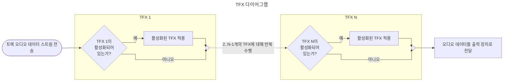

# 개요

이 문서는 루프스테이션 시스템을 RTOS로 구현함에 있어 필요한 기준, 설계, 구현 원칙들을 명시한 문서입니다.

# 1. 시스템 설계 원칙

루프스테이션 시스템은 실시간으로 트랙에 저장된 오디오 데이터를 출력하되 실시간성을 유지하는 것이 가장 중요합니다. 따라서 실시간성을 잘 지킬 수 있는 RTOS를 적용해 시스템을 설계합니다.

루프스테이션 시스템을 이루는 여러 기능들을 구현할 때 실시간성과 관련있는 기능은 가장 우선되어 처리되어야 하고, 실시간성과 관련없는 기능은 다소 늦게 처리되어도 문제없어야 합니다. 따라서 여러 기능들을 태스크에 나누어 구현하고, 태스크별 우선순위를 다르게 책정하여야 실시간성을 유지하여야 합니다. 

- 실행 시간, 우선순위에 따라 태스크를 분리합니다.
- 오디오 처리 태스크가 가장 높은 우선순위를 가집니다.
- 오디오 처리 태스크에서는 실행 시간을 지연시키는 작업을 하면 안됩니다.
- 태스크간 통신은 큐, 세마포어, 뮤텍스와 같은 기능들을 사용합니다. 태스크간 공유되어야 하는 데이터 역시 가능하면 최소화합니다.

# 2. 전체 SW 구조

시스템 파이프라인은 다음과 같습니다.


# 3. 태스크 구성

루프스테이션에 필요한 태스크들은 다음과 같습니다. 

1. 오디오 처리 태스크 
2. 저장 장치 입출력 태스크
3. 사용자 컨트롤 처리 태스크
4. 루프스테이션 상태 관리 태스크
5. LED, 디스플레이 처리 태스크

위 태스크들은 우선순위대로 나열되어 있습니다.

## 3-1. 오디오 처리 태스크

오디오 데이터를 녹음 장치로부터 가져오고, 내부 처리를 거쳐 출력 장치로 내보냅니다.
여기서는 트랙에 담긴 오디오 데이터에 fx를 적용하는 작업을 담당합니다. 또한 녹음 중에 오디오 데이터에 fx를 적용하는 작업도 담당합니다.

## 3-2. 저장 장치 입출력 태스크

녹음된 오디오 데이터를 저장하고, 재생할 오디오 데이터를 저장 장치로부터 읽는 태스크입니다. 오디오 데이터를 저장할 트랙 파일을 관리합니다.

## 3-3. 사용자 컨트롤 처리 태스크

입출력 fx 적용 버튼, ui 조작 버튼, 트랙의 녹음/재생 버튼 등 시스템에서 사용자가 조작할 수 있는 모든 버튼이나 엔코더들의 입력을 감지 및 전달하는 태스크입니다.

## 3-4. 루프스테이션 상태 관리 태스크

루프스테이션의 각 트랙 상태(`IDLE`, `RECORDING`, `PLAYING`, `OVERDUBBING`, `STOPPED`)를 관리합니다. 또한 입력 fx, 출력 fx 선택 및 적용 상태를 관리합니다.

## 3-5. LED, 디스플레이 처리 태스크

사용자 컨트롤에 의해 변경된 루프스테이션 상태를 표시하고, 이를 적절한 UI로 나타냅니다.

# 4. 태스크 우선순위 및 실행 주기

[3. 태스크 구성](#3-태스크-구성)에 우선순위대로 태스크가 나열되어 있습니다.

우선순위대로 태스크를 실행하는 주기를 정합니다.

> TODO: 각 태스크 별 구체적인 주기값에 대한 내용

# 5. 태스크 간 통신 구조

루프스테이션 시스템에서 발생 가능한 시나리오들은 다음과 같습니다.

- 음성 데이터 루프백 시나리오

    ``` mermaid
    sequenceDiagram 
        
        participant 사용자@{"type":"entity"}
        participant 오디오 처리 태스크
        participant 오디오 처리 태스크
        사용자->>오디오 처리 태스크: 오디오 신호 입력
        오디오 처리 태스크->>사용자: 오디오 신호 출력
    ```

- 녹음 시나리오

    ``` mermaid
    sequenceDiagram 
        
        participant 사용자@{"type":"entity"}
        participant 사용자 컨트롤 처리 태스크
        participant 루프스테이션 상태 관리 태스크
        participant 오디오 처리 태스크
        participant 저장 장치 입출력 태스크
    
        사용자->>사용자 컨트롤 처리 태스크: 트랙 녹음 시작 이벤트 발생
        사용자 컨트롤 처리 태스크->>사용자 컨트롤 처리 태스크: 이벤트 처리
        사용자 컨트롤 처리 태스크-->>루프스테이션 상태 관리 태스크: 트랙 상태 머신 전이 메세지 전송
        루프스테이션 상태 관리 태스크-->>오디오 처리 태스크: 트랙 녹음 시작 메세지 전송
        
        loop 트랙 녹음 종료 이벤트 발생 전까지
        사용자->>오디오 처리 태스크: 오디오 신호 입력
        오디오 처리 태스크->>오디오 처리 태스크: IFX 적용
        오디오 처리 태스크->>저장 장치 입출력 태스크: 오디오 버퍼 저장
        end

        사용자->>사용자 컨트롤 처리 태스크: 트랙 녹음 종료 이벤트 발생
        사용자 컨트롤 처리 태스크->>사용자 컨트롤 처리 태스크: 이벤트 처리
        사용자 컨트롤 처리 태스크-->>루프스테이션 상태 관리 태스크: 트랙 상태 머신 전이 메세지 전송
        루프스테이션 상태 관리 태스크-->>오디오 처리 태스크: 트랙 녹음 종료 메세지 전송
        오디오 처리 태스크->>저장 장치 입출력 태스크: 저장된 트랙 오디오 데이터 파일 정리(?)
    ```

- 트랙 재생 시나리오

    ```mermaid
    sequenceDiagram
        participant 사용자@{"type":"entity"}
        participant 사용자 컨트롤 처리 태스크
        participant 루프스테이션 상태 관리 태스크
        participant 오디오 처리 태스크
        participant 저장 장치 입출력 태스크

        사용자->>사용자 컨트롤 처리 태스크: 트랙 재생 시작 이벤트 발생
        사용자 컨트롤 처리 태스크->>사용자 컨트롤 처리 태스크: 이벤트 처리
        사용자 컨트롤 처리 태스크-->>루프스테이션 상태 관리 태스크: 트랙 상태 머신 전이 메세지 전송
        루프스테이션 상태 관리 태스크-->>오디오 처리 태스크: 트랙 재생 시작 메세지 전송
        
        loop PLAYING이나 OVERDUBBING 상태일 때
            저장 장치 입출력 태스크->>오디오 처리 태스크: 저장된 트랙 오디오 데이터 스트리밍
            오디오 처리 태스크->>오디오 처리 태스크: TFX 적용
            오디오 처리 태스크->>사용자: 오디오 데이터 출력
        end
        사용자->>사용자 컨트롤 처리 태스크: 트랙 재생 종료 이벤트 발생
        사용자 컨트롤 처리 태스크->>사용자 컨트롤 처리 태스크: 이벤트 처리
        사용자 컨트롤 처리 태스크-->>루프스테이션 상태 관리 태스크: 트랙 상태 머신 전이 메세지 전송
        루프스테이션 상태 관리 태스크-->>오디오 처리 태스크: 트랙 재생 종료 메세지 전송
        
    ```

- 사용자 조작 및 이벤트 관리 시나리오

    ```mermaid
    sequenceDiagram
        participant 사용자
        participant 사용자 컨트롤 처리 태스크
        participant 루프스테이션 상태 관리 태스크
        participant LED/디스플레이 처리 태스크
        participant 오디오 처리 태스크

        사용자 ->> 사용자 컨트롤 처리 태스크: 버튼, 노브, 엔코더 조작으로 사용자 이벤트 발생
        사용자 컨트롤 처리 태스크->>사용자 컨트롤 처리 태스크: 이벤트 처리
        사용자 컨트롤 처리 태스크-->>루프스테이션 상태 관리 태스크: 발생한 이벤트에 따라 메세지 전송
        루프스테이션 상태 관리 태스크 ->> 루프스테이션 상태 관리 태스크: 이벤트 종류에 따라 상태 전이 또는 변경
        루프스테이션 상태 관리 태스크 -->> LED/디스플레이 처리 태스크: 처리 이후 상태 변화를 표시 요청
        루프스테이션 상태 관리 태스크 -->> 오디오 처리 태스크: 상태 전이에 의한 메세지 전송
    ```

> TODO: 태스크마다 전달되야할 메세지 또는 신호를 정리하기

# 6. 공유 자원 관리 원칙

> TODO: 태스크마다 전달되야할 메세지를 먼저 정의하고 정의된 메세지에 따라 공유할 자원 파악하기

# 7. 오디오 처리 구조

# 8. 버퍼 관리 구조

# 9. 저장 장치 입출력 구조

# 10. 루프스테이션 상태 머신

## 10-1. 시스템 상태 머신



시스템이 *RUNNING*상태일 때 트랙의 상태 머신이 활성화됩니다.

## 10-2. 트랙 상태 머신



# 11. UI 및 패널 구조

LCD에 출력될 패널의 계층은 다음 다이어그램과 같다.

## 11-1. 패널 계층도



이 다이어그램은 패널 상태 머신으로도 볼 수 있다. 좌우 버튼, Enter, Exit 버튼을 사용하여 디스플레이에 출력될 패널 상태를 변경한다. 

## 11-2. 패널 UI 디자인

UI가 출력될 디스플레이는 128x64 도트 매트릭스 LCD다.

> TODO: 각 패널마다 공통으로 사용될 UI 디자인, 아이콘, 위젯들을 정리한 psd파일

# 12. FX 처리 구조

FX는 IFX와 TFX가 있다. 각각의 처리 구조는 다음과 같고 대략 유사하다.





> 각 FX의 설명과 파라미터는 [fx_design.md](../audio/fx_design.md)를 기준으로 정리합니다. 알고리즘 처리 과정 시각화는 별도 보강이 필요합니다.

# 13. 예외 및 오류 처리

# 14. 하드웨어 기능 테스트 구조
