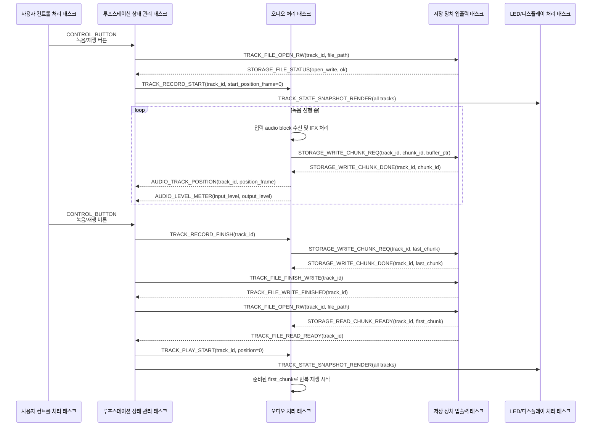

# 녹음 후 재생 전환 정책 TBA

이 문서는 `RECORDING -> PLAYING`, `OVERDUBBING -> PLAYING` 전환에서 발생할 수 있는 저장장치 지연과 버퍼 정책을 나중에 확정하기 위한 참고 문서다.

현재 단계에서는 정책을 확정하지 않는다. 아래 내용은 향후 [track_file_storage_policy.md](./track_file_storage_policy.md), [software_architecture.md](../architecture/software_architecture.md), [task_message_design.md](../architecture/task_message_design.md)를 갱신할 때 참고한다.

## 1. 문제 요약

녹음이 끝난 뒤 바로 재생으로 전환하려면, 녹음 파일을 재생 가능한 상태로 준비해야 한다. 단순한 구현은 다음 흐름을 가진다.

```text
파일 쓰기 마무리
-> WAV header 갱신
-> 파일 close 또는 sync
-> 읽기용 open 또는 seek
-> 첫 read chunk 확보
-> PLAYING 출력 시작
```

이 구조는 오디오 처리 태스크가 직접 FatFs 작업을 기다리지 않게 만들 수는 있지만, 파일 close/open/seek/read 자체의 지연을 없애지는 않는다. 따라서 `RECORDING -> PLAYING` 전환 시 짧은 무음 또는 대기 시간이 발생할 수 있다.

## 2. 현재 메시지 흐름 예시

아래 흐름은 `IDLE -> RECORDING -> PLAYING` 전이를 기준으로 한 메시지 흐름 예시다. 녹음 시작 전에는 저장 파일을 먼저 준비하고, 녹음 중에는 오디오 태스크가 만든 storage chunk를 저장 태스크가 비동기로 기록한다. 녹음을 마치고 재생으로 전환할 때는 파일 쓰기를 마무리한 뒤 첫 재생 chunk를 준비하고 `PLAYING` 출력을 시작한다.



## 3. 현재 흐름의 한계

위 흐름은 구현 단순성을 우선한 구조다. 다음 문제를 해결하지 못한다.

| 항목 | 판단 |
| --- | --- |
| 오디오 처리 태스크가 FatFs 작업을 직접 기다리는 문제 | 저장 태스크로 분리하면 완화 가능 |
| 파일 close/open/seek/read 자체의 시간 비용 | 해결되지 않음 |
| `RECORDING -> PLAYING` 전환 지연 | 해결되지 않음 |
| 첫 재생 chunk가 준비되기 전 무음 가능성 | 남아 있음 |

## 4. 기본 전제와 향후 검토할 대안

| 대안 | 설명 | 장점 | 주의점 |
| --- | --- | --- | --- |
| 전이 지연 허용 | 파일 쓰기 마무리와 첫 read chunk 준비가 끝난 뒤 재생을 시작한다. | 구현이 단순하다. | 녹음 종료 후 재생 시작까지 짧은 지연이 생길 수 있다. |
| read-write 파일 handle 유지 | 파일을 read-write 모드로 열어 close/open 없이 read/write 요청을 처리한다. 이 정책은 기본 전제로 확정한다. | close/open 비용을 줄일 수 있다. | 하나의 handle은 read/write 위치 포인터가 분리되지 않으므로 요청별 frame offset 관리와 header 갱신 정책이 필요하다. |
| 시작 구간 RAM prebuffer | `RECORDING` 중 트랙 시작부 일부를 RAM에 보관하고, 녹음 종료 직후 이 버퍼로 재생을 시작한다. | `RECORDING -> PLAYING` 지연을 숨길 수 있다. | RAM 사용량과 SD read stream으로 이어받는 정책이 필요하다. |
| 재생 위치 rolling buffer | 현재 loop position 이후의 재생 데이터를 RAM에 유지한다. | `OVERDUBBING -> PLAYING` 전환에 적합하다. | loop position, wrap 처리, 버퍼 소유권이 복잡해진다. |

## 5. RAM prebuffer 용량 참고

현재 오디오 포맷 기준은 `44.1 kHz`, `16-bit`, `stereo`다.

```text
WAV 저장 기준 byte rate = 44100 * 2ch * 2byte = 176,400 byte/s
내부 int32_t stereo 기준 byte rate = 44100 * 2ch * 4byte = 352,800 byte/s
```

| 보관 시간 | 16-bit stereo | 내부 int32_t stereo |
| --- | ---: | ---: |
| 50 ms | 약 8.8 KB | 약 17.6 KB |
| 100 ms | 약 17.6 KB | 약 35.3 KB |
| 200 ms | 약 35.3 KB | 약 70.6 KB |
| 500 ms | 약 88.2 KB | 약 176.4 KB |
| 1 s | 약 176.4 KB | 약 352.8 KB |

STM32H743VIT6에서 100~200 ms 수준의 단일 트랙 prebuffer는 검토 가능한 범위다. 다만 DMA 접근 가능 메모리, D-cache coherency, 버퍼 정렬, 다른 태스크의 RAM 사용량을 함께 고려해야 한다.

## 6. RECORDING과 OVERDUBBING의 차이

`RECORDING -> PLAYING`에서는 재생 시작 위치가 트랙 처음이므로, 트랙 시작부 prebuffer가 유효할 수 있다.

`OVERDUBBING -> PLAYING`에서는 오버더빙을 끝낸 시점의 loop position에서 재생이 이어져야 한다. 따라서 트랙 시작부 prebuffer는 충분하지 않다. 이 경우 현재 재생 위치 이후의 데이터를 보관하는 rolling buffer 또는 loop-aware read buffer 정책이 필요하다.

## 7. Undo/Redo 확장 계획

현재 오버더빙 저장 방식은 기존 트랙 chunk를 읽고, 입력 오디오와 합성한 뒤, 같은 파일 offset에 합성 결과를 다시 쓰는 destructive overwrite를 전제로 한다. 이 방식은 구현이 단순하지만, 기존 오디오 데이터를 덮어쓰므로 undo/redo를 구현하기 어렵다.

루프스테이션 기능으로 undo/redo를 추가할 경우에는 기존 파일을 즉시 덮어쓰지 않는 저장 정책이 필요하다. 후보는 다음과 같다.

| 후보 | 설명 | 장점 | 주의점 |
| --- | --- | --- | --- |
| take 파일 방식 | 첫 녹음 또는 오버더빙 결과를 별도 take 파일로 저장하고, 현재 활성 take를 metadata로 선택한다. | undo/redo가 파일 선택 변경으로 단순해질 수 있다. | 첫 녹음 완료 시 동일 오디오 데이터를 가진 기준 take를 준비해야 하며, 저장 공간 사용량이 증가한다. |
| delta 파일 방식 | 오버더빙에서 변경된 구간 또는 추가 입력 성분만 별도 delta 파일로 저장한다. | 원본 트랙을 보존하면서 변경분만 관리할 수 있다. | 재생 시 원본과 delta 합성이 필요해 read/mix 흐름이 복잡해진다. |
| snapshot 파일 방식 | 오버더빙이 끝날 때마다 전체 트랙 결과를 새 파일로 저장한다. | 재생 경로가 단순하고 undo/redo는 이전 snapshot 선택으로 처리할 수 있다. | 저장 용량과 쓰기 시간이 가장 크게 증가한다. |

향후 undo/redo를 도입한다면 첫 녹음 완료 시 기준 take를 생성하는 시점, 오버더빙 시작 시 활성 take와 새 take의 관계, 오버더빙 취소 또는 완료 시 metadata commit 순서를 함께 설계해야 한다.

TODO: `RECORDING -> PLAYING`과 `OVERDUBBING -> PLAYING`에 서로 다른 buffer 정책을 둘지 결정한다.

TODO: read-write handle을 유지한 상태에서 WAV header 갱신, `f_sync`, metadata commit 시점을 어떻게 둘지 결정한다.

TODO: 첫 재생 chunk 준비 전까지 상태를 `PLAYING`으로 전환할지, 별도 `PREPARING_PLAYBACK` 상태를 둘지 결정한다.

TODO: undo/redo 도입 시 take 파일, delta 파일, snapshot 파일 중 어떤 저장 정책을 사용할지 결정한다.
