# 오디오 효과 아키텍처

이 문서는 루프스테이션 요구사항 중 `REQ-FX` 항목을 만족시키기 위한 오디오 효과 구조를 정의한다.
요구사항 문서는 입력 또는 트랙 오디오에 FX를 적용할 수 있어야 한다는 동작을 설명하고, 이 문서는 어떤 FX를 선택할 수 있어야 하는지, 어느 오디오 처리 단계에서 FX가 적용되는지, FX 처리 블록이 어떤 입력을 받아 어떤 출력을 내야 하는지를 설명한다.

FX별 내부 알고리즘, filter 계수, delay line 구조, reverb 메모리 구조 같은 세부 구현은 이 문서가 아니라 기능 문서에서 결정한다.

## 1. 설계 범위

| 항목 | 내용 |
| --- | --- |
| 대상 요구사항 | `REQ-FX-001`, `REQ-FX-002`, `REQ-FX-003`, `REQ-FX-004`, `REQ-FX-005` |
| 포함 범위 | IFX/TFX 구분, 적용 가능한 FX 목록, FX 선택/활성화/파라미터 변경, FX 입출력 block 계약, bypass |
| 연관 설계 | 오디오 입출력, 사용자 입력, 표시 및 피드백, 트랙 생명주기 |
| 제외 범위 | FX별 DSP 알고리즘, 계수 계산, delay/reverb buffer 크기, 음질 튜닝 |

## 2. 관련 요구사항

| 요구사항 ID | 요구사항 요약 | 이 문서의 설계 관점 |
| --- | --- | --- |
| `REQ-FX-001` | 마이크 입력 오디오에 선택된 FX를 적용한다. | 입력 포맷 변환 이후 녹음/패스스루 분기 전에 IFX를 적용한다. |
| `REQ-FX-002` | 재생 중인 트랙 오디오에 선택된 FX를 적용한다. | 트랙 반복 재생 block에 TFX를 적용한 뒤 track gain과 믹싱으로 전달한다. |
| `REQ-FX-003` | 사용자가 변경한 FX 타입을 이후 오디오 처리에 반영한다. | 상태 관리 구조가 FX 선택 상태를 변경하고 오디오 처리 구조에 runtime snapshot으로 전달한다. |
| `REQ-FX-004` | 사용자가 변경한 FX 파라미터 값을 해당 FX 동작에 반영한다. | FX 파라미터 변경 command를 오디오 처리 구조가 block 처리 전에 반영한다. |
| `REQ-FX-005` | 비활성화 상태인 FX를 적용하지 않는다. | FX 처리 지점에서 enabled=false이면 입력 block을 bypass한다. |

## 3. 요구사항별 설계

### 3.1 REQ-FX-001 설계

`REQ-FX-001`은 마이크 입력 오디오에 선택된 FX를 적용할 수 있어야 한다는 요구사항이다.
입력 FX인 IFX는 입력 raw sample이 내부 audio block으로 변환된 뒤, 입력 패스스루와 녹음 경로로 분기되기 전에 적용된다.

#### 3.1.1 필요 아키텍처

| 설계 ID | 아키텍처 항목 | 역할 | 설계 결정 |
| --- | --- | --- | --- |
| `ARCH-FX-001` | IFX 처리 지점 | 마이크 입력 block에 FX를 적용한다. | 입력 포맷 변환 이후, 녹음/패스스루 분기 이전에 둔다. |
| `ARCH-FX-002` | IFX runtime snapshot | 선택 FX, 활성화 상태, 파라미터 값을 보관한다. | 오디오 처리 구조가 최신 snapshot을 block 처리에 사용한다. |
| `ARCH-FX-003` | IFX 입출력 계약 | FX가 받는 block과 내보내는 block을 고정한다. | 내부 `int32_t` interleaved stereo audio block을 입력/출력으로 사용한다. |
| `ARCH-FX-004` | bypass | IFX 비활성화 시 원본 block을 그대로 다음 단계로 넘긴다. | `enabled=false`이면 알고리즘을 호출하지 않는다. |

#### 3.1.2 구조 다이어그램

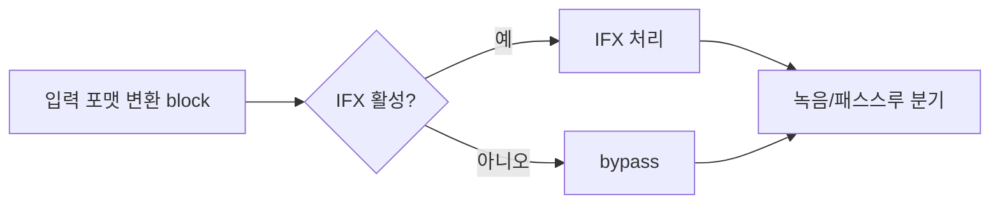

#### 3.1.3 동작 시나리오

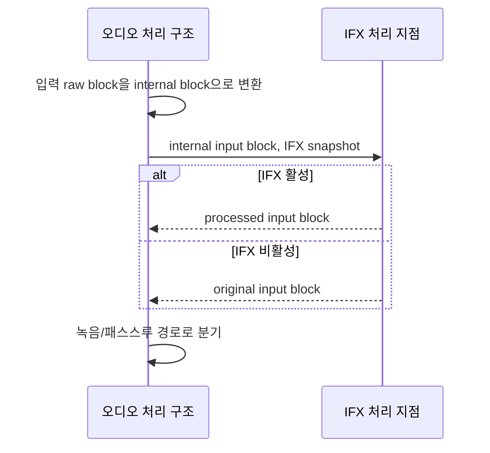

#### 3.1.4 개발해야 할 기능

| 기능 문서 | 기능 | 목적 |
| --- | --- | --- |
| `FEAT-input-fx-processing.md` | IFX 처리 | 입력 audio block에 선택된 FX를 적용하거나 bypass한다. |
| `FEAT-fx-parameter-control.md` | FX 설정 반영 | IFX 선택, 활성화, 파라미터 변경을 runtime snapshot에 반영한다. |

### 3.2 REQ-FX-002 설계

`REQ-FX-002`는 재생 중인 트랙 오디오에 선택된 FX를 적용할 수 있어야 한다는 요구사항이다.
트랙 FX인 TFX는 저장 구조에서 읽은 트랙 재생 block이 반복 재생 위치 관리를 거친 뒤, track gain과 출력 믹싱으로 들어가기 전에 적용된다.

#### 3.2.1 필요 아키텍처

| 설계 ID | 아키텍처 항목 | 역할 | 설계 결정 |
| --- | --- | --- | --- |
| `ARCH-FX-005` | TFX 처리 지점 | 재생 중인 트랙 block에 FX를 적용한다. | loop position 처리 이후, track gain 이전에 둔다. |
| `ARCH-FX-006` | track별 FX 상태 | 어떤 트랙에 어떤 TFX를 적용할지 표현한다. | `track_id`, `fx_id`, `enabled`, parameter snapshot을 사용한다. |
| `ARCH-FX-007` | TFX 입출력 계약 | 트랙 block을 받아 처리된 트랙 block을 반환한다. | 내부 `int32_t` interleaved stereo audio block을 입력/출력으로 사용한다. |
| `ARCH-FX-008` | bypass | TFX 비활성화 시 트랙 block을 그대로 track gain 단계로 넘긴다. | `enabled=false`이면 알고리즘을 호출하지 않는다. |

#### 3.2.2 구조 다이어그램

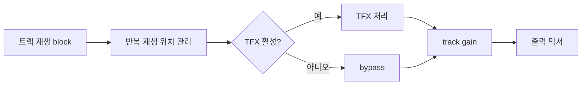

#### 3.2.3 동작 시나리오

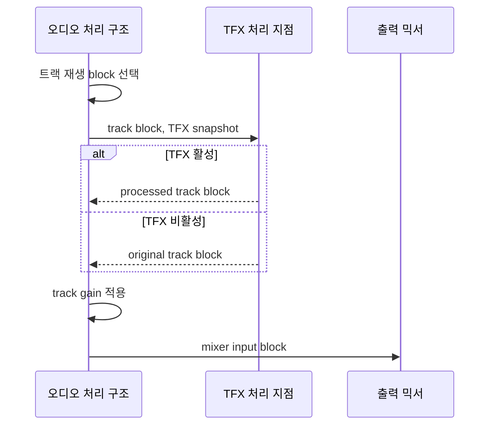

#### 3.2.4 개발해야 할 기능

| 기능 문서 | 기능 | 목적 |
| --- | --- | --- |
| `FEAT-track-fx-processing.md` | TFX 처리 | 트랙 재생 block에 선택된 FX를 적용하거나 bypass한다. |
| `FEAT-fx-parameter-control.md` | FX 설정 반영 | TFX 선택, 활성화, 파라미터 변경을 runtime snapshot에 반영한다. |

### 3.3 REQ-FX-003 설계

`REQ-FX-003`은 사용자가 변경한 FX 타입이 이후 오디오 처리에 반영되어야 한다는 요구사항이다.
FX 타입 변경은 사용자 입력 구조에서 raw event로 시작하고, 상태 관리 구조가 canonical FX state를 변경한 뒤 오디오 처리 구조에 전달한다.

#### 3.3.1 필요 아키텍처

| 설계 ID | 아키텍처 항목 | 역할 | 설계 결정 |
| --- | --- | --- | --- |
| `ARCH-FX-009` | FX 선택 상태 | IFX/TFX별 선택된 `fx_id`를 저장한다. | 상태 관리 구조가 canonical state를 소유한다. |
| `ARCH-FX-010` | FX 선택 command | 오디오 처리 구조의 runtime snapshot을 갱신한다. | `FX_SELECT`를 사용한다. |
| `ARCH-FX-011` | 표시 갱신 | 선택된 FX 타입을 LCD에 반영한다. | `FX_STATE_SNAPSHOT_RENDER` 또는 `FX_PARAM_SNAPSHOT_RENDER`를 사용한다. |
| `ARCH-FX-012` | block 경계 반영 | 처리 중인 block 중간에 설정이 변하지 않게 한다. | 오디오 처리 구조가 다음 block 처리 전 snapshot을 교체한다. |

#### 3.3.2 구조 다이어그램

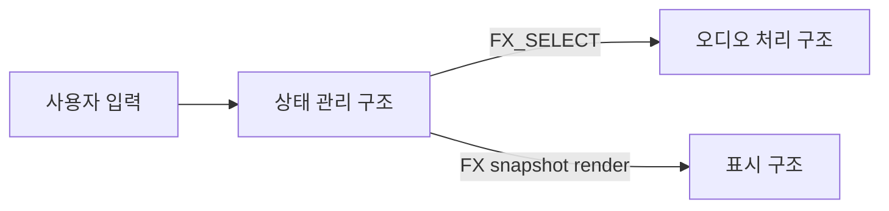

#### 3.3.3 동작 시나리오

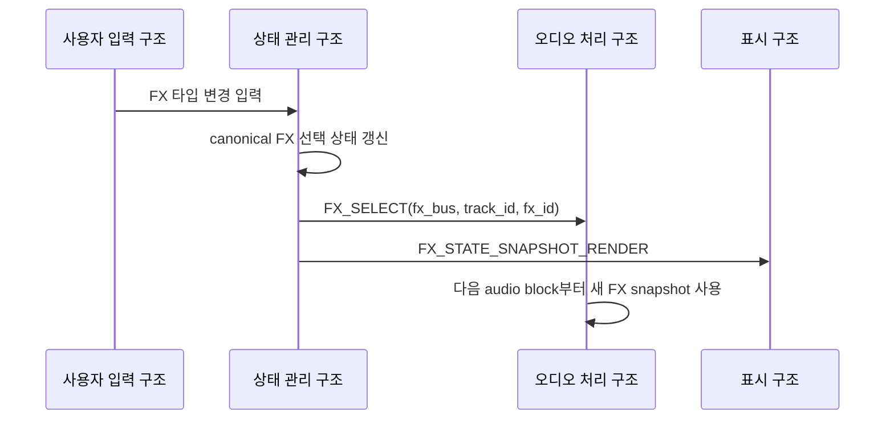

#### 3.3.4 개발해야 할 기능

| 기능 문서 | 기능 | 목적 |
| --- | --- | --- |
| `FEAT-fx-parameter-control.md` | FX 타입 선택 반영 | 사용자 입력으로 바뀐 FX 타입을 오디오 처리 snapshot에 반영한다. |

### 3.4 REQ-FX-004 설계

`REQ-FX-004`는 사용자가 변경한 FX 파라미터 값이 해당 FX 동작에 반영되어야 한다는 요구사항이다.
파라미터 값은 FX 알고리즘이 해석할 수 있는 정수 또는 정규화 값으로 전달하되, 각 알고리즘의 내부 의미는 기능 문서에서 결정한다.

#### 3.4.1 필요 아키텍처

| 설계 ID | 아키텍처 항목 | 역할 | 설계 결정 |
| --- | --- | --- | --- |
| `ARCH-FX-013` | 파라미터 상태 | FX별 파라미터 값을 저장한다. | 상태 관리 구조가 canonical state를 소유한다. |
| `ARCH-FX-014` | 파라미터 command | 오디오 처리 구조에 변경값을 전달한다. | `FX_PARAM_SET`을 사용한다. |
| `ARCH-FX-015` | 파라미터 snapshot | 표시 구조에 현재 FX 패널 전체 값을 전달한다. | `FX_PARAM_SNAPSHOT_RENDER`를 사용한다. |
| `ARCH-FX-016` | block 경계 반영 | 파라미터 변경을 안정적으로 적용한다. | 오디오 처리 구조가 block 처리 전 최신 값을 반영한다. |

#### 3.4.2 구조 다이어그램

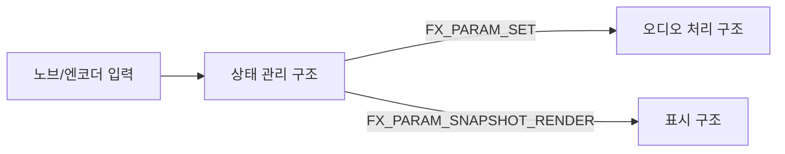

#### 3.4.3 동작 시나리오

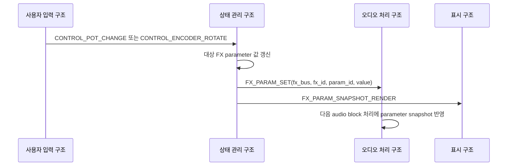

#### 3.4.4 개발해야 할 기능

| 기능 문서 | 기능 | 목적 |
| --- | --- | --- |
| `FEAT-fx-parameter-control.md` | FX 파라미터 변경 반영 | 사용자 입력으로 바뀐 값을 오디오 처리 snapshot에 반영한다. |

### 3.5 REQ-FX-005 설계

`REQ-FX-005`는 비활성화 상태인 FX를 오디오 신호에 적용하지 않아야 한다는 요구사항이다.
비활성화된 FX는 처리 지점 자체가 사라지는 것이 아니라 bypass 경로를 선택한다.

#### 3.5.1 필요 아키텍처

| 설계 ID | 아키텍처 항목 | 역할 | 설계 결정 |
| --- | --- | --- | --- |
| `ARCH-FX-017` | enable flag | FX 적용 여부를 표현한다. | IFX/TFX snapshot에 `enabled` 값을 둔다. |
| `ARCH-FX-018` | bypass path | FX 알고리즘을 호출하지 않고 원본 block을 전달한다. | input block과 output block format을 동일하게 유지한다. |
| `ARCH-FX-019` | 표시 상태 | 비활성화 상태를 사용자에게 보여준다. | FX LED off와 LCD 상태 표시를 갱신한다. |

#### 3.5.2 구조 다이어그램

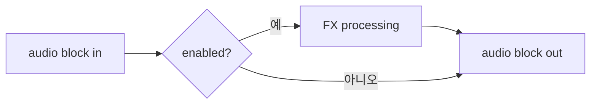

#### 3.5.3 동작 시나리오

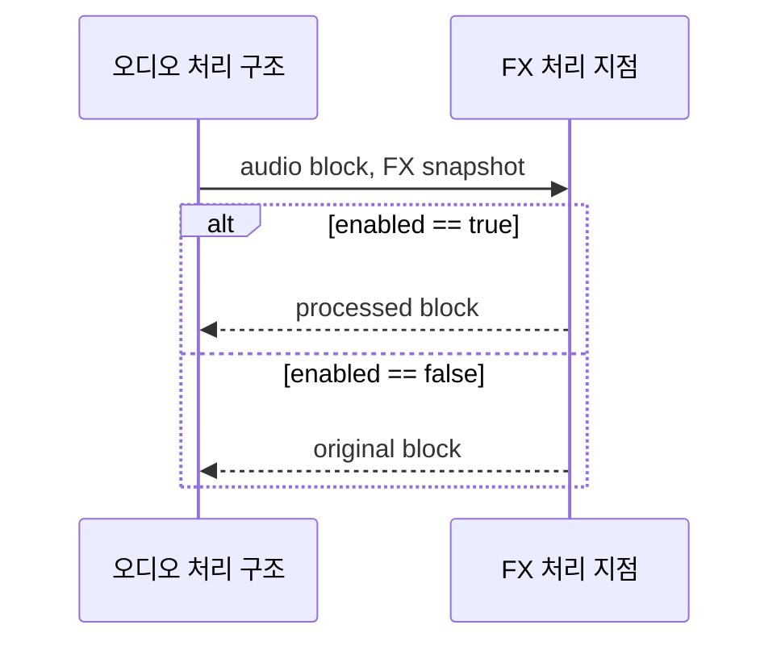

#### 3.5.4 개발해야 할 기능

| 기능 문서 | 기능 | 목적 |
| --- | --- | --- |
| `FEAT-input-fx-processing.md` | IFX bypass | IFX 비활성화 시 입력 block을 그대로 전달한다. |
| `FEAT-track-fx-processing.md` | TFX bypass | TFX 비활성화 시 트랙 block을 그대로 전달한다. |

## 4. 공통 설계 정보

### 4.1 FX 적용 가능한 항목

필수 구현 FX와 추가 후보 FX는 다음과 같이 분리한다.
이 문서는 적용 가능 목록과 입출력 계약만 정의하며, 각 FX의 내부 알고리즘은 기능 문서에서 결정한다.

| 구분 | FX | 적용 가능 bus | 비고 |
| --- | --- | --- | --- |
| 필수 | `LPF` | IFX, TFX | 내부 구현은 filter 계열로 묶을 수 있다. |
| 필수 | `HPF` | IFX, TFX | 내부 구현은 filter 계열로 묶을 수 있다. |
| 필수 | `EQ` | IFX, TFX | 대역 gain 조절 FX다. |
| 필수 | `Reverb` | IFX, TFX | 잔향 계열 FX다. |
| 추가 후보 | `Flanger` | IFX, TFX | 알고리즘과 buffer 크기는 기능 문서에서 결정한다. |
| 추가 후보 | `Phaser` | IFX, TFX | 알고리즘과 stage 수는 기능 문서에서 결정한다. |
| 추가 후보 | `Chorus` | IFX, TFX | delay line과 modulation 방식은 기능 문서에서 결정한다. |
| 추가 후보 | `Delay` | IFX, TFX | delay time과 tempo sync 여부는 기능 문서에서 결정한다. |

### 4.2 FX 적용 지점

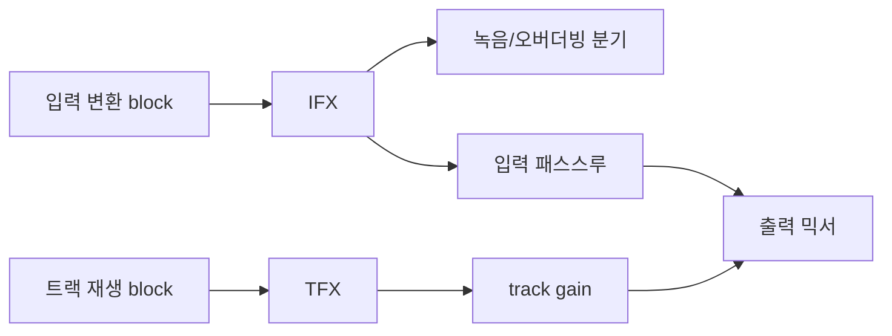

### 4.3 FX 입출력 계약

| 항목 | 기준 |
| --- | --- |
| 입력 block | 내부 `int32_t` interleaved stereo audio block |
| 출력 block | 입력과 동일한 frame 수의 내부 `int32_t` interleaved stereo audio block |
| frame 수 | 호출 단위의 audio block frame 수를 유지한다. |
| channel layout | `L, R, L, R, ...` 순서를 유지한다. |
| bypass | 입력 block을 동일 format의 출력 block으로 전달한다. |
| clipping | FX 내부에서 발생한 범위 초과는 최종 출력 제한 단계와 각 FX 기능 문서의 정책을 따른다. |

### 4.4 주요 메시지

| 메시지 | 송신 | 수신 | 용도 |
| --- | --- | --- | --- |
| `FX_ENABLE_SET` | 상태 관리 구조 | 오디오 처리 구조 | IFX/TFX 활성화 상태 변경 |
| `FX_SELECT` | 상태 관리 구조 | 오디오 처리 구조 | IFX/TFX 타입 변경 |
| `FX_PARAM_SET` | 상태 관리 구조 | 오디오 처리 구조 | FX 파라미터 변경 |
| `FX_STATE_SNAPSHOT_RENDER` | 상태 관리 구조 | 표시 구조 | FX 선택/활성화 표시 갱신 |
| `FX_PARAM_SNAPSHOT_RENDER` | 상태 관리 구조 | 표시 구조 | FX 파라미터 표시 갱신 |

## 5. 기능 문서 작성 대상

| 기능 문서 | 목적 | 주요 입력 | 주요 출력 |
| --- | --- | --- | --- |
| `FEAT-input-fx-processing.md` | IFX 적용 지점에서 선택된 FX를 적용하거나 bypass한다. | input audio block, IFX snapshot | processed input block |
| `FEAT-track-fx-processing.md` | TFX 적용 지점에서 선택된 FX를 적용하거나 bypass한다. | track audio block, TFX snapshot | processed track block |
| `FEAT-fx-parameter-control.md` | FX 선택, 활성화, 파라미터 변경을 runtime snapshot에 반영한다. | FX command | FX runtime snapshot |

## 6. 미정 사항

| 항목 | 결정 필요 내용 | 영향 |
| --- | --- | --- |
| FX별 파라미터 ID | 각 FX가 사용하는 파라미터 ID와 기본값을 확정해야 한다. | `FX_PARAM_SET`, 표시 |
| IFX/TFX 동시 적용 수 | bus별 하나만 허용할지, chain을 허용할지 정해야 한다. | 처리 비용, UI |
| TFX 대상 범위 | TFX를 트랙별로 둘지 선택 트랙 또는 전역으로 둘지 확정해야 한다. | runtime snapshot |
| 알고리즘 구현 | LPF/HPF/EQ/Reverb 등 세부 DSP 알고리즘을 정해야 한다. | Feature 단계 |
| FX 처리 비용 한계 | audio block 안에서 허용할 CPU 시간을 정해야 한다. | 실시간성 |
