# 사용자 입력 아키텍처

이 문서는 루프스테이션 요구사항 중 `REQ-INPUT` 항목을 만족시키기 위한 사용자 입력 구조를 정의한다.
요구사항 문서는 사용자의 물리 조작을 후속 구조가 의미 입력으로 처리할 수 있는 형태로 변환해야 함을 설명하고, 이 문서는 그 조작을 감지, 정규화, 전달, 해석하기 위한 내부 구조를 설명한다.

## 1. 설계 범위

| 항목 | 내용 |
| --- | --- |
| 대상 요구사항 | `REQ-INPUT-001`, `REQ-INPUT-002`, `REQ-INPUT-003`, `REQ-INPUT-004`, `REQ-INPUT-005`, `REQ-INPUT-006` |
| 포함 범위 | 버튼 입력 감지, 로터리 엔코더 회전/누름 감지, 아날로그 조작값 변경 감지, raw event 생성, 상태 관리 구조로 event 전달 |
| 연관 설계 | 표시 및 피드백, 오디오 효과, 트랙 생명주기, 실시간 동작 |
| 제외 범위 | LCD 렌더링, LED 출력, FX 알고리즘, 트랙 상태 전이 세부 정책, 물리 핀 초기화 코드 |

## 2. 관련 요구사항

| 요구사항 ID | 요구사항 요약 | 이 문서의 설계 관점 |
| --- | --- | --- |
| `REQ-INPUT-001` | 좌, 우, Enter, Exit 조작을 패널 조작 입력으로 처리할 수 있는 형태로 변환한다. | 버튼 press/release를 raw event로 전달하고 상태 관리 구조가 패널 탐색 명령으로 해석한다. |
| `REQ-INPUT-002` | FX 조작을 FX 활성화 입력으로 처리할 수 있는 형태로 변환한다. | IFX/TFX 버튼 event를 FX enable toggle 입력으로 해석할 수 있게 전달한다. |
| `REQ-INPUT-003` | FX부의 아날로그 조작을 FX 파라미터 변경 입력으로 처리할 수 있는 형태로 변환한다. | 아날로그 조작값을 threshold/rate limit 후 정규화해 상태 관리 구조로 전달한다. |
| `REQ-INPUT-004` | 트랙부의 아날로그 조작을 트랙 볼륨 변경 입력으로 처리할 수 있는 형태로 변환한다. | 아날로그 입력값을 대상 트랙 파라미터 변경 입력으로 해석할 수 있게 전달한다. |
| `REQ-INPUT-005` | 로터리 조작을 회전 방향 입력으로 처리할 수 있는 형태로 변환한다. | 로터리 엔코더 회전량을 signed delta로 표현해 전달한다. |
| `REQ-INPUT-006` | 로터리 누름 조작을 선택 또는 보조 입력으로 처리할 수 있는 형태로 변환한다. | 엔코더 push를 일반 버튼과 같은 press/release event로 전달한다. |

## 3. 요구사항별 설계

### 3.1 REQ-INPUT-001 설계

`REQ-INPUT-001`은 제어부의 좌, 우, Enter, Exit 조작을 받아 디스플레이 패널 조작 입력으로 처리할 수 있는 형태로 변환해야 한다는 요구사항이다.
이를 구현하려면 버튼 상태 감지, debounce, raw button event 생성, 패널 탐색 해석 아키텍처가 필요하다.
입력 처리 구조는 물리 입력의 발생만 보장하고, 현재 패널에서 그 입력이 어떤 의미를 갖는지는 상태 관리 구조가 판단한다.

#### 3.1.1 필요 아키텍처

| 설계 ID | 아키텍처 항목 | 역할 | 설계 결정 |
| --- | --- | --- | --- |
| `ARCH-INPUT-001` | 버튼 scan | 좌, 우, Enter, Exit 버튼의 물리 상태를 읽는다. | 디지털 입력 상태를 주기적으로 읽는다. |
| `ARCH-INPUT-002` | debounce | 접점 흔들림으로 인한 중복 event를 제거한다. | 안정화된 press/release 변화만 raw event로 만든다. |
| `ARCH-INPUT-003` | raw button event | 버튼 ID, 상태, 감지 시각을 하나의 event로 표현한다. | `CONTROL_BUTTON` 메시지와 `ControlButtonPayload`를 사용한다. |
| `ARCH-INPUT-004` | 패널 탐색 해석 | raw button event를 패널 이동, 진입, 복귀로 해석한다. | 상태 관리 구조가 현재 패널 상태를 기준으로 결정한다. |
| `ARCH-INPUT-005` | 표시 갱신 요청 | 패널 선택이 바뀌면 표시 구조에 갱신을 요청한다. | 표시 갱신은 `ARCH-DISPLAY.md`에서 다룬다. |

#### 3.1.2 구조 다이어그램

#### 3.1.3 동작 시나리오

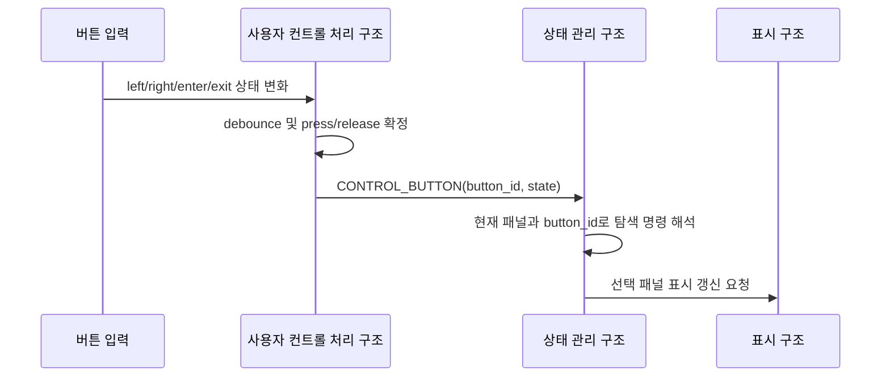

#### 3.1.4 개발해야 할 기능

| 기능 문서 | 기능 | 목적 |
| --- | --- | --- |
| `FEAT-INPUT-001.md` ~ `FEAT-INPUT-009.md` | 버튼 event 처리 | 제어 버튼의 interrupt 기록, debounce, snapshot 갱신, `CONTROL_BUTTON` 전송, 오류 기록을 구현한다. |

### 3.2 REQ-INPUT-002 설계

`REQ-INPUT-002`는 FX부의 FX 조작을 받아 FX 활성화 입력으로 처리할 수 있는 형태로 변환해야 한다는 요구사항이다.
이를 구현하려면 FX 버튼 event를 일반 버튼 event로 수집하고, 상태 관리 구조가 IFX 또는 TFX 활성화 toggle로 해석하는 아키텍처가 필요하다.
FX 활성화 결과는 오디오 처리 구조와 표시 구조로 전달된다.

#### 3.2.1 필요 아키텍처

| 설계 ID | 아키텍처 항목 | 역할 | 설계 결정 |
| --- | --- | --- | --- |
| `ARCH-INPUT-006` | FX 버튼 감지 | IFX/TFX 같은 FX 조작 버튼의 상태 변화를 감지한다. | 버튼 입력과 같은 scan/debounce 경로를 공유한다. |
| `ARCH-INPUT-007` | FX button event | 어떤 FX 조작이 발생했는지 button ID로 표현한다. | `CONTROL_BUTTON` 메시지에 FX button ID를 담는다. |
| `ARCH-INPUT-008` | FX 활성화 해석 | press event를 FX enable toggle로 해석한다. | 상태 관리 구조가 canonical FX state를 변경한다. |
| `ARCH-INPUT-009` | 오디오 설정 전파 | 변경된 FX enable state를 오디오 처리 구조에 전달한다. | `FX_ENABLE_SET` 계열 command로 연결한다. |
| `ARCH-INPUT-010` | 표시 갱신 전파 | FX 활성화 상태를 LED 또는 LCD에 반영한다. | 표시 구조에 FX state snapshot을 전달한다. |

#### 3.2.2 구조 다이어그램

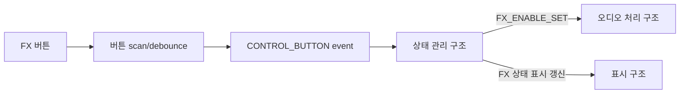

#### 3.2.3 동작 시나리오

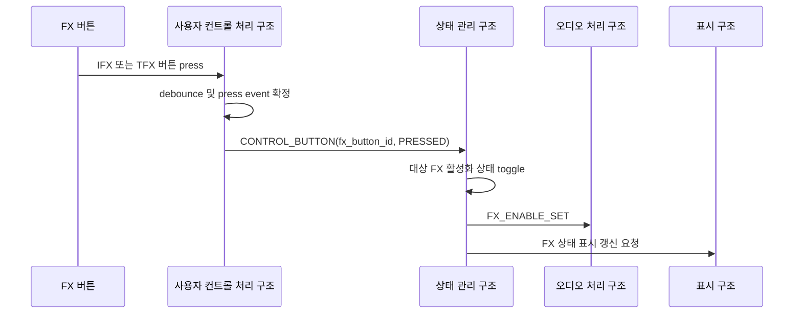

#### 3.2.4 개발해야 할 기능

| 기능 문서 | 기능 | 목적 |
| --- | --- | --- |
| `FEAT-INPUT-001.md` ~ `FEAT-INPUT-009.md` | 버튼 event 처리 | FX 버튼 입력의 interrupt 기록, debounce, snapshot 갱신, `CONTROL_BUTTON` 전송, 오류 기록을 구현한다. |

### 3.3 REQ-INPUT-003 설계

`REQ-INPUT-003`은 FX부의 아날로그 조작을 받아 FX 파라미터 변경 입력으로 처리할 수 있는 형태로 변환해야 한다는 요구사항이다.
이를 구현하려면 아날로그 입력 sampling, 값 안정화, 정규화, FX 파라미터 대상 해석 아키텍처가 필요하다.
아날로그 입력은 작은 흔들림이 많으므로 threshold와 rate limit을 거친 변경 event만 상태 관리 구조로 전달한다.

#### 3.3.1 필요 아키텍처

| 설계 ID | 아키텍처 항목 | 역할 | 설계 결정 |
| --- | --- | --- | --- |
| `ARCH-INPUT-011` | 아날로그 입력 sampling | FX부 아날로그 조작값을 주기적으로 읽는다. | 입력 처리 구조가 sampling 주기를 관리한다. |
| `ARCH-INPUT-012` | 변화 감지 | 의미 없는 미세 변화를 제거한다. | threshold와 rate limit을 적용한다. |
| `ARCH-INPUT-013` | 값 정규화 | raw 입력값을 UI/파라미터 범위로 변환한다. | `raw_value`와 `normalized_value`를 함께 전달한다. |
| `ARCH-INPUT-014` | pot event 생성 | pot ID, raw 값, 정규화 값을 event로 표현한다. | `CONTROL_POT_CHANGE` 메시지와 `ControlPotPayload`를 사용한다. |
| `ARCH-INPUT-015` | FX 파라미터 해석 | 현재 선택된 FX와 파라미터에 값을 반영한다. | 상태 관리 구조가 현재 FX context를 기준으로 결정한다. |

#### 3.3.2 구조 다이어그램

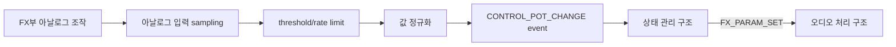

#### 3.3.3 동작 시나리오

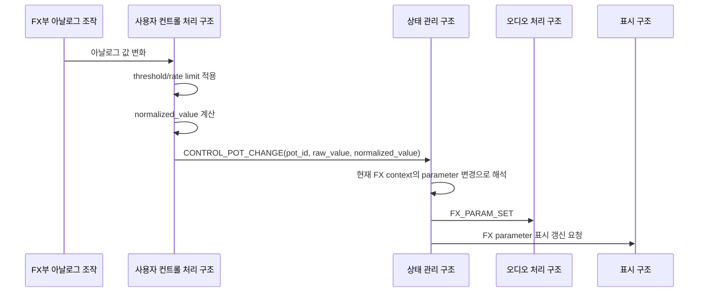

#### 3.3.4 개발해야 할 기능

| 기능 문서 | 기능 | 목적 |
| --- | --- | --- |
| `FEAT-potentiometer-sampling.md` | 아날로그 입력 sampling | raw 입력값을 주기적으로 읽고 의미 있는 변경만 event로 만든다. |

### 3.4 REQ-INPUT-004 설계

`REQ-INPUT-004`는 트랙부의 아날로그 조작을 받아 트랙 볼륨 변경 입력으로 처리할 수 있는 형태로 변환해야 한다는 요구사항이다.
이를 구현하려면 아날로그 입력을 트랙 파라미터 변경 event로 전달하고, 상태 관리 구조가 선택 트랙 또는 매핑된 트랙의 볼륨 변경으로 해석하는 아키텍처가 필요하다.

#### 3.4.1 필요 아키텍처

| 설계 ID | 아키텍처 항목 | 역할 | 설계 결정 |
| --- | --- | --- | --- |
| `ARCH-INPUT-016` | 트랙부 아날로그 sampling | 트랙 볼륨 조작값을 읽는다. | 아날로그 입력 sampling 경로를 공유한다. |
| `ARCH-INPUT-017` | 입력 대상 식별 | 어떤 트랙 또는 어떤 트랙 파라미터에 해당하는지 식별한다. | pot ID와 현재 UI context를 함께 사용한다. |
| `ARCH-INPUT-018` | 값 정규화 | raw 입력값을 track gain 범위로 변환할 수 있게 준비한다. | 입력 처리 구조는 정규화 값만 제공하고 gain scaling은 상태 관리 구조가 결정한다. |
| `ARCH-INPUT-019` | 트랙 파라미터 해석 | 입력값을 트랙 볼륨 변경으로 해석한다. | 상태 관리 구조가 `TRACK_PARAM_SET` 또는 track gain 변경 command로 전파한다. |

#### 3.4.2 구조 다이어그램

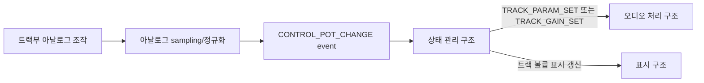

#### 3.4.3 동작 시나리오

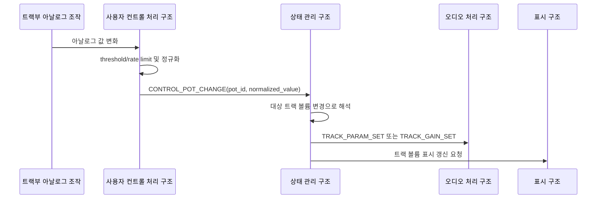

#### 3.4.4 개발해야 할 기능

| 기능 문서 | 기능 | 목적 |
| --- | --- | --- |
| `FEAT-potentiometer-sampling.md` | 아날로그 입력 sampling | 트랙부 아날로그 조작값을 안정적으로 event로 만든다. |

### 3.5 REQ-INPUT-005 설계

`REQ-INPUT-005`는 로터리 조작을 받아 회전 방향 입력으로 처리할 수 있는 형태로 변환해야 한다는 요구사항이다.
이를 구현하려면 encoder counter 또는 quadrature decoding, 방향/step 계산, modifier snapshot 포함 event 생성 아키텍처가 필요하다.
회전 입력이 어떤 값 변경으로 이어지는지는 현재 패널과 선택 항목에 따라 상태 관리 구조가 해석한다.
입력 처리 구조는 debounce가 끝난 버튼별 현재 상태를 내부 `button_state_snapshot`으로 보관하고, 엔코더 회전 event를 만들 때 그중 modifier로 사용할 버튼 상태를 `modifier_mask`에 복사한다.

#### 3.5.1 필요 아키텍처

| 설계 ID | 아키텍처 항목 | 역할 | 설계 결정 |
| --- | --- | --- | --- |
| `ARCH-INPUT-020` | encoder decoding | 로터리 엔코더 회전 방향과 step 수를 계산한다. | 회전 입력을 방향과 step으로 변환하는 decoding 경로를 사용한다. |
| `ARCH-INPUT-021` | delta 계산 | 시계 방향과 반시계 방향을 signed delta로 표현한다. | 시계 방향은 양수, 반시계 방향은 음수로 전달한다. |
| `ARCH-INPUT-022` | button state snapshot | debounce가 끝난 버튼별 현재 press/release 상태를 보관한다. | 입력 처리 구조가 `button_state_snapshot`을 유지한다. |
| `ARCH-INPUT-023` | modifier snapshot | 회전 순간 눌려 있는 modifier 버튼 상태를 함께 기록한다. | `button_state_snapshot`에서 encoder push 등 modifier bit를 읽어 `modifier_mask` 필드에 복사한다. |
| `ARCH-INPUT-024` | encoder event 생성 | encoder ID, delta, step 수, timestamp를 event로 표현한다. | `CONTROL_ENCODER_ROTATE` 메시지를 사용한다. |
| `ARCH-INPUT-025` | 값 변경 해석 | 현재 선택 항목의 값을 증가/감소시킨다. | 상태 관리 구조가 UI context를 기준으로 결정한다. |

#### 3.5.2 구조 다이어그램

#### 3.5.3 동작 시나리오

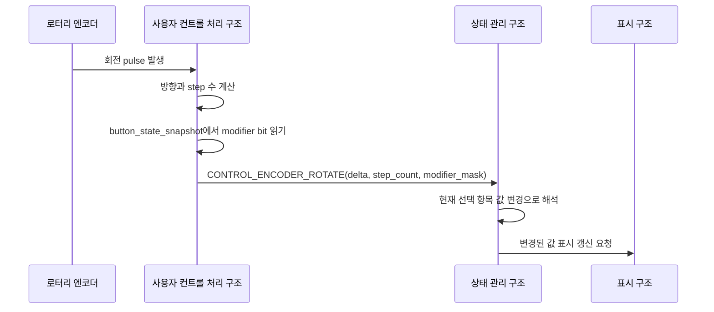

#### 3.5.4 개발해야 할 기능

| 기능 문서 | 기능 | 목적 |
| --- | --- | --- |
| `FEAT-encoder-event-processing.md` | 엔코더 회전 event 처리 | 로터리 회전을 signed delta event로 변환한다. |

### 3.6 REQ-INPUT-006 설계

`REQ-INPUT-006`은 로터리 누름 조작을 받아 선택 또는 보조 입력으로 처리할 수 있는 형태로 변환해야 한다는 요구사항이다.
이를 구현하려면 엔코더 push 입력을 일반 버튼과 같은 press/release event로 수집하고, 상태 관리 구조가 선택 또는 modifier 입력으로 해석하는 아키텍처가 필요하다.
엔코더 push의 press/release 변화는 `CONTROL_BUTTON`으로 상태 관리 구조에 전달되고, 동시에 입력 처리 구조의 `button_state_snapshot`에도 반영된다.
따라서 이후 엔코더 회전이 발생하면 입력 처리 구조는 현재 push 상태를 modifier bit로 포함한 `CONTROL_ENCODER_ROTATE` event를 생성할 수 있다.

#### 3.6.1 필요 아키텍처

| 설계 ID | 아키텍처 항목 | 역할 | 설계 결정 |
| --- | --- | --- | --- |
| `ARCH-INPUT-026` | encoder push scan | 엔코더 push switch 상태를 읽는다. | 버튼 scan/debounce 경로를 공유한다. |
| `ARCH-INPUT-027` | button state snapshot 갱신 | debounce가 확정한 encoder push 상태를 내부 상태에 저장한다. | press면 encoder push modifier bit를 set, release면 clear한다. |
| `ARCH-INPUT-028` | push event 생성 | encoder push를 button ID가 있는 raw event로 표현한다. | `CONTROL_BUTTON` 메시지에 encoder push button ID를 담는다. |
| `ARCH-INPUT-029` | 선택 입력 해석 | 현재 UI context에서 선택, 확정, 진입 같은 의미로 해석한다. | 상태 관리 구조가 현재 패널과 선택 항목 기준으로 결정한다. |
| `ARCH-INPUT-030` | modifier snapshot 제공 | push를 누른 상태의 회전을 별도 modifier로 해석할 수 있게 한다. | 입력 처리 구조의 `button_state_snapshot`이 encoder rotate event의 `modifier_mask` 입력이 된다. |

#### 3.6.2 구조 다이어그램

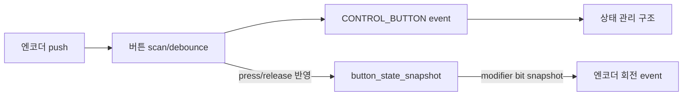

#### 3.6.3 동작 시나리오

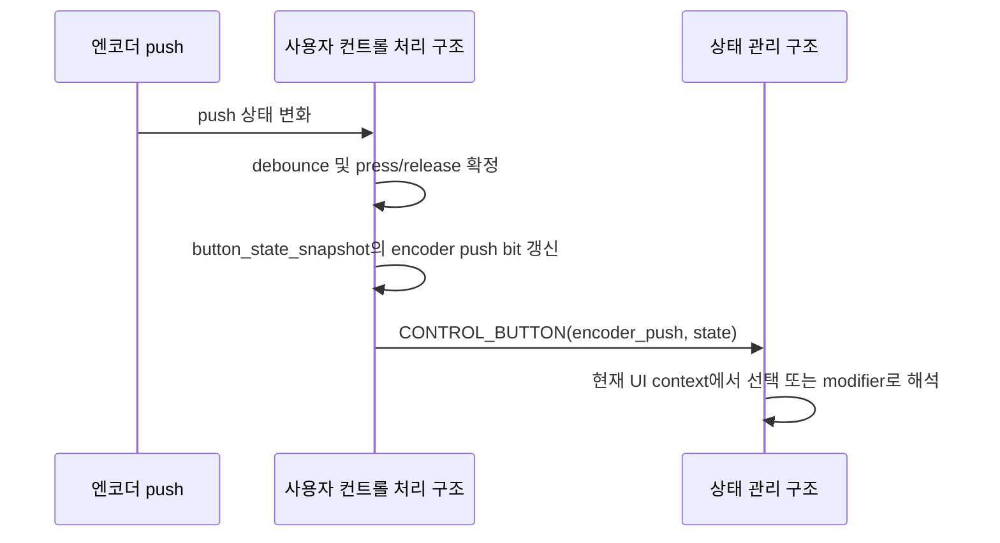

#### 3.6.4 개발해야 할 기능

| 기능 문서 | 기능 | 목적 |
| --- | --- | --- |
| `FEAT-INPUT-001.md` ~ `FEAT-INPUT-009.md` | 버튼 event 처리 | 엔코더 push의 interrupt 기록, debounce, snapshot 갱신, `CONTROL_BUTTON` 전송, 오류 기록을 구현한다. |
| `FEAT-encoder-push-input.md` | 엔코더 push 입력 해석 | push event를 선택 또는 파라미터 변경 이벤트로 해석한다. |

## 4. 공통 설계 정보

이 절은 요구사항별 설계에서 반복해서 등장하는 입력 event, 책임 분리, 물리 입력 장치 정보를 정리한다.
요구사항별 절에서는 이 값을 반복 설명하지 않고 필요한 아키텍처와 기능에 집중한다.

### 4.1 전체 입력 경로

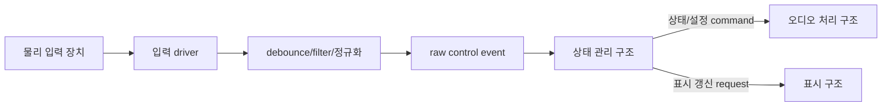

### 4.2 공통 구성 요소

| 설계 ID | 구성 요소 | 책임 | 입력 | 출력 | 관련 요구사항 |
| --- | --- | --- | --- | --- | --- |
| `ARCH-INPUT-031` | 버튼 scan/debounce | 물리 버튼의 안정된 press/release 변화를 만든다. | digital input state | `CONTROL_BUTTON` | `REQ-INPUT-001`, `REQ-INPUT-002`, `REQ-INPUT-006` |
| `ARCH-INPUT-032` | button state snapshot | debounce가 끝난 버튼별 현재 상태를 보관하고 회전 event의 modifier 입력으로 제공한다. | debounced button state | `modifier_mask` | `REQ-INPUT-005`, `REQ-INPUT-006` |
| `ARCH-INPUT-033` | 아날로그 입력 sampling | raw 입력값을 읽고 의미 있는 변경을 찾는다. | analog input sample | `CONTROL_POT_CHANGE` | `REQ-INPUT-003`, `REQ-INPUT-004` |
| `ARCH-INPUT-034` | 엔코더 decoding | 회전 방향과 step 수를 계산한다. | encoder rotation input | `CONTROL_ENCODER_ROTATE` | `REQ-INPUT-005` |
| `ARCH-INPUT-035` | raw event queue | 입력 event를 순서대로 상태 관리 구조에 전달한다. | control event | `state_event_queue` message | `REQ-INPUT-001` ~ `REQ-INPUT-006` |
| `ARCH-INPUT-036` | 상태 관리 해석 | raw event를 시스템 동작으로 변환한다. | control event, current state | audio/display/storage command | `REQ-INPUT-001` ~ `REQ-INPUT-006` |

### 4.3 입력 event 메시지

| 메시지 타입 | Payload | 설명 |
| --- | --- | --- |
| `CONTROL_BUTTON` | `ControlButtonPayload` | 버튼과 엔코더 push의 press/release 상태를 전달한다. |
| `CONTROL_ENCODER_ROTATE` | `ControlEncoderPayload` | 로터리 엔코더 회전 방향, step 수, modifier snapshot을 전달한다. |
| `CONTROL_POT_CHANGE` | `ControlPotPayload` | 아날로그 조작의 raw 값과 정규화 값을 전달한다. |

### 4.4 Payload 핵심 필드

| Payload | 핵심 필드 | 설명 |
| --- | --- | --- |
| `ControlButtonPayload` | `button_id`, `state`, `timestamp_ms` | 어떤 버튼이 언제 눌리거나 떼어졌는지 표현한다. |
| `ControlEncoderPayload` | `encoder_id`, `delta`, `step_count`, `modifier_mask`, `timestamp_ms` | 회전 방향과 양, 회전 순간의 modifier 상태를 표현한다. |
| `ControlPotPayload` | `pot_id`, `raw_value`, `normalized_value`, `timestamp_ms` | 아날로그 조작의 원본값과 해석 가능한 정규화 값을 표현한다. |

### 4.5 책임 분리

| 책임 | 담당 구조 | 이유 |
| --- | --- | --- |
| debounce, press/release 감지 | 사용자 컨트롤 처리 구조 | 물리 입력 안정화는 입력 장치에 가까운 계층에서 처리한다. |
| button state snapshot 유지 | 사용자 컨트롤 처리 구조 | 회전 event 생성 시점의 modifier 상태를 즉시 복사해야 한다. |
| 아날로그 입력 threshold/rate limit | 사용자 컨트롤 처리 구조 | 아날로그 흔들림과 과도한 event 생성을 입력 계층에서 줄인다. |
| long press/repeat/double click 해석 | 상태 관리 구조 | 현재 트랙 상태와 UI context에 따라 의미가 달라진다. |
| 엔코더 push + 회전 modifier 해석 | 상태 관리 구조 | modifier 조합의 의미가 현재 선택 항목에 따라 달라진다. |
| BPM, FX, 트랙 볼륨 변경 해석 | 상태 관리 구조 | canonical state 변경과 command 전파를 한 곳에서 관리한다. |

## 5. 기능 문서 작성 대상

요구사항별 설계를 실제 구현으로 나누면 다음 기능 문서가 필요하다.
각 기능 문서는 `docs/3-Features/ARCH-INPUT/` 아래에 기능 한 개씩 작성한다.

| 기능 문서 | 목적 | 주요 입력 | 주요 출력 |
| --- | --- | --- | --- |
| `FEAT-INPUT-001.md` | 버튼 source를 `ButtonId`로 식별한다. | EXTI source | `ButtonId` |
| `FEAT-INPUT-002.md` | 버튼 EXTI ISR에서 raw event를 기록한다. | EXTI interrupt | `ButtonIsrEvent` |
| `FEAT-INPUT-003.md` | ISR 버튼 event를 사용자 컨트롤 입력 큐에 보관한다. | `ButtonIsrEvent` | `button_isr_event_queue` |
| `FEAT-INPUT-004.md` | 사용자 컨트롤 처리 태스크가 raw event를 순서대로 읽는다. | `button_isr_event_queue` | raw button transition |
| `FEAT-INPUT-005.md` | 버튼 bounce를 제거하고 stable edge를 확정한다. | raw button transition | stable button edge |
| `FEAT-INPUT-006.md` | 버튼 상태 snapshot을 갱신한다. | stable button edge | `button_state_snapshot` |
| `FEAT-INPUT-007.md` | stable edge를 `CONTROL_BUTTON` payload로 변환한다. | stable button edge | `ControlButtonPayload` |
| `FEAT-INPUT-008.md` | `CONTROL_BUTTON` message를 상태 관리 event queue로 전송한다. | `ControlButtonPayload` | `CONTROL_BUTTON` |
| `FEAT-INPUT-009.md` | 버튼 입력 오류와 overflow를 기록한다. | input error | diagnostic counter |
|  | 로터리 엔코더 회전을 signed delta event로 생성한다. | encoder rotation input | `CONTROL_ENCODER_ROTATE` |
|  | 아날로그 조작값을 안정적인 event로 생성한다. | analog input sample | `CONTROL_POT_CHANGE` |
|  | 엔코더 push를 선택 또는 파라미터 변경 이벤트로 해석한다. | `CONTROL_BUTTON` | selection/parameter change event |

## 6. 미정 사항

| 항목 | 결정 필요 내용 | 영향 |
| --- | --- | --- |
| 버튼 ID 목록 | 실제 버튼 배치와 버튼 ID mapping을 확정해야 한다. | `ButtonId`, 표시/상태 해석 |
| debounce 시간 | 버튼별 debounce 기준 시간을 정해야 한다. | 입력 응답성, 중복 입력 방지 |
| long press 기준 | 길게 누름과 반복 입력의 시간 기준을 정해야 한다. | 트랙 reset, UI repeat 동작 |
| 아날로그 입력 정규화 범위 | `normalized_value`의 범위와 scaling 정책을 정해야 한다. | FX parameter, track volume 해석 |
| 아날로그 입력 threshold | raw 입력 변화량 기준과 rate limit 주기를 정해야 한다. | event 양, 조작 민감도 |
| 엔코더 step 단위 | encoder pulse와 UI step의 대응 관계를 정해야 한다. | 값 변경 속도, 사용자 조작감 |
