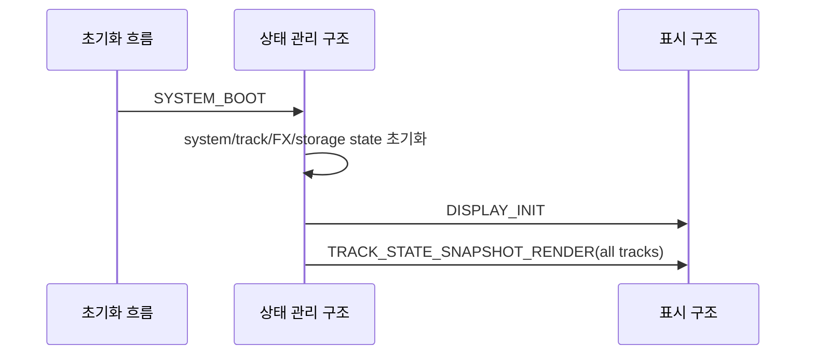
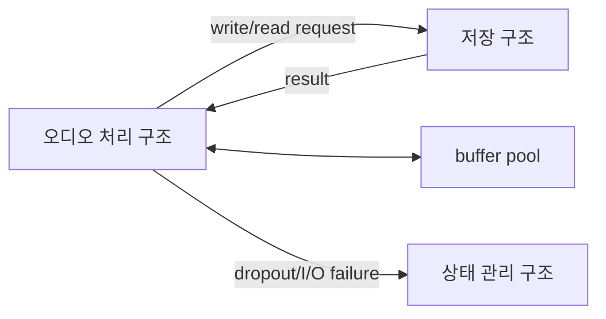
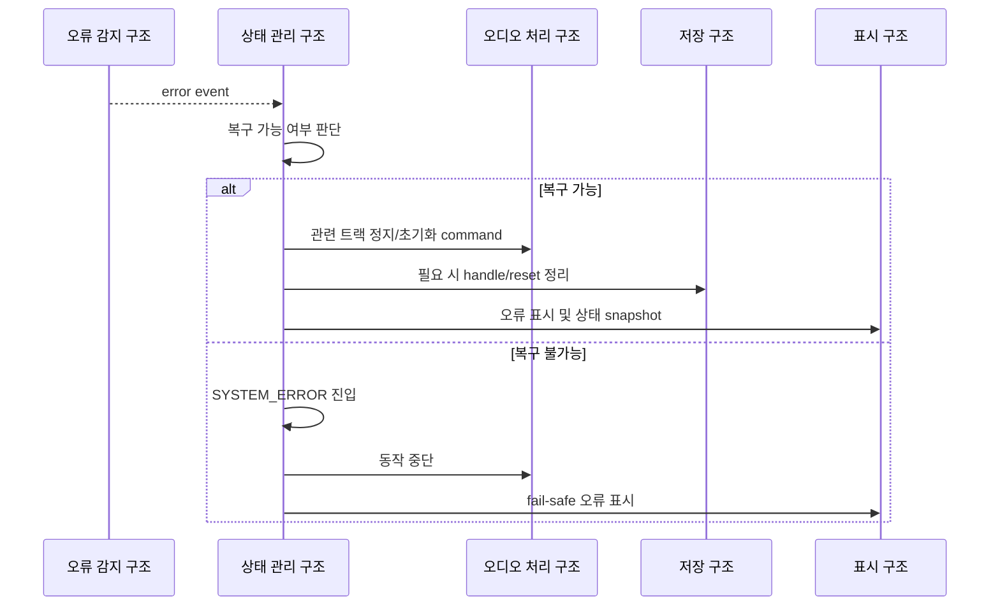

# 실시간 동작 및 오류 대응 아키텍처

이 문서는 루프스테이션 요구사항 중 `REQ-RUNTIME` 항목을 만족시키기 위한 실시간 동작, 초기화, 오류 대응 구조를 정의한다.
요구사항 문서는 시스템이 끊김 없이 동작하고 오류를 안전하게 처리해야 한다는 제약을 설명하고, 이 문서는 태스크 분리, 메시지 흐름, buffer 소유권, 오류 전파 구조를 설명한다.

## 1. 설계 범위

| 항목 | 내용 |
| --- | --- |
| 대상 요구사항 | `REQ-RUNTIME-001` ~ `REQ-RUNTIME-011` |
| 포함 범위 | 시스템 초기화, 실시간 오디오 처리, 저장 I/O 응답, 사용자 입력 응답, 오류 보고, fail-safe, 장시간 상태 일관성 |
| 연관 설계 | 오디오 입출력, 저장 및 불러오기, 트랙 생명주기, 사용자 입력, 표시 및 피드백 |
| 제외 범위 | 개별 peripheral driver 구현, 정량 성능 목표 확정, 오류 코드 전체 목록 |

## 2. 관련 요구사항

| 요구사항 ID | 요구사항 요약 | 이 문서의 설계 관점 |
| --- | --- | --- |
| `REQ-RUNTIME-001` | 전원 인가 시 필요한 자원을 초기화한다. | 부팅 초기화 흐름과 태스크 시작 순서를 정의한다. |
| `REQ-RUNTIME-002` | 녹음 중 끊김 없이 저장한다. | 오디오 처리와 storage write를 분리하고 buffer backpressure를 관리한다. |
| `REQ-RUNTIME-003` | 재생 중 끊김 없이 재생한다. | read prebuffer와 출력 underrun 대응 구조를 둔다. |
| `REQ-RUNTIME-004` | 오버더빙 중 재생과 녹음을 동시에 유지한다. | read/write chunk 흐름과 오디오 처리 우선순위를 분리한다. |
| `REQ-RUNTIME-005` | 사용자 입력에 정해진 응답 시간 안에 반응한다. | 입력 event queue와 상태 관리 해석 경로를 정의한다. |
| `REQ-RUNTIME-006` | 저장 작업을 시간 안에 완료하거나 오류를 보고한다. | storage request/result와 timeout/error 보고 구조를 둔다. |
| `REQ-RUNTIME-007` | 오류 발생 시 사용자에게 표시한다. | 오류 event를 상태 관리 구조로 모으고 표시 구조에 전달한다. |
| `REQ-RUNTIME-008` | 동작 중 오류 시 트랙을 안전한 초기 상태로 전환한다. | 오디오/저장 오류를 트랙 상태 복구 정책으로 연결한다. |
| `REQ-RUNTIME-009` | 저장 오류 시 저장 기능을 안전한 초기 상태로 되돌린다. | storage error 후 handle/buffer/queue 정리 구조를 둔다. |
| `REQ-RUNTIME-010` | 복구 불가능한 오류 시 오류 상태로 진입하고 동작을 중단한다. | fail-safe system error state를 둔다. |
| `REQ-RUNTIME-011` | 장시간 동작 중 상태 일관성을 유지한다. | canonical state와 snapshot 표시, request id 추적을 사용한다. |

## 3. 요구사항별 설계

### 3.1 REQ-RUNTIME-001 설계

전원 인가 후 시스템은 입력, 표시, 오디오, 저장 기능이 사용 가능한 초기 상태로 진입해야 한다.

| 설계 ID | 아키텍처 항목 | 역할 | 설계 결정 |
| --- | --- | --- | --- |
| `ARCH-RUNTIME-001` | 시스템 부팅 event | 초기화 완료 후 상태 모델 생성을 시작한다. | `SYSTEM_BOOT`를 상태 관리 구조로 전달한다. |
| `ARCH-RUNTIME-002` | 태스크 초기화 | 입력, 오디오, 저장, 표시 구조를 준비한다. | 하드웨어 초기화 후 RTOS queue와 task를 시작한다. |
| `ARCH-RUNTIME-003` | 초기 표시 | 초기 패널과 트랙 상태를 표시한다. | `DISPLAY_INIT`, `TRACK_STATE_SNAPSHOT_RENDER`를 보낸다. |

### 3.2 REQ-RUNTIME-002 ~ REQ-RUNTIME-004 설계

녹음, 재생, 오버더빙의 무중단 요구사항은 오디오 처리 구조를 높은 우선순위로 두고 저장 I/O를 비동기로 분리하는 방식으로 만족시킨다.

| 설계 ID | 아키텍처 항목 | 역할 | 설계 결정 |
| --- | --- | --- | --- |
| `ARCH-RUNTIME-004` | 오디오 처리 우선순위 | 일정한 audio block 주기로 처리한다. | 오디오 처리 구조가 blocking I/O를 수행하지 않는다. |
| `ARCH-RUNTIME-005` | buffer pool | storage read/write 지연을 흡수한다. | buffer descriptor와 소유권 이전 규칙을 둔다. |
| `ARCH-RUNTIME-006` | storage worker | SD/FatFs 작업을 별도 구조에서 수행한다. | `storage_request_queue`로 요청을 직렬화한다. |
| `ARCH-RUNTIME-007` | underrun/backlog 감지 | buffer 부족 또는 처리 지연을 감지한다. | 오디오 처리 구조가 dropout/error event를 보고한다. |

### 3.3 REQ-RUNTIME-005 설계

사용자 입력 응답은 입력 처리 구조가 raw event를 빠르게 만들고, 상태 관리 구조가 canonical state 변경을 결정하는 방식으로 처리한다.

| 설계 ID | 아키텍처 항목 | 역할 | 설계 결정 |
| --- | --- | --- | --- |
| `ARCH-RUNTIME-008` | 입력 event queue | 사용자 입력을 순서대로 전달한다. | `state_event_queue`를 사용한다. |
| `ARCH-RUNTIME-009` | 입력 안정화 | debounce, threshold, encoder delta를 계산한다. | 사용자 입력 구조가 담당한다. |
| `ARCH-RUNTIME-010` | 상태 변경 시작 | 입력 해석 후 command를 필요한 구조로 보낸다. | 상태 관리 구조가 담당한다. |
| `ARCH-RUNTIME-011` | 응답 시간 측정 | event timestamp와 처리 시각을 비교할 수 있게 한다. | payload에 `timestamp_ms`를 포함한다. |

### 3.4 REQ-RUNTIME-006 설계

저장 작업은 완료 또는 오류를 명시적으로 반환해야 한다.

| 설계 ID | 아키텍처 항목 | 역할 | 설계 결정 |
| --- | --- | --- | --- |
| `ARCH-RUNTIME-012` | request id | 요청과 결과를 연결한다. | storage 요청에 `request_id`를 포함한다. |
| `ARCH-RUNTIME-013` | requester 반환 | 결과를 요청한 구조로 직접 돌려준다. | 오디오 요청 결과는 오디오 처리 구조로 직접 반환한다. |
| `ARCH-RUNTIME-014` | timeout/error 보고 | 응답 지연 또는 실패를 상태 관리 구조로 보고한다. | `STORAGE_ERROR`, `AUDIO_TRACK_IO_FAILED`를 사용한다. |

### 3.5 REQ-RUNTIME-007 ~ REQ-RUNTIME-010 설계

오류 대응 요구사항은 오류를 감지한 구조가 상태 관리 구조에 의미 있는 오류 event를 보내고, 상태 관리 구조가 복구 가능 여부를 판단하는 방식으로 만족시킨다.

| 설계 ID | 아키텍처 항목 | 역할 | 설계 결정 |
| --- | --- | --- | --- |
| `ARCH-RUNTIME-015` | 오류 감지 | 각 구조가 자기 책임 범위의 오류를 감지한다. | 오디오 dropout, storage failure, media error를 분리한다. |
| `ARCH-RUNTIME-016` | 오류 event | 상태 관리 구조로 오류 정보를 전달한다. | `AUDIO_TRACK_IO_FAILED`, `AUDIO_DROPOUT_DETECTED`, `STORAGE_ERROR`를 사용한다. |
| `ARCH-RUNTIME-017` | 사용자 표시 | 오류 상태를 LCD 또는 LED로 보여준다. | 표시 구조에 system/diagnostic render를 보낸다. |
| `ARCH-RUNTIME-018` | 트랙 복구 | 동작 중 오류가 발생한 트랙을 안전한 초기 상태로 전환한다. | 오류별 초기화 범위는 미정 사항으로 둔다. |
| `ARCH-RUNTIME-019` | fail-safe | 복구 불가능 오류에서 임의 동작을 멈춘다. | system error state를 두고 오디오/저장 command를 차단한다. |

### 3.6 REQ-RUNTIME-011 설계

장시간 동작 일관성은 canonical state, request/result 추적, snapshot 표시, buffer 소유권 규칙으로 유지한다.

| 설계 ID | 아키텍처 항목 | 역할 | 설계 결정 |
| --- | --- | --- | --- |
| `ARCH-RUNTIME-020` | canonical state | 시스템/트랙/FX/UI 상태의 원본을 유지한다. | 상태 관리 구조가 소유한다. |
| `ARCH-RUNTIME-021` | snapshot 표시 | 표시 누락으로 인한 불일치를 줄인다. | 상태 변경 시 전체 snapshot을 보낸다. |
| `ARCH-RUNTIME-022` | request/result 추적 | 비동기 요청이 뒤섞이지 않게 한다. | `request_id`와 requester를 사용한다. |
| `ARCH-RUNTIME-023` | buffer 소유권 | read/write buffer의 중복 사용을 막는다. | 소유권 이전 시점과 반환 시점을 문서화한다. |

## 4. 공통 설계 정보

### 4.1 태스크 책임

| 구조 | 주 책임 | 런타임 관점 |
| --- | --- | --- |
| 사용자 입력 구조 | 버튼/엔코더/포텐셔미터 event 생성 | 입력 응답성과 event timestamp |
| 상태 관리 구조 | canonical state와 오류 정책 | 상태 일관성, fail-safe |
| 오디오 처리 구조 | audio block 처리와 믹싱 | 실시간 우선순위, dropout 감지 |
| 저장 구조 | SD/FatFs read/write | I/O 완료/오류 반환 |
| 표시 구조 | LCD/LED 렌더링 | 오류와 상태 표시 |

### 4.2 오류 event

| 오류 event | 송신 | 의미 |
| --- | --- | --- |
| `AUDIO_TRACK_IO_FAILED` | 오디오 처리 구조 | 트랙 파일 open/read/write/close 실패가 오디오 동작에 영향을 줌 |
| `AUDIO_DROPOUT_DETECTED` | 오디오 처리 구조 | audio block 처리 지연 또는 누락 발생 |
| `STORAGE_ERROR` | 저장 구조 | 저장 장치 mount, media, FatFs 공통 오류 발생 |
| `TRACK_FILE_RESET_FAILED` | 저장 구조 | 트랙 초기화 실패 |

### 4.3 buffer 소유권 기준

| buffer | 소유권 이전 | 반환 |
| --- | --- | --- |
| audio block | DMA event 후 오디오 처리 구조가 소비 | 처리 완료 후 pool 반환 |
| storage write chunk | write request 전송 시 저장 구조로 이전 | `STORAGE_WRITE_CHUNK_DONE` 후 반환 |
| storage read chunk | `STORAGE_READ_CHUNK_READY` 수신 시 오디오 처리 구조로 이전 | 재생 소비 후 반환 |

## 5. 기능 문서 작성 대상

| 기능 문서 | 목적 | 주요 입력 | 주요 출력 |
| --- | --- | --- | --- |
| `FEAT-rtos-task-model.md` | 태스크 우선순위와 queue 구성을 구현한다. | task config | running tasks |
| `FEAT-task-message-contract.md` | 메시지 envelope와 request/result 계약을 구현한다. | message type | typed queue message |
| `FEAT-buffer-ownership.md` | audio/storage buffer 소유권 이전을 구현한다. | buffer descriptor | safe buffer reuse |
| `FEAT-error-reporting.md` | 오류 event와 사용자 표시 경로를 구현한다. | error condition | error state/display |

## 6. 미정 사항

| 항목 | 결정 필요 내용 | 영향 |
| --- | --- | --- |
| 정량 지연 목표 | 오디오 지연, 입력 응답, storage timeout 기준을 정해야 한다. | 검증 기준 |
| RTOS 우선순위 | 실제 task priority 값을 정해야 한다. | 실시간성 |
| queue 길이 | 각 queue와 mailbox 길이를 정해야 한다. | 메모리와 누락 정책 |
| 오류별 복구 범위 | 트랙 초기화, 저장 기능 재초기화, 시스템 오류 진입 기준을 정해야 한다. | fail-safe |
| 장시간 시험 기준 | 시험 시간과 반복 조작 조건을 정해야 한다. | 검증 계획 |
