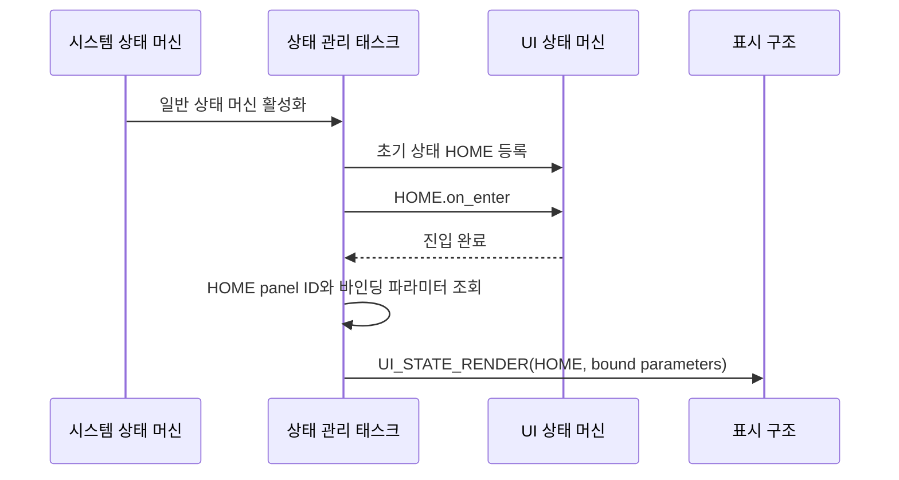
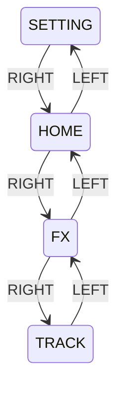
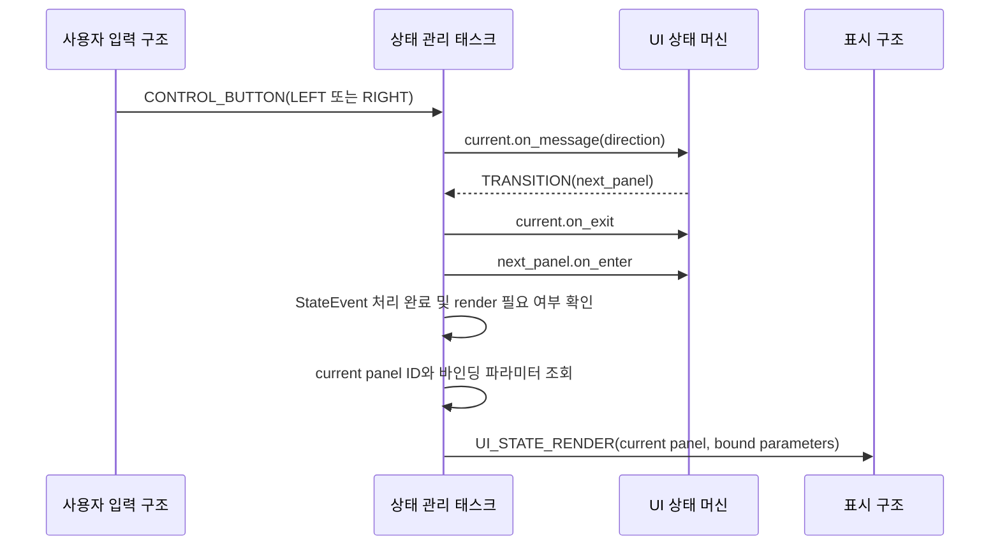
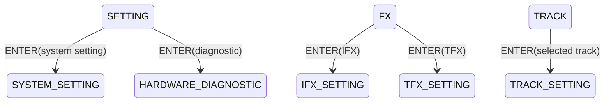
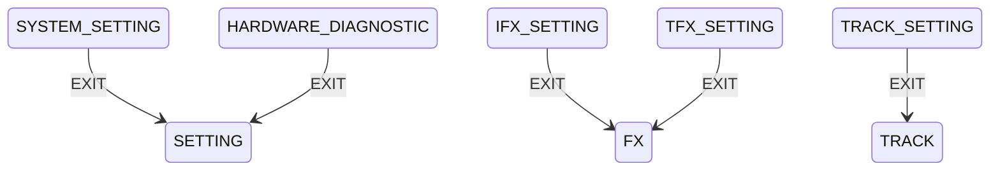
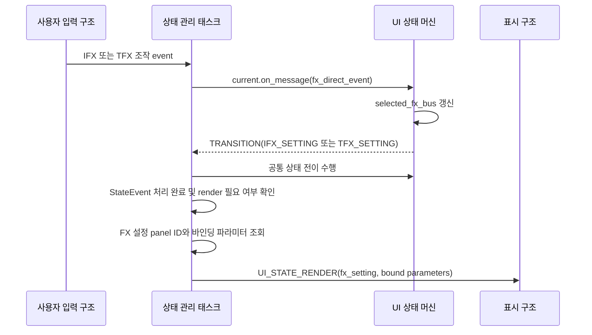
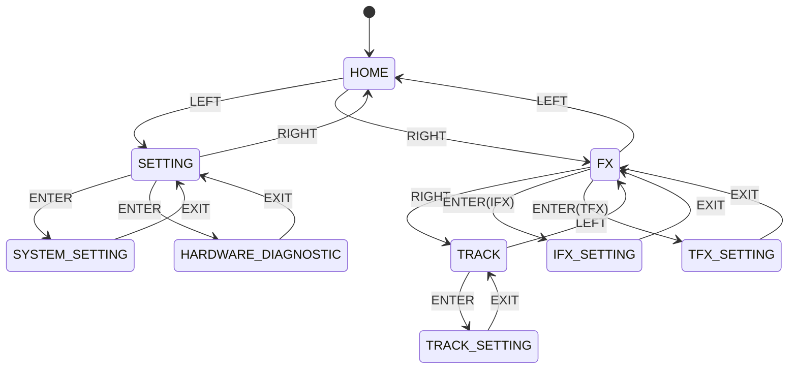
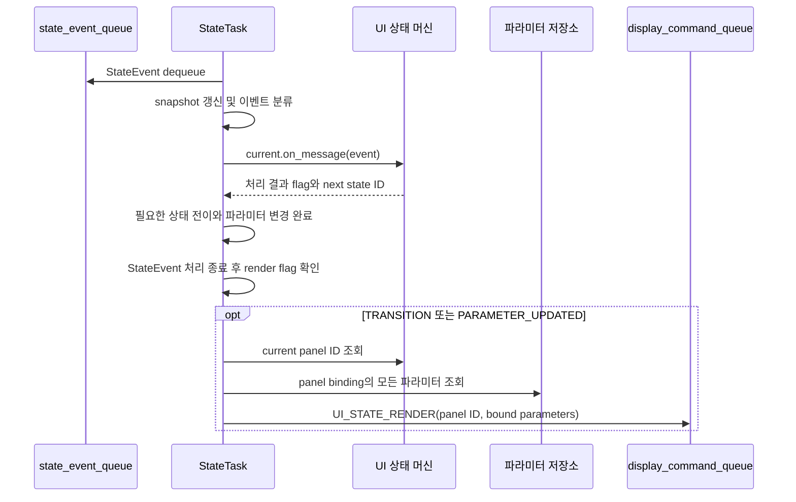

# UI 상태 머신 아키텍처

이 문서는 루프스테이션 요구사항 중 `REQ-STATE-UI` 항목을 만족시키기 위한 UI 상태 머신 구조를 정의한다.
상태 머신의 공통 생명주기와 이벤트 처리 계약은 `ARCH-STATE.md`를 따르며, 실제 LCD frame 생성과 출력은 `ARCH-DISPLAY.md`를 따른다.

## 1. 설계 범위

| 항목 | 내용 |
| --- | --- |
| 대상 요구사항 | `REQ-STATE-UI-001` ~ `REQ-STATE-UI-013` |
| 포함 범위 | 초기 홈 패널, 상위 패널 좌우 탐색, Enter 하위 패널 진입, Exit 상위 패널 복귀, IFX/TFX 설정 패널 직접 진입, 상태 전이 결과 반환 |
| 연관 설계 | 상태 머신 공통 구조, 사용자 입력, 표시 및 피드백, 시스템 상태 머신, 오디오 효과 |
| 제외 범위 | UI 상태별 render command 생성과 queue 전송, LCD widget 배치, u8g2 drawing API, FX 활성화 및 파라미터 변경, 물리 버튼 debounce |

## 2. 관련 요구사항

| 요구사항 ID | 요구사항 요약 | 이 문서의 설계 관점 |
| --- | --- | --- |
| `REQ-STATE-UI-001` | UI 상태 머신을 홈 패널에서 시작한다. | 초기 상태를 `HOME`으로 등록하며, StateTask가 초기화 완료 후 최초 render를 요청한다. |
| `REQ-STATE-UI-002` | 설정 패널에서 우 조작 시 홈 패널로 전환한다. | 상위 패널 우측 탐색표에 `SETTING -> HOME`을 둔다. |
| `REQ-STATE-UI-003` | 홈 패널에서 좌 조작 시 설정 패널로 전환한다. | 상위 패널 좌측 탐색표에 `HOME -> SETTING`을 둔다. |
| `REQ-STATE-UI-004` | 홈 패널에서 우 조작 시 FX 패널로 전환한다. | 상위 패널 우측 탐색표에 `HOME -> FX`를 둔다. |
| `REQ-STATE-UI-005` | FX 패널에서 좌 조작 시 홈 패널로 전환한다. | 상위 패널 좌측 탐색표에 `FX -> HOME`을 둔다. |
| `REQ-STATE-UI-006` | FX 패널에서 우 조작 시 트랙 패널로 전환한다. | 상위 패널 우측 탐색표에 `FX -> TRACK`을 둔다. |
| `REQ-STATE-UI-007` | 트랙 패널에서 좌 조작 시 FX 패널로 전환한다. | 상위 패널 좌측 탐색표에 `TRACK -> FX`를 둔다. |
| `REQ-STATE-UI-008` | 설정 패널에서 선택 항목에 해당하는 하위 패널로 진입한다. | 선택 context를 조회해 `SYSTEM_SETTING` 또는 `HARDWARE_DIAGNOSTIC`으로 전이한다. |
| `REQ-STATE-UI-009` | FX 패널에서 선택한 FX 설정 패널로 진입한다. | 선택 FX bus에 따라 `IFX_SETTING` 또는 `TFX_SETTING`으로 전이한다. |
| `REQ-STATE-UI-010` | 트랙 패널에서 트랙 설정 패널로 진입한다. | Enter 이벤트를 `TRACK -> TRACK_SETTING` 전이로 매핑한다. |
| `REQ-STATE-UI-011` | 하위 패널에서 Exit 조작 시 상위 패널로 복귀한다. | 각 하위 패널에 고정된 parent panel을 두고 Exit 전이에 사용한다. |
| `REQ-STATE-UI-012` | IFX 조작 시 IFX 설정 패널로 전환한다. | 현재 패널과 관계없이 IFX 직접 진입 전이를 적용한다. |
| `REQ-STATE-UI-013` | TFX 조작 시 TFX 설정 패널로 전환한다. | 현재 패널과 관계없이 TFX 직접 진입 전이를 적용한다. |

## 3. 요구사항별 설계

### 3.1 REQ-STATE-UI-001 설계

UI 상태 머신은 시스템이 정상 실행을 시작할 때 `HOME` 상태로 등록된다.
UI 상태는 표시 command queue와 파라미터 저장소를 참조하지 않는다.
최초 `HOME.on_enter` 완료 후 StateTask가 현재 UI 상태와 바인딩된 파라미터를 조회해 홈 패널을 출력하기 위한 `UI_STATE_RENDER` 요청을 전달한다.

| 설계 ID | 아키텍처 항목 | 역할 | 설계 결정 |
| --- | --- | --- | --- |
| `ARCH-STATE-UI-001` | 패널 상태 모델 | 현재 선택된 패널을 canonical state로 유지한다. | 상위 패널과 하위 패널을 정적 상태로 등록한다. |
| `ARCH-STATE-UI-002` | 패널 context | 선택 항목과 대상 정보를 상태와 분리한다. | `selected_item`, `selected_track`, `selected_fx_bus`를 context에 보관한다. |
| `ARCH-STATE-UI-003` | 초기 패널 상태 | 최초 표시 패널을 고정한다. | 초기 상태 참조를 `HOME`으로 등록한다. |
| `ARCH-STATE-UI-004` | 최초 패널 render 조정 | canonical UI 상태와 실제 화면을 일치시킨다. | StateTask가 `HOME.on_enter` 완료를 확인한 후 현재 panel ID와 HOME에 바인딩된 모든 파라미터를 포함한 `UI_STATE_RENDER`를 생성한다. |

### 3.2 REQ-STATE-UI-002 ~ REQ-STATE-UI-007 설계

상위 패널은 `SETTING <-> HOME <-> FX <-> TRACK` 순서로 배치한다.
좌우 조작은 현재 상위 패널과 방향을 탐색표에 적용하며, 탐색표에 목적지가 없는 `SETTING`의 좌 조작과 `TRACK`의 우 조작은 현재 상태를 유지한다.

| 설계 ID | 아키텍처 항목 | 역할 | 설계 결정 |
| --- | --- | --- | --- |
| `ARCH-STATE-UI-005` | 상위 패널 순서 | 좌우 탐색의 인접 관계를 정의한다. | `SETTING`, `HOME`, `FX`, `TRACK` 순서의 비순환 탐색표를 사용한다. |
| `ARCH-STATE-UI-006` | 좌 조작 전이 | 현재 패널의 왼쪽 인접 패널을 선택한다. | `HOME -> SETTING`, `FX -> HOME`, `TRACK -> FX`를 정의한다. |
| `ARCH-STATE-UI-007` | 우 조작 전이 | 현재 패널의 오른쪽 인접 패널을 선택한다. | `SETTING -> HOME`, `HOME -> FX`, `FX -> TRACK`을 정의한다. |
| `ARCH-STATE-UI-008` | 탐색 경계 | 상위 패널 목록의 양 끝에서 범위를 벗어나지 않게 한다. | 목적지가 없는 방향 조작은 `HANDLED`로 처리하고 현재 상태를 유지한다. |
| `ARCH-STATE-UI-009` | 상위 패널 render 조정 | 상태 전이 결과를 LCD에 반영한다. | StateTask가 StateEvent 처리를 모두 완료한 후 `TRANSITION` 결과를 확인하고 현재 panel ID와 바인딩된 모든 파라미터로 `UI_STATE_RENDER`를 생성한다. |

### 3.3 REQ-STATE-UI-008 ~ REQ-STATE-UI-010 설계

Enter 조작은 현재 상위 패널의 선택 context를 기준으로 하위 패널을 결정한다.
하위 패널마다 parent panel을 고정해 진입 경로와 복귀 경로가 서로 다른 상태를 가리키지 않게 한다.

| 설계 ID | 아키텍처 항목 | 역할 | 설계 결정 |
| --- | --- | --- | --- |
| `ARCH-STATE-UI-010` | Enter 대상 선택 | 상위 패널의 선택 항목을 하위 패널로 변환한다. | 현재 패널과 context를 Enter 전이표에 적용한다. |
| `ARCH-STATE-UI-011` | 설정 하위 패널 | 설정 항목에 대응하는 panel state를 선택한다. | 시스템 설정은 `SYSTEM_SETTING`, 하드웨어 점검은 `HARDWARE_DIAGNOSTIC`으로 전이한다. |
| `ARCH-STATE-UI-012` | FX 하위 패널 | 선택된 FX bus에 대응하는 panel state를 선택한다. | IFX는 `IFX_SETTING`, TFX는 `TFX_SETTING`으로 전이한다. |
| `ARCH-STATE-UI-013` | 트랙 하위 패널 | 선택 트랙의 설정 화면으로 진입한다. | `TRACK -> TRACK_SETTING`으로 전이하고 `selected_track`을 유지한다. |
| `ARCH-STATE-UI-014` | 하위 패널 render 조정 | 전이한 하위 패널과 해당 패널의 값을 출력한다. | StateTask가 StateEvent 처리를 모두 완료한 후 현재 child panel ID와 그 패널에 바인딩된 모든 파라미터를 `UI_STATE_RENDER`에 포함한다. |

| 현재 패널 | 선택 조건 | Enter 목적 상태 | parent panel |
| --- | --- | --- | --- |
| `SETTING` | 시스템 설정 항목 | `SYSTEM_SETTING` | `SETTING` |
| `SETTING` | 하드웨어 점검 항목 | `HARDWARE_DIAGNOSTIC` | `SETTING` |
| `FX` | IFX 선택 | `IFX_SETTING` | `FX` |
| `FX` | TFX 선택 | `TFX_SETTING` | `FX` |
| `TRACK` | 선택 트랙 존재 | `TRACK_SETTING` | `TRACK` |

### 3.4 REQ-STATE-UI-011 설계

Exit 조작은 하위 패널에서 고정된 parent panel로 복귀시킨다.
복귀 후 상위 패널의 선택 context를 유지해 사용자가 진입 전에 선택했던 항목을 계속 확인할 수 있게 한다.

| 설계 ID | 아키텍처 항목 | 역할 | 설계 결정 |
| --- | --- | --- | --- |
| `ARCH-STATE-UI-015` | parent panel mapping | 하위 패널별 복귀 목적지를 정의한다. | 각 하위 panel state 등록 정보에 parent panel을 둔다. |
| `ARCH-STATE-UI-016` | Exit 전이 | 하위 패널에서 상위 패널로 돌아간다. | Exit 처리 결과로 `TRANSITION(parent_panel)`을 반환한다. |
| `ARCH-STATE-UI-017` | 선택 context 유지 | 복귀 전후의 사용자 선택을 보존한다. | Exit 전이에서는 parent panel의 선택 context를 초기화하지 않는다. |
| `ARCH-STATE-UI-018` | 복귀 panel render 조정 | 복귀한 상위 패널을 화면에 반영한다. | StateTask가 Exit StateEvent 처리를 완료한 후 현재 parent panel ID와 그 패널에 바인딩된 모든 파라미터로 `UI_STATE_RENDER`를 생성한다. |

### 3.5 REQ-STATE-UI-012 및 REQ-STATE-UI-013 설계

IFX와 TFX 조작은 현재 패널 계층을 순차 탐색하지 않고 대응하는 설정 패널로 직접 진입하는 전역 패널 이벤트다.
직접 진입한 FX 설정 패널의 parent panel은 항상 `FX`로 두므로 Exit 조작 시 `FX` 상위 패널로 복귀한다.

| 설계 ID | 아키텍처 항목 | 역할 | 설계 결정 |
| --- | --- | --- | --- |
| `ARCH-STATE-UI-019` | FX 직접 진입 이벤트 | 현재 패널과 관계없이 FX 설정 패널 이동을 요청한다. | IFX와 TFX 조작 이벤트를 공통 패널 전이표보다 먼저 검사한다. |
| `ARCH-STATE-UI-020` | IFX 직접 전이 | IFX 조작의 목적 패널을 고정한다. | 현재 상태에서 `IFX_SETTING`으로 전이하고 `selected_fx_bus=IFX`로 갱신한다. |
| `ARCH-STATE-UI-021` | TFX 직접 전이 | TFX 조작의 목적 패널을 고정한다. | 현재 상태에서 `TFX_SETTING`으로 전이하고 `selected_fx_bus=TFX`로 갱신한다. |
| `ARCH-STATE-UI-022` | 직접 진입 parent | 직접 진입 이후 Exit 목적지를 일관되게 한다. | 두 FX 설정 패널의 parent panel을 `FX`로 유지한다. |
| `ARCH-STATE-UI-023` | 직접 진입 render 조정 | 선택한 FX 설정 화면을 즉시 표시한다. | StateTask가 직접 진입 StateEvent 처리를 완료한 후 현재 FX 설정 panel ID와 그 패널에 바인딩된 모든 파라미터로 `UI_STATE_RENDER`를 생성한다. |

## 4. 공통 설계 정보

### 4.1 전체 패널 상태 머신

IFX 및 TFX 직접 진입은 모든 panel state를 출발점으로 가질 수 있으므로 위 상태 다이어그램에 중복 edge를 나열하지 않고 3.5절의 전역 패널 이벤트 규칙으로 정의한다.

### 4.2 패널 상태와 계층

| panel state | 계층 | parent panel | 주요 context |
| --- | --- | --- | --- |
| `HOME` | 상위 | 없음 | BPM 선택 항목 |
| `SETTING` | 상위 | 없음 | `selected_item` |
| `FX` | 상위 | 없음 | `selected_fx_bus` |
| `TRACK` | 상위 | 없음 | `selected_track` |
| `SYSTEM_SETTING` | 하위 | `SETTING` | `selected_item` |
| `HARDWARE_DIAGNOSTIC` | 하위 | `SETTING` | 진단 항목과 page |
| `IFX_SETTING` | 하위 | `FX` | IFX id와 parameter 선택 |
| `TFX_SETTING` | 하위 | `FX` | TFX id와 parameter 선택 |
| `TRACK_SETTING` | 하위 | `TRACK` | `selected_track`, track parameter 선택 |

### 4.3 상태 전이와 표시 책임

| 책임 | 담당 |
| --- | --- |
| 입력 event를 UI 상태 event로 분류 | StateTask의 이벤트 분류기 |
| 현재 panel state와 선택 context 유지 | UI 상태 머신 |
| 전이 유효성 검사와 생명주기 호출 | `ARCH-STATE.md`의 공통 상태 관리 구조 |
| StateEvent 전체 처리 결과와 render 필요 여부 확인 | StateTask |
| 현재 panel ID와 바인딩된 모든 파라미터 조회 | StateTask |
| `UI_STATE_RENDER` 생성과 render command queue 전송 | StateTask |
| panel id별 LCD frame 생성과 출력 | `ARCH-DISPLAY.md`의 표시 구조 |

### 4.4 주요 이벤트와 command

| 이름 | 방향 | 용도 |
| --- | --- | --- |
| 좌/우 control event | 사용자 입력 구조 -> UI 상태 머신 | 상위 패널 탐색 |
| Enter control event | 사용자 입력 구조 -> UI 상태 머신 | 선택된 하위 패널 진입 |
| Exit control event | 사용자 입력 구조 -> UI 상태 머신 | parent panel 복귀 |
| IFX/TFX direct event | 사용자 입력 구조 -> UI 상태 머신 | FX 설정 패널 직접 진입 |
| 상태 처리 결과 flag | UI 상태 머신 및 StateTask 내부 처리기 -> StateTask | 상태 전이 또는 파라미터 변경에 따른 render 필요 여부 전달 |
| `UI_STATE_RENDER` | StateTask -> 표시 구조 | 현재 panel ID와 해당 패널에 바인딩된 모든 파라미터 전달 |

### 4.5 StateTask 렌더링 후처리 계약

UI 상태의 `on_enter`, `on_message`, `on_exit`은 `UI_STATE_RENDER`를 생성하거나 `display_command_queue`에 접근하지 않는다.
StateTask는 하나의 `StateEvent`에 대한 snapshot 갱신, 이벤트 분류, UI 상태 이벤트 처리, 상태 전이와 파라미터 변경을 모두 완료한 뒤 처리 결과 flag를 검사한다.
결과에 상태 전이 또는 파라미터 변경이 포함된 경우에만 현재 UI 상태의 panel ID를 조회하고, panel-parameter binding에 등록된 모든 파라미터 값을 파라미터 저장소에서 복사해 하나의 `UI_STATE_RENDER` command를 생성한다.
패널에 바인딩되지 않은 파라미터와 다른 패널의 파라미터는 command에 포함하지 않는다.

## 5. 기능 문서 작성 대상

| 설계 ID | 기능 문서 | 기능 |
| --- | --- | --- |
| `ARCH-STATE-UI-001` | [FEAT-STATE-UI-001.md](../3-Features/ARCH-STATE-UI/FEAT-STATE-UI-001.md) | 패널 상태 모델 |
| `ARCH-STATE-UI-002` | [FEAT-STATE-UI-002.md](../3-Features/ARCH-STATE-UI/FEAT-STATE-UI-002.md) | 패널 context |
| `ARCH-STATE-UI-003` | [FEAT-STATE-UI-003.md](../3-Features/ARCH-STATE-UI/FEAT-STATE-UI-003.md) | 초기 패널 상태 |
| `ARCH-STATE-UI-004` | [FEAT-STATE-UI-004.md](../3-Features/ARCH-STATE-UI/FEAT-STATE-UI-004.md) | 최초 패널 render 조정 |
| `ARCH-STATE-UI-005` | [FEAT-STATE-UI-005.md](../3-Features/ARCH-STATE-UI/FEAT-STATE-UI-005.md) | 상위 패널 순서 |
| `ARCH-STATE-UI-006` | [FEAT-STATE-UI-006.md](../3-Features/ARCH-STATE-UI/FEAT-STATE-UI-006.md) | 좌 조작 전이 |
| `ARCH-STATE-UI-007` | [FEAT-STATE-UI-007.md](../3-Features/ARCH-STATE-UI/FEAT-STATE-UI-007.md) | 우 조작 전이 |
| `ARCH-STATE-UI-008` | [FEAT-STATE-UI-008.md](../3-Features/ARCH-STATE-UI/FEAT-STATE-UI-008.md) | 탐색 경계 |
| `ARCH-STATE-UI-009` | [FEAT-STATE-UI-009.md](../3-Features/ARCH-STATE-UI/FEAT-STATE-UI-009.md) | 상위 패널 render 조정 |
| `ARCH-STATE-UI-010` | [FEAT-STATE-UI-010.md](../3-Features/ARCH-STATE-UI/FEAT-STATE-UI-010.md) | Enter 대상 선택 |
| `ARCH-STATE-UI-011` | [FEAT-STATE-UI-011.md](../3-Features/ARCH-STATE-UI/FEAT-STATE-UI-011.md) | 설정 하위 패널 |
| `ARCH-STATE-UI-012` | [FEAT-STATE-UI-012.md](../3-Features/ARCH-STATE-UI/FEAT-STATE-UI-012.md) | FX 하위 패널 |
| `ARCH-STATE-UI-013` | [FEAT-STATE-UI-013.md](../3-Features/ARCH-STATE-UI/FEAT-STATE-UI-013.md) | 트랙 하위 패널 |
| `ARCH-STATE-UI-014` | [FEAT-STATE-UI-014.md](../3-Features/ARCH-STATE-UI/FEAT-STATE-UI-014.md) | 하위 패널 render 조정 |
| `ARCH-STATE-UI-015` | [FEAT-STATE-UI-015.md](../3-Features/ARCH-STATE-UI/FEAT-STATE-UI-015.md) | parent panel mapping |
| `ARCH-STATE-UI-016` | [FEAT-STATE-UI-016.md](../3-Features/ARCH-STATE-UI/FEAT-STATE-UI-016.md) | Exit 전이 |
| `ARCH-STATE-UI-017` | [FEAT-STATE-UI-017.md](../3-Features/ARCH-STATE-UI/FEAT-STATE-UI-017.md) | 선택 context 유지 |
| `ARCH-STATE-UI-018` | [FEAT-STATE-UI-018.md](../3-Features/ARCH-STATE-UI/FEAT-STATE-UI-018.md) | 복귀 panel render 조정 |
| `ARCH-STATE-UI-019` | [FEAT-STATE-UI-019.md](../3-Features/ARCH-STATE-UI/FEAT-STATE-UI-019.md) | FX 직접 진입 이벤트 |
| `ARCH-STATE-UI-020` | [FEAT-STATE-UI-020.md](../3-Features/ARCH-STATE-UI/FEAT-STATE-UI-020.md) | IFX 직접 전이 |
| `ARCH-STATE-UI-021` | [FEAT-STATE-UI-021.md](../3-Features/ARCH-STATE-UI/FEAT-STATE-UI-021.md) | TFX 직접 전이 |
| `ARCH-STATE-UI-022` | [FEAT-STATE-UI-022.md](../3-Features/ARCH-STATE-UI/FEAT-STATE-UI-022.md) | 직접 진입 parent |
| `ARCH-STATE-UI-023` | [FEAT-STATE-UI-023.md](../3-Features/ARCH-STATE-UI/FEAT-STATE-UI-023.md) | 직접 진입 render 조정 |

## 6. 미정 사항

| 항목 | 결정 필요 내용 | 영향 |
| --- | --- | --- |
| 패널 항목 순서 | 설정, FX, 트랙 패널 안에서 선택 가능한 항목과 이동 순서를 확정해야 한다. | Enter 대상 선택 |
| 직접 진입 재입력 | 이미 IFX/TFX 설정 패널일 때 같은 직접 진입 이벤트를 재수신하는 동작을 정해야 한다. | context 초기화와 render 횟수 |
| 진단 panel paging | 하드웨어 점검 항목과 page 전환 이벤트를 확정해야 한다. | `HARDWARE_DIAGNOSTIC` context |
| 오류 panel | 시스템 오류 표시를 UI state로 둘지 표시 command만 사용할지 정해야 한다. | 시스템 오류와 panel state 관계 |
| render 전송 실패 | `UI_STATE_RENDER` queue 전송 실패 시 상태 유지, 재시도 또는 오류 승격 정책을 정해야 한다. | canonical panel과 실제 화면 일관성 |
