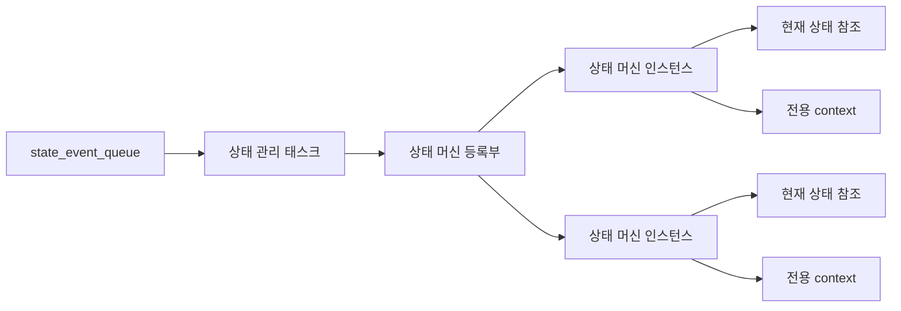
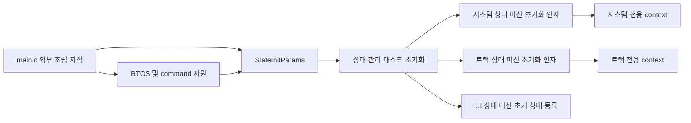
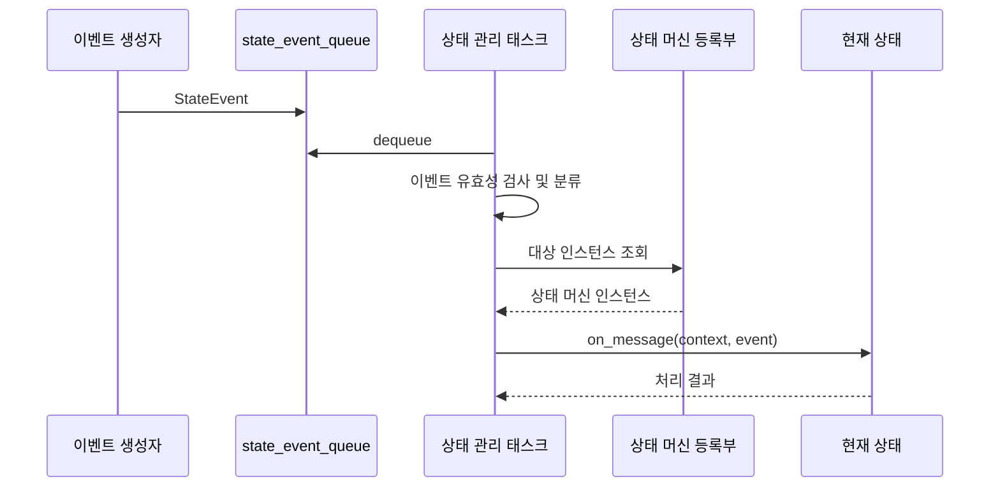
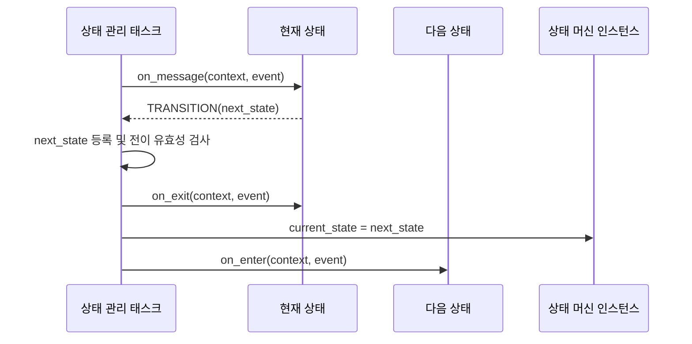

# 상태 머신 공통 아키텍처

이 문서는 루프스테이션의 여러 상태 머신에 공통으로 적용되는 소유 구조, 이벤트 분류와 위임 방식, 생명주기 인터페이스, 상태 전이 및 처리 결과 계약을 정의한다.
각 상태 머신의 상태 종류, 초기 상태, 전이 조건과 도메인 동작은 해당 상태 머신의 전용 아키텍처 문서에서 정의한다.

## 1. 설계 범위

| 항목 | 내용 |
| --- | --- |
| 대상 요구사항 | `REQ-STATE-001` ~ `REQ-STATE-006` |
| 포함 범위 | 상태 머신 등록과 소유권, 태스크 외부 자원 조립과 초기화 인자 주입, 정적 상태 인스턴스, 이벤트 분류와 위임, 공통 생명주기 인터페이스, 전이 순서, 공통 처리 결과와 오류 판별 |
| 연관 설계 | 상태 머신별 상태 종류와 전이, 사용자 입력 이벤트, 표시 및 피드백, 실시간 동작과 오류 대응 |
| 제외 범위 | 특정 상태 머신의 상태 목록과 전이 조건, 특정 상태의 진입 및 이탈 동작, 상태별 command 생성, 상태 머신별 구체적 자원 목록, C 파일 배치 |

## 2. 관련 요구사항

| 요구사항 ID | 요구사항 요약 | 이 문서의 설계 관점 |
| --- | --- | --- |
| `REQ-STATE-001` | 각 상태 머신의 현재 상태를 구분하여 일관되게 유지한다. | 상태 관리 태스크가 등록된 상태 머신 인스턴스와 현재 상태 참조의 단일 소유자가 된다. |
| `REQ-STATE-002` | 각 상태 머신을 정의된 초기 상태에서 시작한다. | 등록 시 초기 상태 참조를 설정하고 공통 진입 생명주기를 호출한다. |
| `REQ-STATE-003` | 상태 이벤트를 대상 상태 머신이 현재 상태에 맞게 처리한다. | 이벤트 분류기가 메시지의 식별 정보를 조사해 대상 인스턴스를 결정하고 메시지 처리를 위임한다. |
| `REQ-STATE-004` | 허용된 이벤트에 대해서만 정의된 다음 상태로 전환한다. | 현재 상태가 반환한 전이 요청을 검증한 뒤 공통 이탈, 참조 변경, 진입 순서로 전환한다. |
| `REQ-STATE-005` | 연속된 상태 이벤트의 처리 결과를 순서대로 반영한다. | 단일 소비자가 이벤트를 하나씩 끝까지 처리하고 다음 이벤트를 가져온다. |
| `REQ-STATE-006` | 미처리 이벤트와 허용되지 않은 전이가 유효한 상태를 훼손하지 않으며 오류 여부를 판별할 수 있어야 한다. | 공통 처리 결과로 무관한 이벤트, 거부된 전이, 처리 오류를 구분하고 상태 관리 태스크가 결과를 확인한다. |

## 3. 요구사항별 설계

### 3.1 REQ-STATE-001 설계

상태 머신 인스턴스는 자신의 현재 상태와, 필요한 경우에만 전용 도메인 context를 가진다. 상태 관리 태스크는 등록된 인스턴스를 직렬로 운용하는 단일 변경 주체이며, 각 context에 포함된 도메인 자원의 사용 책임은 해당 상태 머신에 있다.
다른 태스크나 상태 머신은 현재 상태 참조를 직접 변경하지 않고 이벤트를 통해 변경을 요청한다.

| 설계 ID | 아키텍처 항목 | 역할 | 설계 결정 |
| --- | --- | --- | --- |
| `ARCH-STATE-001` | 상태 머신 등록부 | 실행할 상태 머신 인스턴스를 식별한다. | 상태 관리 태스크가 정적으로 구성된 인스턴스 등록부를 소유한다. |
| `ARCH-STATE-002` | 상태 머신 인스턴스 | 현재 상태와 도메인 데이터를 분리해 유지한다. | 인스턴스마다 현재 상태 참조와 전용 context를 가진다. |
| `ARCH-STATE-003` | 단일 변경 주체 | canonical state의 동시 변경을 방지한다. | 상태 관리 태스크의 직렬 처리 경로에서만 현재 상태 참조와 context의 canonical state를 변경한다. |

### 3.2 REQ-STATE-002 설계

상태와 상태 머신 인스턴스는 런타임 중 동적으로 생성하지 않는다.
초기화 시 각 인스턴스에 전용 설계가 정한 초기 상태를 연결하고, 초기 상태의 `on_enter`를 호출한 뒤 이벤트 수신을 허용한다.
상태 머신이 queue, semaphore 또는 command 전달 경로 등의 자원을 필요로 하는 경우 상태 관리 태스크 내부에서 생성하거나 임의로 탐색하지 않는다. 태스크 생성 전에 외부 조립 지점에서 자원을 준비하고, 미리 정의된 초기화 인자 구조체를 통해 해당 상태 머신에만 전달한다.
검토 결과 UI 상태 머신은 현재 UI 상태와 전이 규칙만 소유하며 render queue와 파라미터 저장소를 직접 사용하지 않으므로 전용 초기화 인자와 자원 context가 필요하지 않다. UI 렌더링에 필요한 `display_command_queue`는 StateTask 자체의 초기화 인자로 전달한다.

| 설계 ID | 아키텍처 항목 | 역할 | 설계 결정 |
| --- | --- | --- | --- |
| `ARCH-STATE-004` | 정적 상태 인스턴스 | 동적 할당 없이 상태를 전환한다. | 각 상태 구현을 미리 생성하고 상태 참조만 전환한다. |
| `ARCH-STATE-005` | 초기 상태 주입 | 상태 머신별 시작 상태를 공통 구조에 연결한다. | 등록 정보가 초기 상태 참조와 context를 제공한다. |
| `ARCH-STATE-006` | 최초 진입 | 초기 상태의 생명주기를 시작한다. | 등록 완료 후 이벤트 처리 전에 초기 상태의 `on_enter`를 한 번 호출한다. |
| `ARCH-STATE-022` | 외부 자원 조립 | 상태 머신의 의존 자원 생성 시점과 소유 경계를 분리한다. | `main.c`와 같은 태스크 외부 조립 지점이 필요한 RTOS 자원을 생성하고 유효한 handle을 초기화 인자에 설정한다. |
| `ARCH-STATE-023` | 정형화된 초기화 인자 | 태스크와 자원이 필요한 상태 머신의 의존성을 명시적으로 구분한다. | `StateInitParams`는 태스크 자체의 의존성과 필요한 상태 머신별 초기화 인자를 미리 정의된 필드로 가진다. |
| `ARCH-STATE-024` | 상태 머신별 인자 전달 | 상태 관리 태스크가 구체 자원의 사용 책임을 갖지 않게 한다. | 태스크 초기화 경로는 상위 인자와 태스크 자체의 의존성을 검증한 뒤 전용 자원이 필요한 상태 머신에만 해당 인자를 전달한다. |
| `ARCH-STATE-025` | 전용 context 의존성 보관 | 이벤트 처리 중 필요한 자원을 안전하게 사용한다. | 전용 자원이 있는 상태 머신은 자신의 초기화 인자를 검증하고 필요한 handle 또는 port 참조만 자신의 context에 보관한다. |

### 3.3 REQ-STATE-003 설계

상태 관리 태스크는 `state_event_queue`의 단일 소비자로 동작한다.
이벤트의 공통 식별 정보와 payload를 조사해 대상 상태 머신 인스턴스를 결정한 뒤, 해당 인스턴스의 현재 상태에 메시지 처리를 위임한다.

| 설계 ID | 아키텍처 항목 | 역할 | 설계 결정 |
| --- | --- | --- | --- |
| `ARCH-STATE-007` | 상태 이벤트 수신 | 상태 변경 요청을 순서대로 읽는다. | 상태 관리 태스크만 `state_event_queue`를 dequeue한다. |
| `ARCH-STATE-008` | 이벤트 유효성 검사 | 잘못된 메시지가 상태 머신에 전달되는 것을 막는다. | 이벤트 종류와 해당 payload의 유효성을 분류 전에 검사한다. |
| `ARCH-STATE-009` | 이벤트 분류 | 메시지를 처리할 상태 머신 종류와 인스턴스를 결정한다. | `StateEvent`의 이벤트 종류와 payload 식별 정보를 분류 규칙에 적용한다. |
| `ARCH-STATE-010` | 메시지 위임 | 현재 상태가 이벤트를 해석하도록 한다. | 대상 인스턴스의 현재 상태가 구현한 `on_message`를 호출한다. |

### 3.4 REQ-STATE-004 설계

모든 상태는 동일한 생명주기 인터페이스를 구현한다.
현재 상태는 `on_message`에서 이벤트를 처리하고, 전이가 필요한 경우 다음 상태를 포함한 처리 결과를 반환한다. 상태 관리 태스크는 다음 상태가 해당 상태 머신에 등록된 유효한 상태인지 확인한 뒤 공통 전이 순서를 실행한다.

| 설계 ID | 아키텍처 항목 | 역할 | 설계 결정 |
| --- | --- | --- | --- |
| `ARCH-STATE-011` | 공통 생명주기 | 상태 구현마다 동일한 호출 지점을 제공한다. | `on_enter`, `on_message`, `on_exit`을 공통 생명주기로 정의한다. |
| `ARCH-STATE-012` | 생명주기 인터페이스 | 상태 구현을 공통 방식으로 호출한다. | 모든 상태가 동일한 생명주기 함수 집합을 구현한다. |
| `ARCH-STATE-013` | 전이 요청 검증 | 등록되지 않았거나 허용되지 않은 상태 전이를 차단한다. | 다음 상태 참조가 대상 상태 머신의 상태 집합에 포함되는지 검사한다. |
| `ARCH-STATE-014` | 공통 전이 순서 | 상태 이탈과 진입의 호출 순서를 고정한다. | `on_message -> on_exit -> 현재 상태 참조 변경 -> on_enter` 순서로 실행한다. |

#### 3.4.1 공통 생명주기 계약

| 생명주기 | 입력 | 책임 | 제한 |
| --- | --- | --- | --- |
| `on_enter` | 상태 머신 context, 전이 원인 | 새 상태의 진입 시 필요한 상태 내부 값을 준비한다. | 다른 상태 머신의 현재 상태를 직접 변경하지 않는다. |
| `on_message` | 상태 머신 context, 상태 이벤트 | 현재 상태에서 이벤트를 처리하고 처리 결과를 반환한다. | 현재 상태 참조를 직접 변경하지 않는다. |
| `on_exit` | 상태 머신 context, 전이 원인 | 현재 상태를 떠나기 전 상태 내부 값을 정리한다. | 다음 상태의 진입 동작을 직접 호출하지 않는다. |

### 3.5 REQ-STATE-005 설계

상태 이벤트는 하나의 상태 관리 태스크가 직렬로 처리한다.
하나의 이벤트에 대한 대상 조회, 메시지 처리, 필요한 상태 전이, 파라미터 변경, 처리 결과 확인과 후속 command 요청이 끝나기 전에는 다음 이벤트를 dequeue하지 않는다.
후속 command가 비동기로 실행 완료될 때까지 기다리지는 않으며, 현재 이벤트가 만든 command를 queue에 enqueue한 시점을 이벤트 처리 완료로 본다.

| 설계 ID | 아키텍처 항목 | 역할 | 설계 결정 |
| --- | --- | --- | --- |
| `ARCH-STATE-015` | 직렬 이벤트 처리 | 이벤트 간 상태 변경 순서를 보존한다. | 이벤트 하나의 처리를 완료한 뒤 다음 이벤트를 dequeue한다. |
| `ARCH-STATE-016` | 전이 commit 지점 | 현재 상태 참조가 부분적으로 갱신되는 것을 막는다. | 전이 검증과 `on_exit` 완료 후 현재 상태 참조를 한 번만 변경한다. |
| `ARCH-STATE-017` | 처리 완료 확인 | 다음 이벤트가 확정된 상태를 기준으로 처리되게 한다. | `on_enter`, 파라미터 변경, 처리 결과 확인과 필요한 render command enqueue까지 완료해야 해당 이벤트 처리를 종료한다. |

### 3.6 REQ-STATE-006 설계

상태의 메시지 처리 결과는 정상 처리, 상태 전이, 무관한 이벤트, 허용되지 않은 전이, 처리 오류를 구분해야 한다.
상태 관리 태스크는 모든 결과를 확인하며, 상태를 변경할 수 없는 결과에서는 현재 상태 참조를 유지한다.

| 설계 ID | 아키텍처 항목 | 역할 | 설계 결정 |
| --- | --- | --- | --- |
| `ARCH-STATE-018` | 공통 처리 결과 | 상태 구현의 처리 결과를 동일한 의미로 해석한다. | `HANDLED`, `TRANSITION`, `IGNORED`, `REJECTED`, `ERROR`를 구분한다. |
| `ARCH-STATE-019` | 결과 확인 | 미처리 이벤트와 상태 처리 실패를 탐지한다. | 상태 관리 태스크가 모든 `on_message` 반환값을 검사한다. |
| `ARCH-STATE-020` | 상태 보존 | 거부되거나 실패한 처리로 유효한 상태가 훼손되지 않게 한다. | `IGNORED`, `REJECTED`, `ERROR` 결과에서는 현재 상태 참조를 변경하지 않는다. |
| `ARCH-STATE-021` | 오류 판별 정보 | 상위 오류 정책이 처리 결과를 판단할 수 있게 한다. | 오류 결과에 이벤트 식별자, 대상 인스턴스, 현재 상태와 오류 원인을 포함한다. |

#### 3.6.1 공통 처리 결과

| 처리 결과 | 의미 | 상태 관리 태스크의 처리 |
| --- | --- | --- |
| `HANDLED` | 현재 상태가 이벤트를 처리했으며 전이는 필요하지 않다. | 현재 상태를 유지하고 이벤트 처리를 완료한다. |
| `TRANSITION` | 이벤트를 처리했고 유효성 검사가 필요한 다음 상태가 있다. | 전이 요청을 검증하고 공통 전이 순서를 실행한다. |
| `IGNORED` | 유효한 이벤트지만 현재 상태 머신의 처리 대상이 아니다. | 현재 상태를 유지하고 정상적인 미처리 결과로 기록한다. |
| `REJECTED` | 대상은 맞지만 현재 상태에서 허용되지 않는 이벤트 또는 전이다. | 현재 상태를 유지하고 거부 원인을 기록한다. |
| `ERROR` | 메시지 처리 또는 생명주기 수행 중 오류가 발생했다. | 현재 상태를 임의로 변경하지 않고 오류 판별 정보를 생성한다. |

## 4. 공통 설계 정보

### 4.1 상태 머신 등록 정보

| 항목 | 용도 |
| --- | --- |
| 상태 머신 식별자 | 이벤트 분류 결과와 상태 머신 인스턴스를 연결한다. |
| 인스턴스 식별자 | 같은 종류의 여러 상태 머신 인스턴스를 구분한다. |
| 초기 상태 참조 | 등록 직후 시작할 상태를 지정한다. |
| 허용 상태 집합 | 전이 요청의 다음 상태가 유효한지 검사한다. |
| context 참조 | 상태 머신이 수명 동안 유지할 도메인 데이터를 제공한다. |

### 4.2 초기화 인자 계층

| 구조 | 포함 내용 | 사용 주체 |
| --- | --- | --- |
| `StateInitParams` | `state_event_queue` 같은 태스크 자체의 의존성과 상태 머신별 초기화 인자 | 상태 관리 태스크 초기화 경로 |
| 상태 머신별 InitParams | 해당 머신이 사용할 queue, semaphore, command port 또는 공유 상태 참조 | 해당 상태 머신 초기화 함수 |
| 상태 머신 context | 검증을 통과한 의존성 참조와 머신의 mutable 도메인 데이터 | 해당 상태 머신과 상태 생명주기 |

`StateInitParams`와 그 구조체가 참조하는 자원은 태스크 및 상태 머신이 사용하는 동안 유효한 수명을 가져야 한다. 초기화 함수는 지역 변수의 주소를 런타임 context에 보관하지 않고, 필요한 handle과 값을 안전한 수명의 context에 복사한다.

### 4.3 책임 분리

| 책임 | 담당 |
| --- | --- |
| queue dequeue와 이벤트 유효성 검사 | 상태 관리 태스크 |
| RTOS 및 command 자원 생성과 초기화 인자 구성 | `main.c`와 같은 태스크 외부 조립 지점 |
| 상위 초기화 인자 검증과 상태 머신별 인자 전달 | 상태 관리 태스크 초기화 경로 |
| 상태 머신별 초기화 인자 검증 | 각 상태 머신 초기화 함수 |
| 이벤트 분류와 대상 인스턴스 조회 | 상태 관리 태스크와 상태 머신 등록부 |
| 현재 상태 변경 경로의 직렬화 | 상태 관리 태스크 |
| context의 도메인 데이터와 의존 자원 사용 | 각 상태 머신 |
| 현재 상태에서의 이벤트 해석 | 각 상태 구현의 `on_message` |
| 공통 생명주기 호출과 전이 순서 | 상태 관리 태스크 |
| 상태 종류, 초기 상태, 허용 전이 정의 | 상태 머신별 아키텍처와 구현 |
| 처리 결과 및 오류 정보 확인 | 상태 관리 태스크 |
| 상태별 command 생성 및 전달 | 상태 머신별 아키텍처와 기능 문서 |

## 5. 기능 문서 작성 대상

| 설계 ID | 기능 문서 | 기능 |
| --- | --- | --- |
| `ARCH-STATE-001` | [FEAT-STATE-001.md](../3-Features/ARCH-STATE/FEAT-STATE-001.md) | 상태 머신 등록부 |
| `ARCH-STATE-002` | [FEAT-STATE-002.md](../3-Features/ARCH-STATE/FEAT-STATE-002.md) | 상태 머신 인스턴스 |
| `ARCH-STATE-003` | [FEAT-STATE-003.md](../3-Features/ARCH-STATE/FEAT-STATE-003.md) | canonical state 단일 변경 주체 |
| `ARCH-STATE-004` | [FEAT-STATE-004.md](../3-Features/ARCH-STATE/FEAT-STATE-004.md) | 정적 상태 인스턴스 |
| `ARCH-STATE-005` | [FEAT-STATE-005.md](../3-Features/ARCH-STATE/FEAT-STATE-005.md) | 초기 상태 주입 |
| `ARCH-STATE-006` | [FEAT-STATE-006.md](../3-Features/ARCH-STATE/FEAT-STATE-006.md) | 최초 상태 진입 |
| `ARCH-STATE-007` | [FEAT-STATE-007.md](../3-Features/ARCH-STATE/FEAT-STATE-007.md) | 상태 이벤트 queue 수신 |
| `ARCH-STATE-008` | [FEAT-STATE-008.md](../3-Features/ARCH-STATE/FEAT-STATE-008.md) | 상태 이벤트 유효성 검사 |
| `ARCH-STATE-009` | [FEAT-STATE-009.md](../3-Features/ARCH-STATE/FEAT-STATE-009.md) | 상태 이벤트 분류 |
| `ARCH-STATE-010` | [FEAT-STATE-010.md](../3-Features/ARCH-STATE/FEAT-STATE-010.md) | 현재 상태 메시지 위임 |
| `ARCH-STATE-011` | [FEAT-STATE-011.md](../3-Features/ARCH-STATE/FEAT-STATE-011.md) | 공통 상태 생명주기 정의 |
| `ARCH-STATE-012` | [FEAT-STATE-012.md](../3-Features/ARCH-STATE/FEAT-STATE-012.md) | 상태 생명주기 인터페이스 |
| `ARCH-STATE-013` | [FEAT-STATE-013.md](../3-Features/ARCH-STATE/FEAT-STATE-013.md) | 상태 전이 요청 검증 |
| `ARCH-STATE-014` | [FEAT-STATE-014.md](../3-Features/ARCH-STATE/FEAT-STATE-014.md) | 공통 상태 전이 실행 |
| `ARCH-STATE-015` | [FEAT-STATE-015.md](../3-Features/ARCH-STATE/FEAT-STATE-015.md) | 상태 이벤트 직렬 처리 |
| `ARCH-STATE-016` | [FEAT-STATE-016.md](../3-Features/ARCH-STATE/FEAT-STATE-016.md) | 상태 전이 commit |
| `ARCH-STATE-017` | [FEAT-STATE-017.md](../3-Features/ARCH-STATE/FEAT-STATE-017.md) | 상태 이벤트 처리 완료 확인 |
| `ARCH-STATE-018` | [FEAT-STATE-018.md](../3-Features/ARCH-STATE/FEAT-STATE-018.md) | 공통 상태 처리 결과 정의 |
| `ARCH-STATE-019` | [FEAT-STATE-019.md](../3-Features/ARCH-STATE/FEAT-STATE-019.md) | 상태 처리 결과 검사 |
| `ARCH-STATE-020` | [FEAT-STATE-020.md](../3-Features/ARCH-STATE/FEAT-STATE-020.md) | 실패 시 canonical state 보존 |
| `ARCH-STATE-021` | [FEAT-STATE-021.md](../3-Features/ARCH-STATE/FEAT-STATE-021.md) | 상태 오류 판별 정보 생성 |
| `ARCH-STATE-022` | [FEAT-STATE-022.md](../3-Features/ARCH-STATE/FEAT-STATE-022.md) | 외부 상태 자원 조립 |
| `ARCH-STATE-023` | [FEAT-STATE-023.md](../3-Features/ARCH-STATE/FEAT-STATE-023.md) | 상태 초기화 인자 구조 정의 |
| `ARCH-STATE-024` | [FEAT-STATE-024.md](../3-Features/ARCH-STATE/FEAT-STATE-024.md) | 상태 머신별 초기화 인자 전달 |
| `ARCH-STATE-025` | [FEAT-STATE-025.md](../3-Features/ARCH-STATE/FEAT-STATE-025.md) | 상태 머신 의존성 보관 |

## 6. 미정 사항

| 항목 | 결정 필요 내용 | 영향 |
| --- | --- | --- |
| 등록부 크기 | 상태 머신 종류와 인스턴스의 최대 개수를 확정해야 한다. | 정적 메모리 크기 |
| 생명주기 함수 실패 | `on_exit` 또는 `on_enter` 실패 시 상태 참조 유지, 복구, 오류 승격 정책을 정해야 한다. | 전이 일관성과 오류 대응 |
| 상태 command 전달 | 각 상태 머신이 초기화 인자로 받을 command queue 또는 port의 구체 타입과 메시지 정책을 정해야 한다. | 상태 머신별 InitParams와 context, command 원자성 |
| command 전송 실패 | 필수 command 전송 실패 시 상태 유지, rollback, retry 정책을 정해야 한다. | canonical state와 외부 동작의 일관성 |
| 오류 정보 전달 | 상태 처리 오류를 진단 또는 상위 오류 정책에 전달하는 메시지 형식을 정해야 한다. | 오류 보고 경로 |
