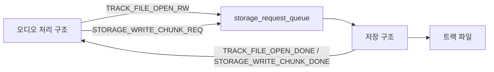
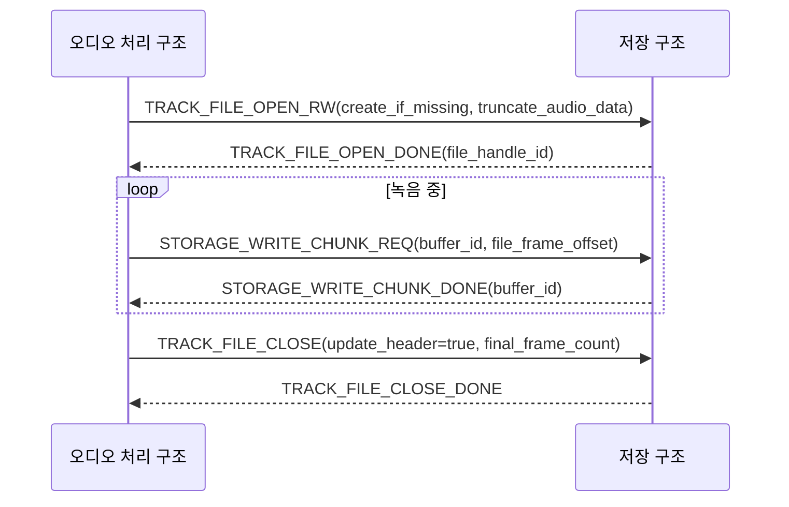
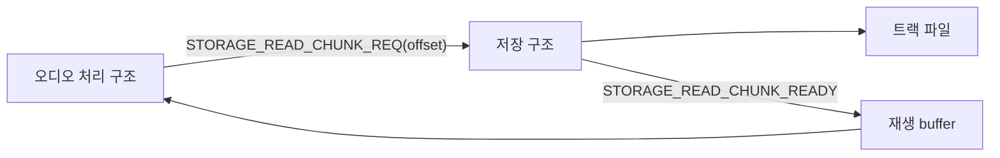
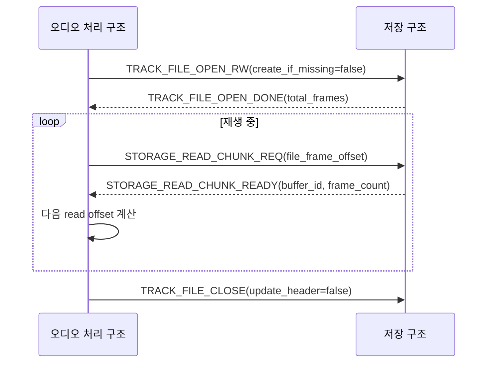
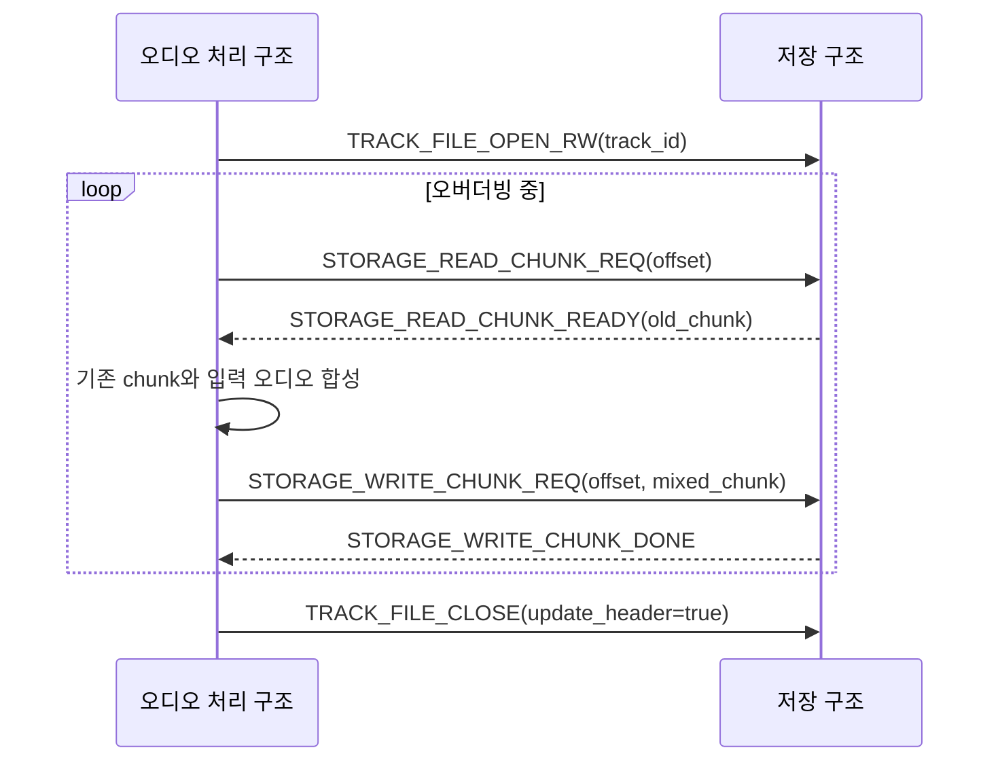
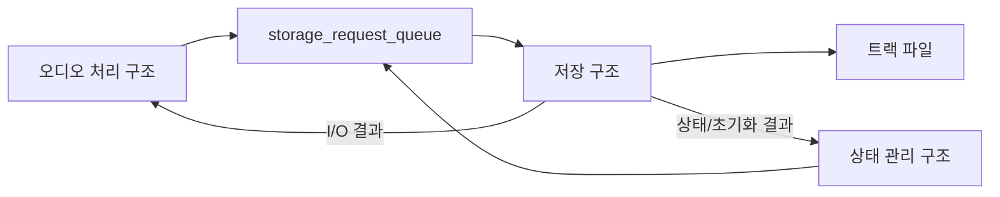

# 저장 및 불러오기 아키텍처

이 문서는 루프스테이션 요구사항 중 `REQ-STORAGE` 항목을 만족시키기 위한 저장 및 불러오기 구조를 정의한다.
요구사항 문서는 오디오 데이터를 저장하거나 읽을 수 있어야 한다는 동작을 설명하고, 이 문서는 파일 open/read/write/close와 chunk 단위 I/O를 처리하는 내부 구조를 설명한다.

## 1. 설계 범위

| 항목 | 내용 |
| --- | --- |
| 대상 요구사항 | `REQ-STORAGE-001`, `REQ-STORAGE-002`, `REQ-STORAGE-003` |
| 포함 범위 | 트랙 파일 open/close, WAV header 갱신, storage chunk read/write, 저장 장치 오류 보고, 트랙 파일 초기화 |
| 연관 설계 | 오디오 입출력, 트랙 생명주기, 실시간 동작, 표시 및 피드백 |
| 제외 범위 | SDMMC/FatFs low-level driver 구현, 파일명 정책 상세, undo/redo 저장 정책 확정 |

## 2. 관련 요구사항

| 요구사항 ID | 요구사항 요약 | 이 문서의 설계 관점 |
| --- | --- | --- |
| `REQ-STORAGE-001` | 녹음하려는 오디오 신호를 파일 형태로 저장한다. | 오디오 처리 구조가 만든 storage chunk를 트랙 파일에 순차 기록한다. |
| `REQ-STORAGE-002` | 재생하려는 트랙 파일을 읽고 오디오 재생 경로로 전달한다. | 파일 frame offset 기반 read chunk를 오디오 처리 구조에 반환한다. |
| `REQ-STORAGE-003` | 오버더빙하려는 오디오 신호를 파일 형태로 저장한다. | 기존 chunk를 읽고 합성 결과를 같은 offset에 다시 쓰는 read/write 흐름을 지원한다. |

## 3. 요구사항별 설계

### 3.1 REQ-STORAGE-001 설계

`REQ-STORAGE-001`은 트랙 녹음 중 입력 오디오를 파일로 저장해야 한다는 요구사항이다.
오디오 처리 구조는 실시간 경로에서 파일 시스템을 직접 다루지 않고, 저장 구조에 chunk write 요청을 비동기로 보낸다.

#### 3.1.1 필요 아키텍처

| 설계 ID | 아키텍처 항목 | 역할 | 설계 결정 |
| --- | --- | --- | --- |
| `ARCH-STORAGE-001` | 트랙 파일 open | 녹음 대상 트랙 파일을 준비한다. | `TRACK_FILE_OPEN_RW`를 사용하고 필요하면 audio data를 초기화한다. |
| `ARCH-STORAGE-002` | storage chunk write | 오디오 block을 저장 단위로 묶어 기록한다. | `STORAGE_WRITE_CHUNK_REQ`를 사용한다. |
| `ARCH-STORAGE-003` | write 결과 반환 | write 완료 후 buffer 반환 가능 여부를 알린다. | `STORAGE_WRITE_CHUNK_DONE`을 오디오 처리 구조로 보낸다. |
| `ARCH-STORAGE-004` | 파일 close/finalize | 녹음 종료 시 WAV header와 frame 수를 확정한다. | `TRACK_FILE_CLOSE`와 `update_header=true`를 사용한다. |
| `ARCH-STORAGE-005` | 오류 보고 | open/write/close 실패를 요청자에게 반환한다. | 오디오 처리 구조가 필요 시 상태 관리 구조에 오류를 보고한다. |

#### 3.1.2 구조 다이어그램

#### 3.1.3 동작 시나리오

#### 3.1.4 개발해야 할 기능

| 기능 문서 | 기능 | 목적 |
| --- | --- | --- |
| `FEAT-wav-file-open-rw.md` | 트랙 파일 read-write open | 녹음 파일을 생성 또는 초기화한다. |
| `FEAT-storage-chunk-write.md` | storage chunk 쓰기 | 오디오 chunk를 파일에 기록하고 완료를 반환한다. |

### 3.2 REQ-STORAGE-002 설계

`REQ-STORAGE-002`는 저장된 트랙 파일을 읽어 재생 경로로 전달할 수 있어야 한다는 요구사항이다.
읽기 요청은 파일 포인터 이동 명령을 따로 두지 않고, 매 요청의 `file_frame_offset`으로 읽을 위치를 명시한다.

#### 3.2.1 필요 아키텍처

| 설계 ID | 아키텍처 항목 | 역할 | 설계 결정 |
| --- | --- | --- | --- |
| `ARCH-STORAGE-006` | 트랙 파일 open | 재생 대상 파일과 metadata를 확인한다. | `TRACK_FILE_OPEN_RW`를 read-write 모드로 사용한다. |
| `ARCH-STORAGE-007` | read chunk 요청 | 필요한 frame offset의 chunk를 읽는다. | `STORAGE_READ_CHUNK_REQ`에 `file_frame_offset`을 포함한다. |
| `ARCH-STORAGE-008` | read 결과 반환 | 읽은 buffer를 오디오 처리 구조에 전달한다. | `STORAGE_READ_CHUNK_READY`를 사용한다. |
| `ARCH-STORAGE-009` | loop offset 처리 | 트랙 끝에서 처음으로 돌아갈 수 있게 한다. | 오디오 처리 구조가 다음 요청 offset을 계산한다. |
| `ARCH-STORAGE-010` | 파일 close | 재생 정지 또는 오류 시 파일 handle을 정리한다. | `TRACK_FILE_CLOSE`와 `update_header=false`를 사용한다. |

#### 3.2.2 구조 다이어그램

#### 3.2.3 동작 시나리오

#### 3.2.4 개발해야 할 기능

| 기능 문서 | 기능 | 목적 |
| --- | --- | --- |
| `FEAT-wav-file-open-rw.md` | 트랙 파일 read-write open | 재생 대상 트랙 파일을 준비한다. |
| `FEAT-storage-chunk-read.md` | storage chunk 읽기 | 파일에서 재생용 chunk를 읽어 반환한다. |

### 3.3 REQ-STORAGE-003 설계

`REQ-STORAGE-003`은 오버더빙하려는 오디오 신호를 파일 형태로 저장해야 한다는 요구사항이다.
오버더빙은 기존 트랙 chunk를 읽고 입력 오디오와 합성한 결과를 다시 파일에 쓰는 흐름이다.

#### 3.3.1 필요 아키텍처

| 설계 ID | 아키텍처 항목 | 역할 | 설계 결정 |
| --- | --- | --- | --- |
| `ARCH-STORAGE-011` | read-write handle | 같은 트랙 파일에서 읽기와 쓰기를 모두 수행한다. | `TRACK_FILE_OPEN_RW` 단일 handle 정책을 사용한다. |
| `ARCH-STORAGE-012` | offset 기반 I/O | read/write 위치를 요청마다 명시한다. | `file_frame_offset`으로 위치를 전달한다. |
| `ARCH-STORAGE-013` | read chunk | 기존 트랙 데이터를 오디오 처리 구조로 전달한다. | `STORAGE_READ_CHUNK_READY`를 사용한다. |
| `ARCH-STORAGE-014` | write chunk | 합성 결과를 같은 offset에 기록한다. | 현재는 destructive overwrite를 전제로 한다. |
| `ARCH-STORAGE-015` | finalize | 오버더빙 종료 후 header 또는 metadata를 갱신한다. | `TRACK_FILE_CLOSE(update_header=true)`를 사용한다. |

#### 3.3.2 구조 다이어그램

#### 3.3.3 동작 시나리오

#### 3.3.4 개발해야 할 기능

| 기능 문서 | 기능 | 목적 |
| --- | --- | --- |
| `FEAT-storage-chunk-read.md` | 기존 chunk 읽기 | 오버더빙 합성에 필요한 기존 오디오를 읽는다. |
| `FEAT-storage-chunk-write.md` | 합성 chunk 쓰기 | 오버더빙 결과를 파일에 기록한다. |
| `FEAT-record-to-playback-transition.md` | 저장 후 재생 전환 | 저장 완료 후 재생 또는 정지 흐름으로 이어지게 한다. |

## 4. 공통 설계 정보

### 4.1 전체 저장 경로

### 4.2 공통 메시지

| 메시지 | 송신 | 수신 | 용도 |
| --- | --- | --- | --- |
| `TRACK_FILE_OPEN_RW` | 오디오 처리 구조 | 저장 구조 | 트랙 파일을 read-write 모드로 연다. |
| `TRACK_FILE_CLOSE` | 오디오 처리 구조 | 저장 구조 | 파일을 닫고 필요 시 header를 갱신한다. |
| `STORAGE_WRITE_CHUNK_REQ` | 오디오 처리 구조 | 저장 구조 | storage chunk를 파일에 쓴다. |
| `STORAGE_READ_CHUNK_REQ` | 오디오 처리 구조 | 저장 구조 | 파일에서 storage chunk를 읽는다. |
| `TRACK_FILE_RESET` | 상태 관리 구조 | 저장 구조 | 트랙 파일의 audio data 또는 metadata를 초기화한다. |

### 4.3 파일 handle 정책

| 항목 | 결정 |
| --- | --- |
| open mode | 녹음, 재생, 오버더빙 모두 read-write 모드를 사용한다. |
| read/write 위치 | 파일 포인터 이동 메시지 없이 요청의 `file_frame_offset`으로 표현한다. |
| 요청 결과 | 요청자인 오디오 처리 구조 또는 상태 관리 구조로 직접 반환한다. |
| 오버더빙 저장 | 현재는 기존 데이터를 같은 offset에 다시 쓰는 destructive overwrite를 전제로 한다. |

## 5. 기능 문서 작성 대상

| 기능 문서 | 목적 | 주요 입력 | 주요 출력 |
| --- | --- | --- | --- |
| `FEAT-sd-card-mount.md` | 저장 장치를 mount하고 상태를 보고한다. | card detect, mount request | media status |
| `FEAT-wav-file-open-rw.md` | 트랙 파일을 read-write 모드로 열고 metadata를 확인한다. | track id, open option | file handle |
| `FEAT-storage-chunk-write.md` | storage chunk를 파일에 쓴다. | write chunk request | write result |
| `FEAT-storage-chunk-read.md` | storage chunk를 파일에서 읽는다. | read chunk request | read buffer |
| `FEAT-record-to-playback-transition.md` | 저장 완료 후 재생 준비 상태를 관리한다. | close/read result | playback ready |

## 6. 미정 사항

| 항목 | 결정 필요 내용 | 영향 |
| --- | --- | --- |
| 파일명/디렉터리 규칙 | 트랙 파일 경로와 이름 규칙을 확정해야 한다. | open/reset 구현 |
| metadata 저장 방식 | 트랙 길이, BPM, 박자표 저장 위치를 정해야 한다. | 재생/동기화 |
| write backlog 정책 | 저장 지연 시 buffer backlog 한계를 정해야 한다. | 드롭아웃 방지 |
| read prebuffer 크기 | 재생 시작 전 확보할 chunk 수를 정해야 한다. | 재생 안정성 |
| undo/redo 저장 정책 | take/delta/snapshot 중 하나를 선택할지 정해야 한다. | 오버더빙 확장 |
