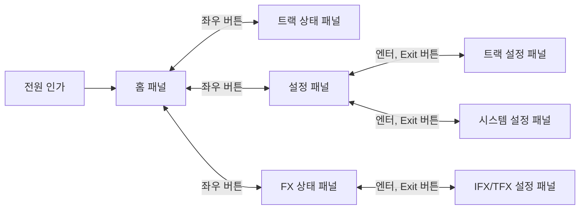

# 프로젝트 소개

이 프로젝트는 루프스테이션 시스템을 임베디드 환경에서 설계, 구현하는 프로젝트입니다. 직접 하드웨어를 만들고, 그 하드웨어를 동작시킬 시스템을 구현하는 것이 목표입니다.

# 루프스테이션 시스템

루프스테이션 시스템은 **실시간으로 음성 또는 외부 오디오 신호를 받아** 하나의 트랙으로 만들어 시스템에 저장한 후 **반복적으로 트랙을 출력하며 트랙 위에 오디오 신호를 추가하는 시스템**입니다. 

또한 단순 녹음 시스템을 넘어서 다양한 이펙트(이하 FX)를 녹음할 때 또는 출력할 때 적용하여 효과를 줄 수 있습니다. 시스템에 여러 개의 트랙이 있다면, 각 트랙마다 다른 FX를 적용할 수 있습니다. 

# 하드웨어 구성

## LCD 화면 및 조작 버튼

LCD화면에 나타나는 현재 시스템의 상태 및 각 트랙 상태를 확인할 수 있습니다. 사용자는 버튼 또는 엔코더를 사용해 녹음(입력)에 적용할 FX와 출력에 적용할 FX를 선택할 수 있습니다. 

## FX 버튼, 노브

FX 버튼은 두 가지입니다. 입력에 사용되는 FX은 IFX, 출력에 사용되는 FX는 TFX라고 부릅니다. IFX 버튼을 눌러 녹음 중인 오디오 신호에 효과를 입힐 수 있습니다. 반대로 TFX 버튼을 눌러 재생중인 트랙에 효과를 입힐 수 있습니다. 

본 시스템은 프로토타입이므로 하나의 IFX와 하나의 TFX만 존재합니다. 

FX 버튼은 토글 방식으로 동작하고, 버튼을 누르면 바로 FX를 수정하는 화면(*IFX/TFX 설정 패널*)으로 전환됩니다.

FX와 연결되어 있는 노브(가변저항)를 조절하여 FX의 특정 변수값을 조절할 수 있습니다.(ex. 필터의 cutoff)

## 트랙

각 트랙에는 녹음/재생 버튼, 정지 버튼, 트랙 설정 버튼이 존재합니다.

> 본 시스템은 프로토타입으로 하나의 트랙만 존재합니다. 

트랙에 오디오 데이터가 없으면 녹음/재생 버튼을 눌러 트랙에 오디오 데이터를 추가할 수 있습니다. 

일단 녹음이 완료되고 녹음/재생 버튼을 누르면 녹음된 데이터는 처음부터 재생되며 끝까지 재생된 경우 다시 처음으로 돌아가 반복 재생합니다. 

정지 버튼을 누르면 재생중인 오디오 데이터의 출력이 정지됩니다. 

트랙 설정 버튼을 누르면 출력에 입힐 FX가 현재 재생중인 트랙에 적용되어 출력됩니다. 

# 구현 계획

하드웨어가 정상 동작하는지, 이상이 없는지 확인하기 위해 먼저 라즈베리파이와 연결될 수 있도록 구성합니다. 이 때는 모든 버튼, 노브, 엔코더가 정상적으로 인식되는지를 확인하고 LCD화면, LED가 정상적으로 출력되는지 확인합니다.

하드웨어에 문제가 없다면 라즈베리파이에서 간단하게 음성 데이터 입력 및 출력을 해봄으로 **핵심 시스템 루프**가 동작하는지 검증합니다.

**핵심 시스템 루프**가 정상 작동한다면, 해당 설계를 유지한채로 STM32H743VIT6 보드와 연결하여 본격적인 개발을 진행합니다.

# 핵심 시스템 루프

루프스테이션의 핵심 시스템 루프는 다음과 같습니다.

```text
1. 시스템 자원 초기화
2. RTOS 설정 초기화
3. 저장 장치 접근 및 마운트
4. FX 처리 자원 준비
5. 루프스테이션 시작
```

## 1. 시스템 자원 초기화

시스템에 필요한 자원, 즉 페리퍼럴과 그 외 기본적인 임베디드 시스템을 설정하는 단계입니다. 이 단계는 CubeMX로 자동 생성된 코드를 실행하므로 직접 구현하지는 않습니다.

## 2. RTOS 설정 초기화

RTOS에서 제공하는 자원들, 그리고 시스템을 구성하는 태스크들을 초기화, 등록, 실행하는 단계입니다. 
루프스테이션을 구성하는 각 태스크가 필요로 하는 큐, 세마포어, 뮤텍스 등 여러 자원들을 초기화 및 등록합니다. 

## 3. 저장 장치 접근 및 마운트

각 트랙에 오디오 데이터를 저장하기 위해서는 저장 장치가 필요합니다. 이 시스템에서는 저장 장치로 SD카드를 사용합니다. FATFS 라이브러리를 사용하여 저장 장치를 마운트합니다.

## 4. FX 처리 자원 준비

이 시스템에서 입력 또는 출력에 입힐 수 있는 FX를 처리하기 위해 필요한 자원을 초기화합니다.

## 5. 루프스테이션 시작

루프스테이션을 구성하는 여러 RTOS 태스크들을 모두 시작합니다. 

# 트랙

## 트랙의 상태

**핵심 시스템 루프**에서 *5. 루프스테이션 시작*단계까지 진행된 경우 각 트랙은 상태머신에 의해 동작합니다. 

트랙은 **녹음/재생 버튼**과 **정지 버튼**으로 상태가 바뀝니다.

1. `IDLE`

    트랙에 아무 녹음도 되지 않은 상태입니다.

- 녹음/재생 버튼 : 녹음을 시작하는 `RECODING` 상태로 전환합니다.
- 정지 버튼 : -

2. `RECORDING`

    이 트랙에 녹음 중인 상태입니다. 녹음이 완료되면 오디오 데이터가 저장 장치에 저장됩니다.

- 녹음/재생 버튼 : 녹음을 마치고, 저장된 오디오 데이터를 재생하는 `PLAYING` 상태로 전환합니다.
- 정지 버튼 : 녹음을 마치고, `STOPPED` 상태로 전환합니다.

3. `PLAYING`

    이 트랙에 저장된 오디오 데이터를 반복 재생하는 상태입니다.

- 녹음/재생 버튼 : 재생 중인 트랙에 오버더빙하는 `OVERDUBBING` 상태로 전환합니다.
- 정지 버튼 : 재생을 멈추고 `STOPPED` 상태로 전환합니다.

4. `OVERDUBBING`

    재생 중인 트랙에 녹음중인 오디오 데이터를 추가하는 상태입니다. 이 상태에서는 입력되는 오디오 데이터를 트랙에 추가하게 됩니다.

- 녹음/재생 버튼 : 녹음을 마치고, 저장된 오디오 데이터를 재생하는 PLAYING 상태로 전환합니다. 단, 이미 재생중인 상태였으므로, 처음부터 재생하지 않고 재생중인 위치에서 계속 반복 재생을 유지합니다.
- 정지 버튼 : 녹음을 마치고, `STOPPED` 상태로 전환합니다.

5. `STOPPED`

    트랙에 오디오 데이터가 있지만 정지중인 상태입니다.

- 녹음/재생 버튼 : 저장된 오디오 데이터를 재생하는 `PLAYING` 상태로 전환합니다.
- 정지 버튼 : 아무것도 하지 않으나, 2초간 길게 누르거나 짧은 시간안에 연속으로 누른다면 트랙에 저장된 오디오 데이터를 지웁니다.

## 트랙 정보

트랙마다 가지는 정보들은 다음과 같습니다.

- 트랙의 길이
- 트랙의 음량
- 트랙의 재생방향(정재생, 역재생)
- 트랙의 TFX 적용 여부

# FX

이펙트(이하 FX)는 오디오 데이터를 입력받아 정해진 처리 과정을 거쳐 오디오 데이터를 출력하는 시스템입니다.

외부로부터 입력되는 오디오 데이터에 적용되거나, 트랙에서 반복 재생되는 오디오 데이터에 적용될 수 있습니다.

## 종류

프로토타입이므로 아래의 4가지 FX만 구현합니다.

- LPF
- HPF
- EQ
- Reverb

다음은 프로토타입이 완성된 이후 가능하다면 추가할 FX들입니다.

- Flanger
- Phaser
- Chorus
- Delay
- ...

> 각 FX에 대한 설명은 별도 문서로 정리합니다.

# 디스플레이

디스플레이는 현재 루프스테이션 시스템의 상태를 나타내거나 설정을 수정할 수 있는 패널을 렌더링합니다. 디스플레이는 하나의 패널만을 렌더링합니다.

## 패널 순서 및 트리

디스플레이 화면은 계층형 패널 구조로 구성됩니다. 좌우 버튼, 엔터 버튼, 뒤로가기 버튼을 누르거나 로터리 엔코더를 돌려 패널을 변경하거나 하위 패널로 진입 또는 상위 패널로 이동할 수 있습니다. 패널 순서와 트리 구조는 다음과 같습니다.



### 패널별 표시 정보

각 패널에 표시되는 정보들은 다음과 같습니다.

로터리 엔코더로 값을 변경할 수 있는 정보라면, `@`가 붙어 있습니다.

- 홈 패널

    - `@현재 BPM` : 트랙이 재생되는 속도를 나타냅니다. 전체 트랙이 `STOPPED` 상태일 때 변경 가능합니다. 

- 트랙 상태 패널

    - `트랙 상태` : 트랙이 가지는 상태를 문자로 보여줍니다.
    - `트랙 볼륨` : 트랙의 볼륨 크기를 보여줍니다.

- 설정 패널

    - 트랙 설정 패널
        
        - `@트랙의 재생 방향` : 정방향인지 역방향인지 보여줍니다.
        - `트랙의 길이` : 녹음된 오디오 데이터의 길이가 BPM 기준으로 1마디인지, 4분의 1마디인지 등을 나타냅니다. 
        - `@트랙의 TFX 적용 여부` : 트랙에 TFX를 적용할지 여부를 on/off로 표시합니다

    - 시스템 설정 패널

        - `?` : 추가바람

- FX 상태 패널

    - `FX 이름` : 현재 IFX와 TFX에 선택된 FX의 이름을 나타냅니다. 
    - `FX 활성화` : IFX와 TFX가 활성화 되어 있는지 on/off로 나타냅니다. FX 버튼으로 토글한 상태를 의미합니다.

    - IFX/TFX 설정 패널

        - `@FX 이름` : 선택된 FX의 이름을 나타냅니다. 여기서는 FX의 종류를 변경 가능합니다.
        - `@FX 활성화` : 선택된 FX가 활성화 되어 있는지 나타냅니다.
        - `@FX 옵션` : FX의 변수들 나타냅니다. FX에 따라 변수들의 종류가 다르며, 변수들의 값을 변경 가능합니다. 

## LED

LED는 디스플레이에 표시되는 정보들중 일부분을 나타냅니다. LED를 통해 상태를 직관적으로 나타내야하는 정보들은 다음과 같습니다.

- IFX, TFX 활성화 상태

    - `on` : 활성화됨
    - `off` : 비활성화됨

- 트랙의 상태

    - `off` : 트랙이 `IDLE` 상태임
    - `빨간색` : 트랙이 `RECORDING` 상태임
    - `초록색` : 트랙이 `PLAYING` 상태임
    - `노란색` : 트랙이 `OVERDUBBING` 상태임
    - `파란색` : 트랙이 `STOPPED` 상태임