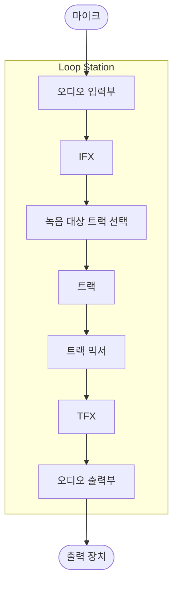
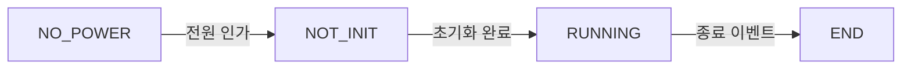
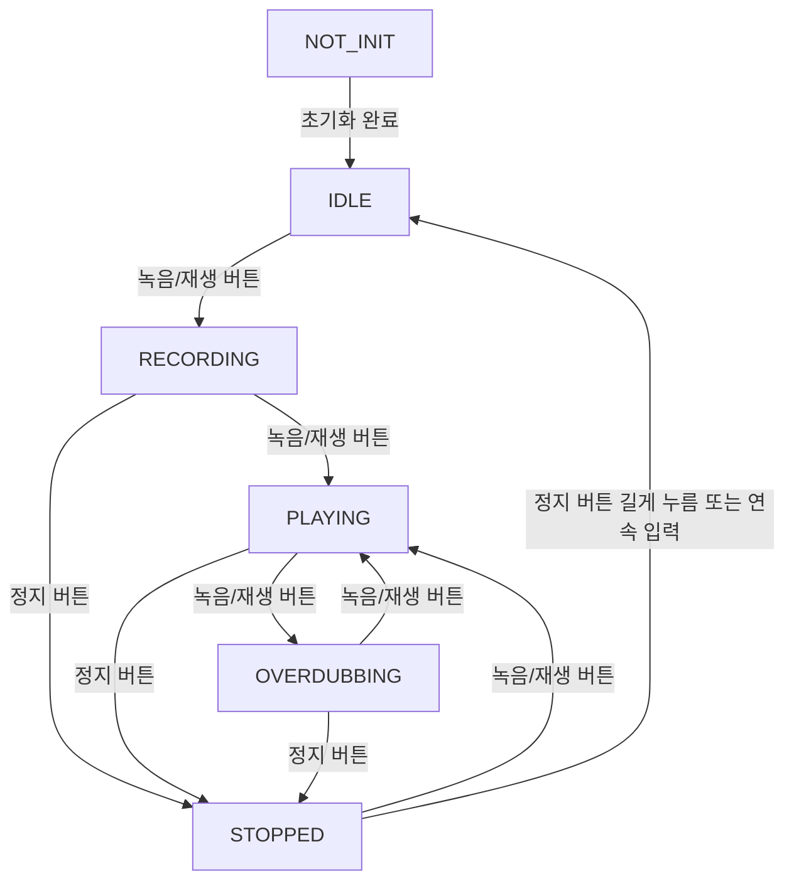
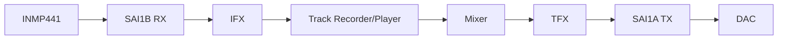

# 소프트웨어 아키텍처

## 1. 설계 원칙

루프스테이션은 실시간 오디오 처리가 가장 중요하다. 따라서 오디오 처리 경로는 높은 우선순위에서 동작해야 하며, 저장장치 접근이나 UI 갱신처럼 지연이 큰 작업과 분리되어야 한다.

주요 원칙:

- 실행 시간과 우선순위에 따라 태스크를 분리한다.
- 오디오 처리 태스크가 가장 높은 우선순위를 가진다.
- 오디오 처리 태스크에서는 blocking I/O나 긴 계산을 피한다.
- 태스크 간 통신은 큐, 세마포어, 뮤텍스 등을 사용한다.
- 공유 데이터는 최소화한다.

## 2. 전체 파이프라인

## 3. RTOS 태스크 구성

| 우선순위 | 태스크 | 역할 |
| --- | --- | --- |
| 1 | 오디오 처리 태스크 | 오디오 입력, FX, 믹싱, 출력 처리 |
| 2 | 저장 장치 입출력 태스크 | 트랙 파일 저장 및 읽기 |
| 3 | 사용자 컨트롤 처리 태스크 | 버튼, 엔코더, 노브 입력 처리 |
| 4 | 루프스테이션 상태 관리 태스크 | 트랙 상태, FX 상태, 시스템 상태 관리 |
| 5 | LED/디스플레이 처리 태스크 | LCD와 LED 표시 갱신 |

TODO: 실제 RTOS 우선순위 값

## 4. 태스크 간 통신

현재 문서에서 확인된 시나리오는 다음과 같다.

| 송신자 | 수신자 | 메시지 예 |
| --- | --- | --- |
| 사용자 컨트롤 처리 태스크 | 루프스테이션 상태 관리 태스크 | 트랙 상태 전이 요청 |
| 루프스테이션 상태 관리 태스크 | 오디오 처리 태스크 | 녹음 시작, 녹음 종료, 재생 시작, 재생 종료 |
| 루프스테이션 상태 관리 태스크 | LED/디스플레이 처리 태스크 | 상태 표시 갱신 요청 |
| 오디오 처리 태스크 | 저장 장치 입출력 태스크 | 오디오 버퍼 저장 요청 |
| 저장 장치 입출력 태스크 | 오디오 처리 태스크 | 저장된 트랙 데이터 스트리밍 |

TODO: 메시지 구조체 정의

TODO: 큐 길이와 버퍼 정책

TODO: 태스크 간 동기화 방식

## 5. 상태 머신

### 5.1 시스템 상태

### 5.2 트랙 상태

## 6. 오디오 처리 구조

현재 하드웨어 테스트에서는 다음 구성이 확인되었다.

- `SAI1 Block B`: INMP441 입력 수신
- `SAI1 Block A`: UDA1334A 또는 PCM5102A 출력 송신
- sample rate: 48 kHz 설정
- 현재 테스트 코드는 polling 기반 passthrough

목표 구조:

TODO: DMA circular buffer 구조

TODO: 오디오 버퍼 크기

TODO: 샘플 포맷과 fixed/floating point 처리 방식

TODO: mixing gain 정책

## 7. 저장 장치 입출력 구조

SD 카드는 `SDMMC1`과 FatFs로 접근한다. 녹음된 트랙 데이터는 저장 장치 입출력 태스크를 통해 파일로 저장한다.

TODO: 파일 포맷

TODO: 파일 flush 정책

TODO: 재생 스트리밍 버퍼 구조

TODO: SD 카드 오류 복구 방식

## 8. FX 처리 구조

FX는 입력용 IFX와 출력용 TFX로 구분한다.

프로토타입 FX 후보:

- LPF
- HPF
- EQ
- Reverb

추가 후보:

- Flanger
- Phaser
- Chorus
- Delay

각 FX의 설명과 파라미터는 [fx_design.md](./fx_design.md)를 기준으로 한다.
