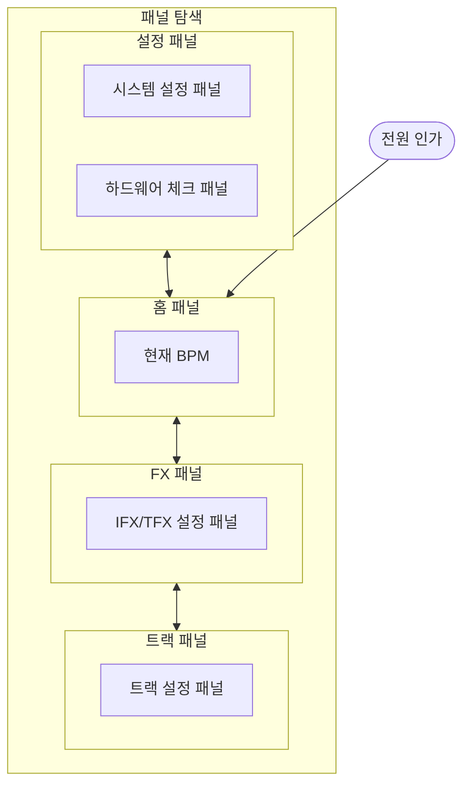

# UI 설계 문서

## 1. UI 구성 요소

| 구성 요소 | 역할 |
| --- | --- |
| GMG12864-06D LCD | 시스템 상태, 트랙 상태, FX 상태, 설정 패널 표시 |
| 버튼 | 녹음/재생, 정지, FX 토글, 패널 이동 |
| KY-040 로터리 엔코더 | 값 변경, 메뉴 조작 |
| 포텐셔미터 | FX 파라미터 또는 아날로그 조작값 입력 |
| LED | IFX/TFX 활성화 상태와 트랙 상태 표시 |

## 2. LCD 패널 구조

LCD는 한 번에 하나의 패널만 표시한다. 패널은 계층형 구조를 가진다.

## 3. 패널별 표시 정보

로터리 엔코더로 값을 변경할 수 있는 항목은 `@`로 표시한다.

### 3.1 홈 패널

| 항목 | 설명 |
| --- | --- |
| `@현재 BPM` | 트랙 재생 속도를 나타낸다. 전체 트랙이 `STOPPED` 상태일 때 변경 가능하다. |

### 3.2 트랙 상태 패널

| 항목 | 설명 |
| --- | --- |
| 트랙 상태 | 선택된 트랙의 상태를 표시한다. |
| 트랙 볼륨 | 선택된 트랙의 볼륨을 표시한다. |

### 3.3 트랙 설정 패널

| 항목 | 설명 |
| --- | --- |
| `@트랙 재생 방향` | 정방향 또는 역방향 재생 여부를 표시하고 변경한다. |
| 트랙 길이 | 녹음된 오디오 데이터의 길이를 표시한다. |
| `@TFX 적용 여부` | 해당 트랙에 TFX를 적용할지 on/off로 표시하고 변경한다. |

### 3.4 FX 상태 패널

| 항목 | 설명 |
| --- | --- |
| FX 이름 | 현재 IFX와 TFX에 선택된 FX 이름을 표시한다. |
| FX 활성화 | IFX와 TFX가 활성화되어 있는지 표시한다. |

### 3.5 IFX/TFX 설정 패널

| 항목 | 설명 |
| --- | --- |
| `@FX 이름` | 선택된 FX 종류를 표시하고 변경한다. |
| `@FX 활성화` | 선택된 FX의 활성화 상태를 표시하고 변경한다. |
| `@FX 옵션` | FX별 파라미터 값을 표시하고 변경한다. |

### 3.6 시스템 설정 패널

| 항목 | 설명 |
| --- | --- |
| @LCD 밝기 | LCD의 밝기를 변경한다.(1~100) |
| 시스템 초기화 | 모든 설정값들을 초기 상태로 변경한다. |

### 3.7 하드웨어 체크 패널

이 패널은 실제 버튼, 노브, 로터리 엔코더와 같이 사용자 입력이 가능한 장치들이 제대로 입력되는지 검사하는 기능을 제공한다. 시스템에서 인지한 값, 상태를 출력한다.

보드에 장착된 K1 버튼을 눌러서 다음페이지로 계속 이동하여 검사할 수 있다. 

한 페이지에 출력 가능한 장치 수가 제한되어 있으므로, 한 페이지에는 최대 4개의 장치 상태를 출력한다.

#### GPIO 검사

| 항목 | 설명 |
| --- | --- |
| FX버튼 상태 | 눌렸을 경우 Pushed, 손을 뗀 경우 Released를 출력한다. |
| LED상태 | 켜졌을 경우 On, 꺼졌을 경우 Off를 출력한다. |

#### 포텐셔미터 검사

| 항목 | 설명 |
| --- | --- |
| 포텐셔미터 값 | ADC로 변환된 포텐셔미터의 값을 그대로 출력한다. |

#### 로터리 엔코더 검사

| 항목 | 설명 |
| --- | --- |
| 로터리 엔코더 방향 | 로터리 엔코더를 회전시켰을 때 마지막 펄스의 방향을 출력한다. 시계방향일 경우 CW, 시계반대방향일 경우 CCW를 출력한다. |
| 로터리 엔코더 버튼 상태 | 눌렸을 경우 Pushed, 손을 뗀 경우 Released를 출력한다. |

## 4. 입력 장치 동작

| 입력 | 동작 |
| --- | --- |
| 녹음/재생 버튼 | 트랙 상태를 `IDLE -> RECORDING -> PLAYING -> OVERDUBBING -> PLAYING` 흐름으로 전환한다. |
| 정지 버튼 | 녹음, 재생, 오버더빙을 중단하고 `STOPPED`로 전환한다. |
| 정지 버튼 길게 누름 또는 연속 입력 | `STOPPED` 상태에서 트랙 데이터를 삭제하고 `IDLE`로 전환한다. |
| IFX 버튼 | IFX 활성화 상태를 토글하고 IFX 설정 패널로 이동한다. |
| TFX 버튼 | TFX 활성화 상태를 토글하고 TFX 설정 패널로 이동한다. |
| 좌/우 버튼 | 같은 계층의 패널을 이동한다. |
| Enter 버튼 | 하위 패널로 진입한다. |
| Exit 버튼 | 상위 패널로 이동한다. |
| KY-040 회전 | 선택된 `@` 항목 값을 변경한다. |

TODO: 실제 버튼 배치와 MCP23017 GPIO 매핑을 UI 입력 이름에 연결

## 5. LED 표시 정책

### 5.1 IFX/TFX LED

| 상태 | LED |
| --- | --- |
| FX 활성화 | on |
| FX 비활성화 | off |

### 5.2 트랙 상태 LED

| 트랙 상태 | LED 색상 |
| --- | --- |
| `IDLE` | off |
| `RECORDING` | 빨간색 |
| `PLAYING` | 초록색 |
| `OVERDUBBING` | 노란색 |
| `STOPPED` | 파란색 |

TODO: 실제 LED 종류와 MCP23017 GPIO 출력 매핑

## 6. 미정 사항

- TODO: 각 패널의 픽셀 단위 레이아웃
- TODO: 공통 아이콘, 위젯, 폰트 규칙
- TODO: 에러 화면 디자인
- TODO: SD 카드 미삽입 또는 오디오 오류 표시 방식
